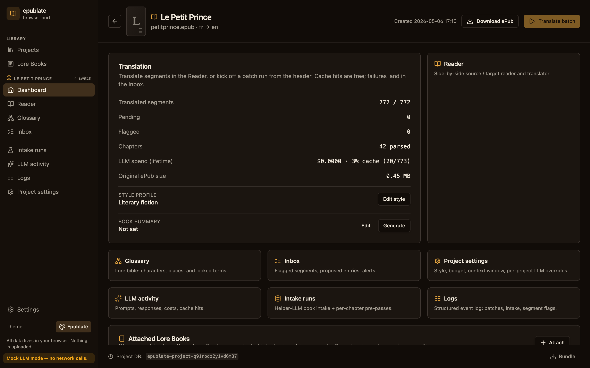
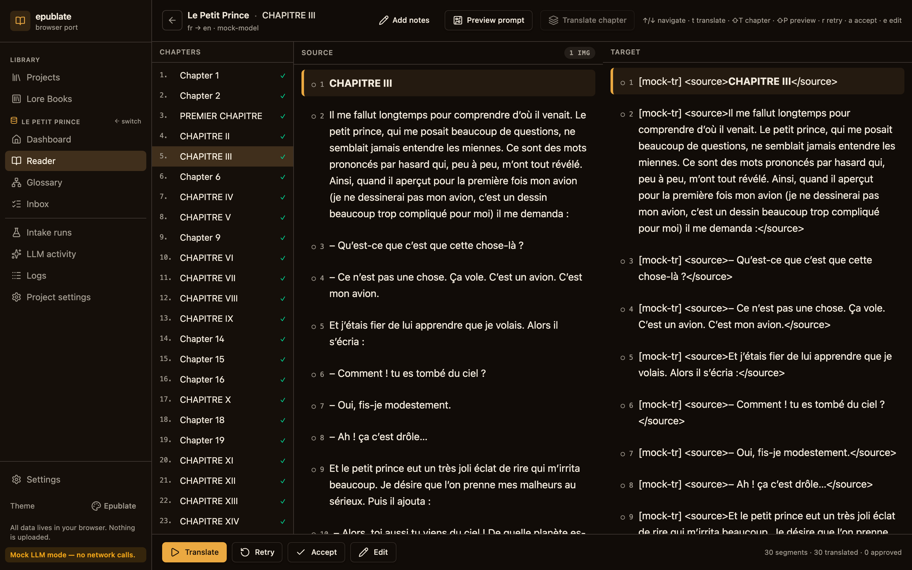
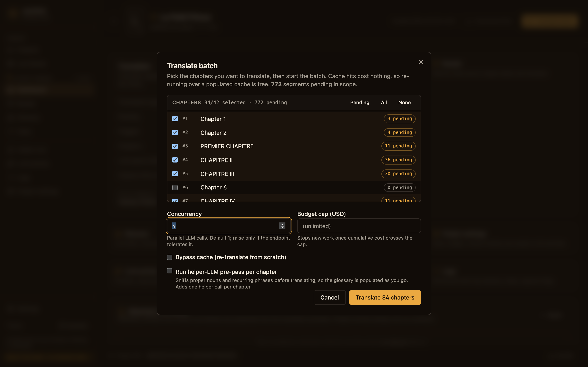
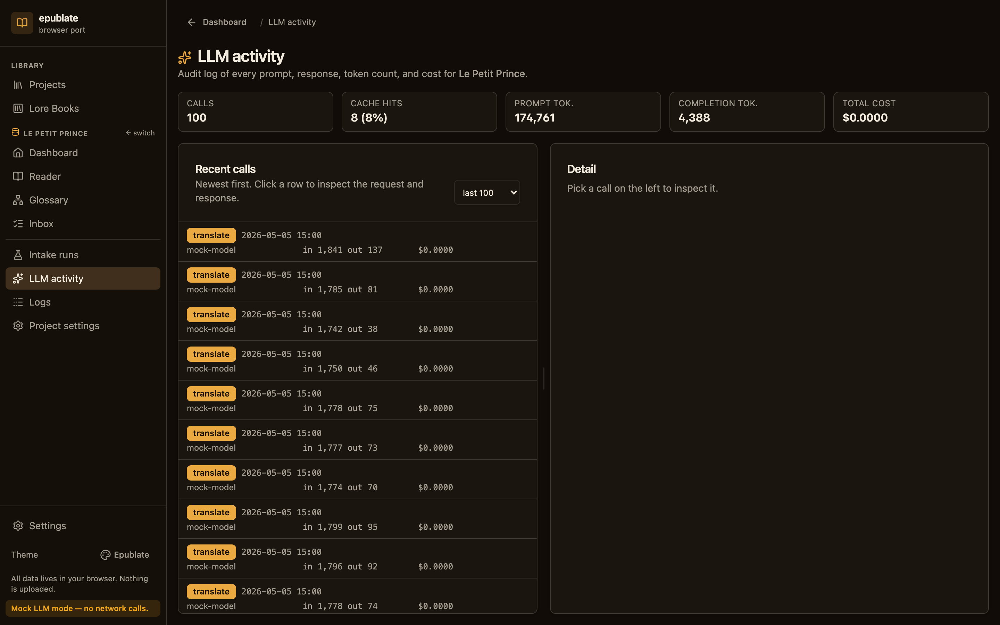
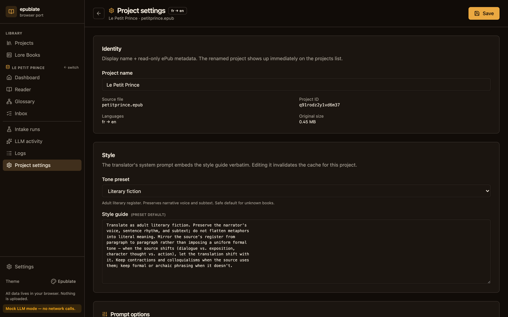
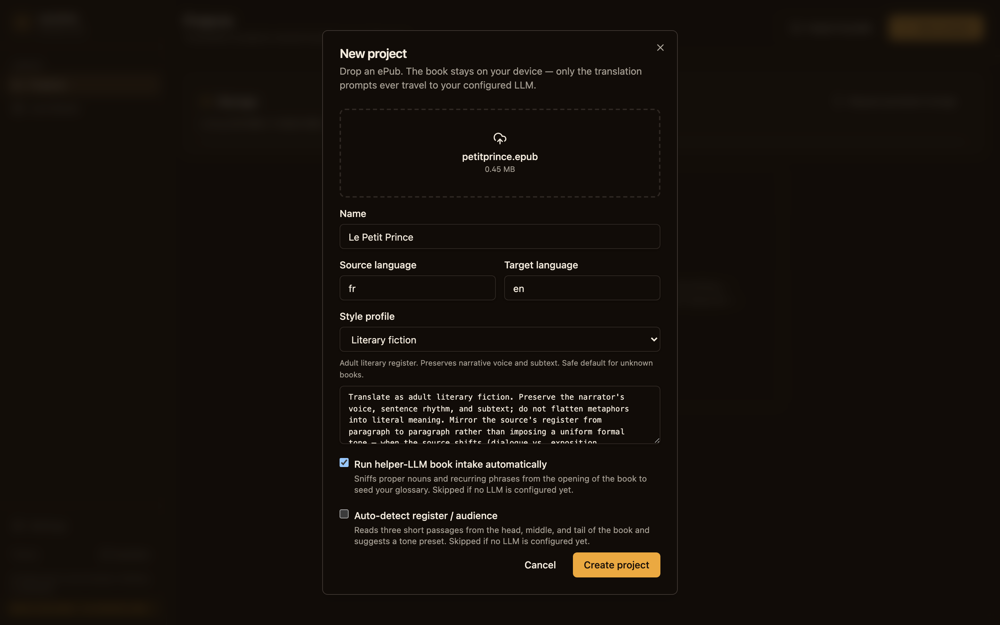
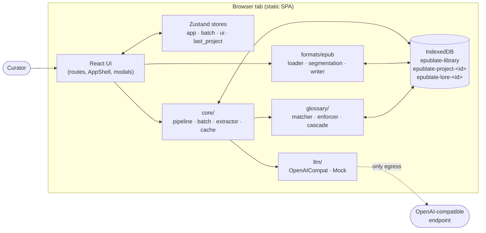

# epublate

**A browser-only ePub translation studio with a per-project lore bible.**

Translate full-length novels with consistent terminology, tone, and style — your book, your glossary, your LLM, your device. The whole tool is a static SPA: nothing leaves the browser except the prompts you choose to send to your configured LLM endpoint.

<p align="center">
  
</p>

> Faithful port of the Python TUI [`epublate`](https://github.com/madpin/epublate) to a fully offline web app. SQLite became IndexedDB, `lxml` became native `DOMParser`, the `openai` SDK became `fetch`, and the Textual TUI became a keyboard-first React app — but the prompts, the glossary semantics, and the segmentation invariants are byte-equivalent.

---

## Why epublate?

**It is not a "click translate" button.** Long-form fiction breaks every assumption a per-paragraph translator makes:

- Characters get renamed mid-chapter when the LLM forgets it called Mr. Bennet "Бенне́т" three pages ago.
- Tone wanders from Victorian-formal to mall-casual whenever a chapter break flushes the context.
- Footnotes, anchors, and `<page-list>` markers vanish, and your ePub fails `epubcheck`.
- Costs explode because every retry re-translates everything from scratch.

epublate fixes all four:

- **Glossary as a hard contract.** Locked terms enforce one-and-only-one target spelling. The translator's prompt embeds the matching entries; the post-processor *fails the segment* if the LLM ignored them. The Inbox surfaces the violations for one-click cascade re-translation.
- **Style as a first-class object.** Pick from ten verbatim presets (literary fiction, hard sci-fi, romance, military thriller, …) or write your own. The helper LLM can sniff a chapter and suggest one. The chosen style is part of the cache key, so changing it invalidates exactly what it should.
- **Byte-faithful ePub round-trip.** We capture the source DOCTYPE verbatim, treat `<table>` / `<ul>` / `<figure>` as block-level scaffolding, preserve empty `<a id="page_v"/>` anchors, and pass non-chapter assets (CSS, fonts, SVGs) through as raw bytes. The output passes `epubcheck` against EPUB 2 and EPUB 3.
- **Cost-aware batches.** Configurable concurrency, hard budget caps, full LLM audit log, SHA-256-keyed cache that survives across batches, and a "translate chapter" affordance from the Reader for incremental cost.

---

## See it in motion

### The Reader — side-by-side panes, segment-anchored scroll sync

<p align="center">
  
</p>

Every segment is its own card. Translated text is rarely the same length as the source, so the Reader anchors scroll sync to segments instead of pixels — the panes stay aligned at the segment level no matter how the prose stretches. Press `t` to translate the focused segment, `Shift+T` for the whole chapter, `r` to bypass the cache. Position memory is per-project: leave the Reader, come back to the same scroll offset.

### Batch mode — chapter-scoped or project-wide

<p align="center">
  
</p>

Bounded concurrency, a hard budget cap, optional helper-LLM pre-pass per chapter, and AbortController-based cancel. Cache hits cost zero, so re-running a batch on a populated cache is free. Per-segment failures are isolated — one bad call doesn't sink the run.

### LLM activity — a per-call audit ledger

<p align="center">
  
</p>

Every prompt + response is logged to a per-project audit table with full token counts, cost, and cache status. Editing a glossary entry, the style guide, or the model invalidates exactly the segments whose cache key changed — nothing more, nothing less.

### Project settings — every per-project knob in one place

<p align="center">
  
</p>

Style guide, context window, budget cap, and per-project LLM overrides — the same screen lets you rename the project (kept in sync with the Projects list) and swap the prose contract on the fly.

> A complete tour with screenshots for every screen lives in [**docs/USAGE.md**](docs/USAGE.md). For an architectural deep dive, see [**docs/ARCHITECTURE.md**](docs/ARCHITECTURE.md).

---

## Highlights

- **Sectioned navigation.** Library (Projects, Lore Books) is always visible; the Project section appears when a book is open and groups Dashboard, Reader, Glossary, Inbox, Project Settings, and the advanced views (LLM activity, Intake runs, Logs). The sidebar footer surfaces global links — **Help & guides**, Settings, theme picker — including a deep-linkable in-app tutorial at `/help` that mirrors this README's onboarding plus the multi-scheme `OLLAMA_ORIGINS` recipe so curators on a deployed HTTPS build can troubleshoot without leaving the SPA.
- **Reader with side-by-side panes**, scroll-sync that's anchored to segments rather than pixels (because translated text is rarely the same length), keyboard-first hotkeys, and per-project position memory — leave the Reader and come back to the same chapter, the same segment, the same scroll offset.
- **Glossary** with proposed / approved / locked statuses, alias support on both source and target sides, target-only entries (for invented terms), JSON / CSV import-export, and an Inbox flow for cascade re-translation when a locked term changes.
- **Lore Books**: standalone, attachable per-project lore artifacts. Ingest from a translated reference ePub, ingest from a source ePub via helper LLM, or import from another project. Attach with read-only or writable mode and a per-attachment priority.
- **Batch runner** with bounded concurrency, hard budget cap, AbortController-based cancel, persistent status bar that survives navigation, helper-LLM pre-pass per chapter (optional), and per-segment failure isolation.
- **Resilience layer.** Configurable per-segment retry budget on top of the provider's own backoff, plus a sliding-window circuit breaker that pauses the batch when transient failures exceed a threshold (default `10` failures in the last `100` segments) — so a flaky local Ollama tunnel can't drag a whole novel into the Inbox one segment at a time. Configurable timeout per chat-completion call, with a curator-friendly abort message that points back at the relevant Settings knob.
- **Per-project context window.** Inject up to N preceding segments of the current chapter into the translator prompt as read-only context, with a separate character budget for paragraph-heavy chapters.
- **Configurable prompt blocks** with **on-demand book + chapter summaries**. The translator prompt is split into a cacheable **system** prefix (rules, style guide, book summary, glossary, target-only terms) and a per-segment **user** tail (chapter notes, proposed-term hints, recent context, source). Every block is wrapped in an XML tag for unambiguous parsing, every block is curator-toggleable from Settings → **Prompt options**, and every prompt has a live **Prompt simulator** that shows the byte-equivalent system / user / wire payload alongside token + cost meters. The same panel is one keystroke away in the Reader (`Shift+P`) for any focused segment. The helper LLM can draft the book summary from the book's first chapters and a 50–120 word recap for any chapter on demand, both auditable in Intake runs.
- **RAG-backed lore (optional).** Attach a 5,000-entry series bible without ballooning every prompt: enable the OpenAI-compatible or local embedding provider in Settings → Embeddings and the pipeline retrieves only the Lore-Book entries (and proposed glossary hints) that are semantically relevant to the current segment.
- **Project bundles** — one-click `.zip` export with the original ePub plus every Dexie row as JSON-Lines, re-importable on any device with a fresh project id (so the same bundle can be imported multiple times without colliding).
- **Installable & offline-first**. One click in Settings → Install saves the app to your dock / home screen via `vite-plugin-pwa`. Once the shell is cached, every screen — browsing, editing, cache-hit translations, ePub re-export, the local-embedding pipeline — works without network. Only *new* LLM/embedding calls need the curator's configured endpoint. The sidebar shows an "Offline" pill when `navigator.onLine` is false.
- **Mock mode** (`?mock=1`) for demos and screenshots — every call goes through a deterministic provider and the cache so the UI is fully exercised without network access or API keys.
- **Themes** — four built-in themes (epublate, textual-dark, textual-light, high-contrast), pickable from the sidebar footer.

---

## 60-second tour

```bash
git clone https://github.com/madpin/epublate-js.git && cd epublate-js
npm install
npm run dev                  # http://localhost:5173
```

Then:

1. Visit **Settings → LLM**. Three "Quick presets" buttons (OpenAI, OpenRouter, Ollama) pre-fill the base URL + model in one click — paste your key, then hit "Test connection". (Or skip the LLM step entirely and append `?mock=1` to the URL for the deterministic mock provider — see the screenshot below.)
2. From the **Projects** landing page, drop an ePub onto the dropzone or click "New project". Pick source / target language and a style preset.
3. The **Dashboard** opens. Click "Translate batch" to run the helper-LLM pre-pass, then translate every pending segment with bounded concurrency and a budget cap. Or open the **Reader**, focus a segment, and press `t` to translate just that one.
4. **Glossary** picks up proposed entries from the helper LLM and from the translator's `new_entities` field on every successful call. Approve or lock the ones you care about.
5. When you're happy, click **Download ePub** on the Dashboard for a translated file, or **Download bundle** for the full project archive.
6. Open **Settings → Install for offline use** and click **Install epublate**. Your browser saves the app to your device so you can open it from your dock / home screen and use every screen offline — including cache-hit translations.

<p align="center">
  
</p>

For a deeper walk-through, see [**docs/USAGE.md**](docs/USAGE.md). The same tour is also bundled into the SPA itself at **Help & guides** in the sidebar footer (`/help`) — handy when you're showing the app to someone new or troubleshooting a connectivity problem on a deployed build.

### Try it without an LLM key

`?mock=1` (or the toggle in Settings → LLM) swaps in a deterministic mock provider. Every screen behaves as if the real LLM had been called — the cache fills, the audit ledger fills, costs render at `$0.0000` — but no network call ever happens. Perfect for demos, screenshots, and CI smoke tests.

```bash
open "http://localhost:5173/?mock=1"
```

### Pre-fill the LLM config from `.env`

Copy `.env.example` to `.env` (or `.env.local`) and uncomment the values you want pre-filled in **Settings → LLM endpoint** on first run:

```bash
cp .env.example .env
# Edit .env — supports VITE_EPUBLATE_LLM_BASE_URL, _API_KEY, _MODEL,
# _HELPER_MODEL, _REASONING_EFFORT, _TIMEOUT_MS, _ORGANIZATION.
npm run dev
```

These values are read at build time and **baked into the bundle**. They seed the Dexie LLM row the first time the app boots on a device; once you click Save in Settings, the persisted row owns the configuration. Curator state always wins — `.env` never silently overrides a saved value.

⚠️ Don't deploy a public build with `VITE_EPUBLATE_LLM_API_KEY` set — it ships inside the JavaScript bundle. For shared deployments, leave it blank and let each curator paste their own key into Settings (where it lives only in their browser's IndexedDB). See `.env.example` for the full reference and the per-provider snippet block.

---

## Privacy & data location

| What                                       | Where it lives                                                       |
| ------------------------------------------ | -------------------------------------------------------------------- |
| Source ePub bytes                          | `epublate-project-<id>` IndexedDB on this device                     |
| Segments, glossary, events, LLM audit log  | Same per-project DB                                                  |
| Reader scroll position                     | `localStorage` (per project)                                         |
| Library projection (recents, theme, prefs) | `epublate-library` IndexedDB                                         |
| LLM API key                                | `epublate-library` IndexedDB. Redact / clear from the Settings screen |
| Lore Books                                 | One IndexedDB per Lore Book, `epublate-lore-<id>`                    |
| **What never leaves your browser**         | The book, your projects, your glossary, your audit log               |
| **What is sent to your LLM endpoint**      | Only the prompts you trigger (segment translate, helper extract)     |

`navigator.storage.persist()` is requested on first project create so the OS doesn't evict your work under storage pressure.

The Settings screen lets you wipe the entire library DB and every per-project DB in one click ("Reset all data").

---

## Architecture at a glance



Per-project data lives in a **named Dexie database** (one per project), so deleting a project is a single `Dexie.delete(name)` and the IDB inspector shows one DB per project — directly mirroring the Python tool's one-`.epublate`-per-project SQLite layout. Lore Books follow the same pattern.

```
src/
├── core/             pipeline, batch, extractor (helper LLM), style, project bundles, exports
├── db/               Dexie schemas + repo layer (projects, segments, glossary, lore, library)
├── formats/epub/     loader, segmentation, writer; round-trip identity is the invariant
├── glossary/         matcher, enforcer, cascade, IO
├── llm/              base, openai_compat, mock, factory, prompts (translator, extractor, …)
├── lore/             lore book model + per-project attachment management
├── routes/           one .tsx per screen; AppShell composes the sidebar + outlet
├── components/       shadcn-style primitives (forms, dialogs, layout)
└── state/            Zustand stores (app, ui, batch, last_project)
```

> The full architectural deep dive — including module-level mermaid diagrams, the cache-key recipe, the batch runner's pause/resume state machine, the translator-prompt recipe, and the byte-faithful ePub round-trip invariants — lives in [**docs/ARCHITECTURE.md**](docs/ARCHITECTURE.md).

---

## Project bundles

The Dashboard's **Download bundle** button produces `<name>.epublate-project.zip` with the original ePub plus every Dexie row as JSON-Lines. The Projects landing page has a matching **Import bundle** button that re-hydrates a previously-exported project into a fresh database with a new id, so the same bundle can be imported multiple times without colliding.

```
<name>.epublate-project.zip
├── manifest.json          schema version, exported_at, project id
├── project.json           single project row
├── library_row.json       library-level metadata (size, progress, …)
├── original.epub          verbatim source bytes
├── chapters.jsonl         one JSON object per line
├── segments.jsonl
├── glossary.jsonl + glossary_aliases.jsonl + glossary_revisions.jsonl
├── entity_mentions.jsonl
├── llm_calls.jsonl        full LLM audit log (request + response)
├── events.jsonl           append-only event stream
├── intake_runs.jsonl + intake_run_entries.jsonl
└── attached_lore.jsonl + lore_meta.jsonl + lore_sources.jsonl
```

Bundles are forward-compatible: older clients refuse newer schemas with a clear error instead of silently corrupting state.

---

## Quick reference

| Command              | What it does                                       |
| -------------------- | -------------------------------------------------- |
| `npm run dev`        | Vite dev server                                    |
| `npm run build`      | `tsc -b && vite build` — production bundle         |
| `npm run preview`    | Serve the production bundle locally                |
| `npm run test`       | Vitest, includes `fake-indexeddb` and DOM tests    |
| `npm run typecheck`  | `tsc -b --noEmit` only                             |
| `npm run lint`       | ESLint                                             |

| Hotkey      | Action                                                          |
| ----------- | --------------------------------------------------------------- |
| `?` or `F1` | Open the cheat sheet                                            |
| `Esc`       | Close any open modal                                            |
| `j` / `↓`   | Next segment (Reader)                                           |
| `k` / `↑`   | Previous segment (Reader)                                       |
| `t`         | Translate the focused segment                                   |
| `Shift+T`   | Translate the entire current chapter (Reader)                   |
| `r`         | Re-translate the focused segment, bypassing the cache           |
| `a`         | Accept the focused translation                                  |
| `e`         | Edit the focused translation                                    |
| `/`         | Focus the Glossary search box                                   |
| `n`         | New Glossary entry                                              |
| `b`         | Open the Batch modal (Dashboard)                                |
| `x`         | Cancel the running batch                                        |
| `i`         | Jump to the project Inbox                                       |

---

## Browser realities

- **CORS** — works against OpenAI, OpenRouter, Together, Groq, DeepInfra, and any other OpenAI-compatible service. Local **Ollama** requires the multi-scheme allow-list so its CORS layer accepts both http:// and https:// origins (the bare `OLLAMA_ORIGINS=*` shorthand is parsed inconsistently across Ollama releases and often rejects https:// deploys):

  ```bash
  export OLLAMA_ORIGINS="http://*,https://*,chrome-extension://*,moz-extension://*"
  ollama serve
  ```
- **Ollama options** — when the base URL looks like Ollama (`:11434` / `ollama` host), Settings surfaces a dedicated card for `num_ctx`, `num_predict`, sampling, Mirostat, and a **Disable thinking** toggle (`think: false`, the documented Ollama switch for Gemma 3 / Qwen 3 / DeepSeek-R1 / GPT-OSS) with one-click presets. Cloud providers ignore the extra body fields, so the values stick around safely if you swap models. See [USAGE → Ollama options](docs/USAGE.md#ollama-options-optional-auto-detected).
- **Reasoning models** — `reasoning_effort` accepts the standard `minimal` / `low` / `medium` / `high` ladder plus an Ollama-compat `none`, so you can suppress thinking on cloud o-series and Ollama alike from a single project config. See [USAGE → LLM endpoint](docs/USAGE.md#llm-endpoint).
- **API keys** are stored in IndexedDB on this device only. They are never logged outside the LLM audit row, which itself stays local. The Settings screen has redact / clear actions.
- **Storage** — a 100,000-word novel is roughly 1–5 MB of segments + a few MB of LLM audit. The Settings screen surfaces per-project size and a delete action.
- **No filesystem** — ePubs come in via the dropzone or file picker; exports go out as browser downloads. There is no file watcher and no syncing — the Bundle export is your portable representation.
- **`epubcheck`** — the bundled writer validates structurally on round-trip (BOMs, DOCTYPEs, namespaces, internal `data-*` attributes, byte-faithful pass-through for non-chapter assets). For external validation, run `epubcheck` against the downloaded `.epub`.

---

## Tech stack

| Layer            | Choice                                                                                |
| ---------------- | ------------------------------------------------------------------------------------- |
| Build            | [Vite 6](https://vitejs.dev) + [TypeScript 5.7](https://www.typescriptlang.org/)      |
| UI               | [React 19](https://react.dev) + [React Router 7](https://reactrouter.com/)            |
| Styling          | [Tailwind CSS 4](https://tailwindcss.com/) + shadcn-style primitives + [Radix](https://www.radix-ui.com/) |
| Icons            | [lucide-react](https://lucide.dev/)                                                   |
| Storage          | [Dexie 4](https://dexie.org/) (IndexedDB)                                             |
| State            | [Zustand 5](https://github.com/pmndrs/zustand)                                        |
| ePub             | [JSZip](https://stuk.github.io/jszip/) + native `DOMParser` / `XMLSerializer`         |
| Tokens / costs   | [`gpt-tokenizer`](https://www.npmjs.com/package/gpt-tokenizer)                        |
| Tests            | [Vitest](https://vitest.dev) + [`fake-indexeddb`](https://www.npmjs.com/package/fake-indexeddb) + [`@testing-library/react`](https://testing-library.com/) + [`fast-check`](https://github.com/dubzzz/fast-check) |
| PWA              | [`vite-plugin-pwa`](https://vite-pwa-org.netlify.app/)                                |
| Toasts           | [`sonner`](https://sonner.emilkowal.ski/)                                             |
| Hotkeys          | [`react-hotkeys-hook`](https://github.com/JohannesKlauss/react-hotkeys-hook)          |
| Screenshots      | [Playwright](https://playwright.dev) — driven by `tools/snap.mjs`                     |

---

## Documentation map

| Doc                                                | What's in it                                                                                  |
| -------------------------------------------------- | --------------------------------------------------------------------------------------------- |
| In-app **Help & guides** (`/help`)                 | Onboarding tour, local-Ollama recipe with copy-button code blocks, troubleshooting accordion — works offline once the SPA is installed. |
| [`docs/USAGE.md`](docs/USAGE.md)                   | Hands-on tour of every screen with screenshots and concept tables.                            |
| [`docs/ARCHITECTURE.md`](docs/ARCHITECTURE.md)     | Architectural deep dive: layers, modules, data flow, cache key, batch state machine, ePub round-trip. |
| [`AGENTS.md`](AGENTS.md)                           | Hard invariants and conventions for AI agents (and humans) modifying the codebase.            |
| [`docs/screenshots/README.md`](docs/screenshots/README.md) | How to capture / refresh the screenshots in mock mode.                                |

---

## Contributing

- Tests run on `vitest`; new behaviour wants a regression test next to the source (e.g. `src/core/pipeline.test.ts`). DB-touching tests use `fake-indexeddb`; round-trip ePub tests use `JSDOM`.
- Architectural conventions and invariants live in [`AGENTS.md`](AGENTS.md). Read it before changing the segmentation pipeline or the cache key shape — both have hidden contracts the tests depend on.
- Screenshots are captured by `tools/snap.mjs` against a dev server running with `?mock=1`. Re-run it whenever a screen materially changes; the filenames are the doc contract.

---

## License

To be decided per project. The original Python tool's license applies to the prompts and the segmentation invariants we ported verbatim.
