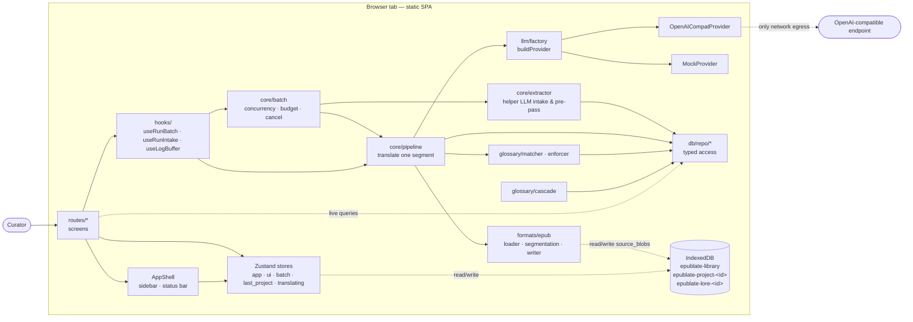
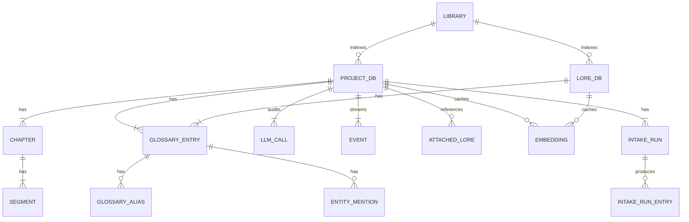
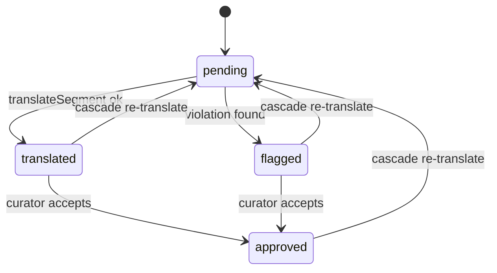
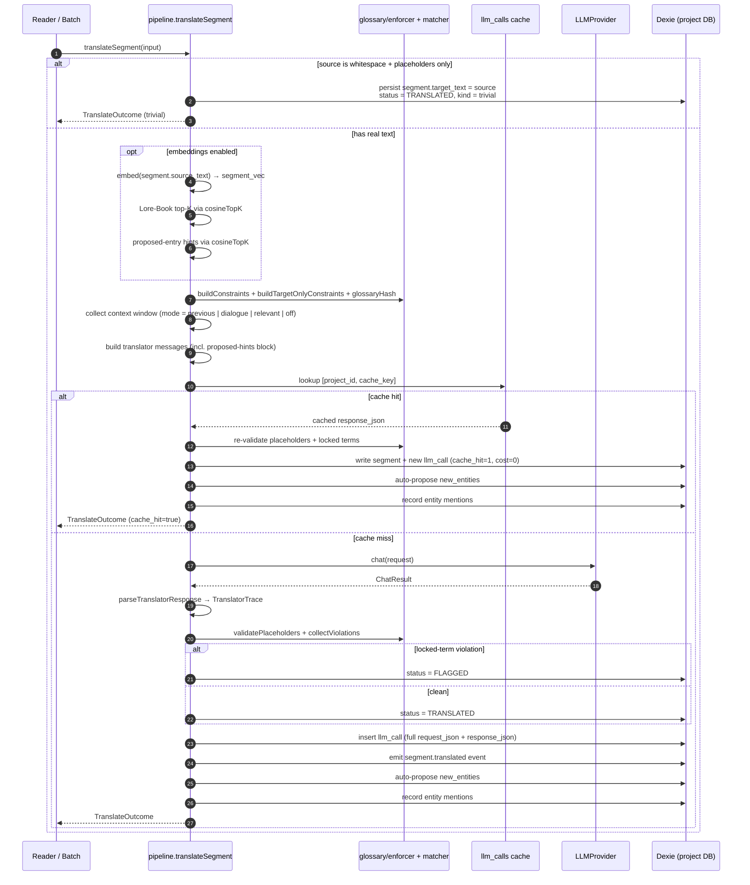
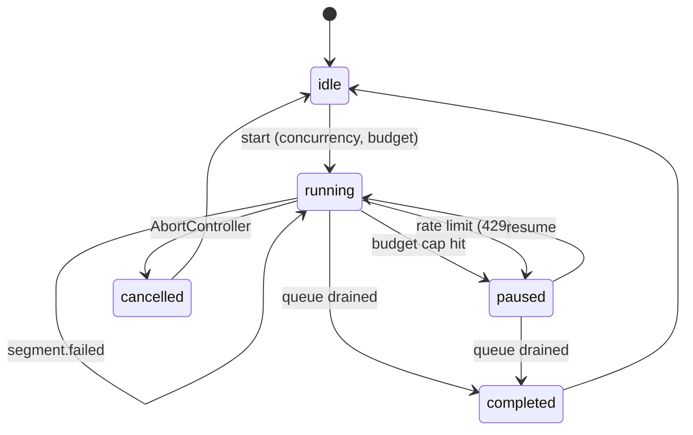
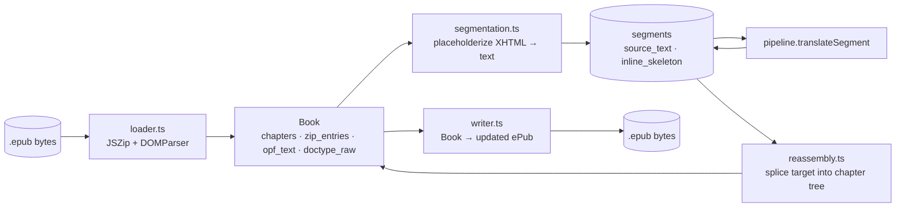
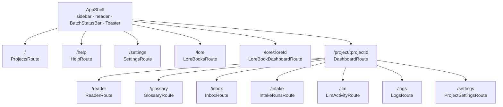
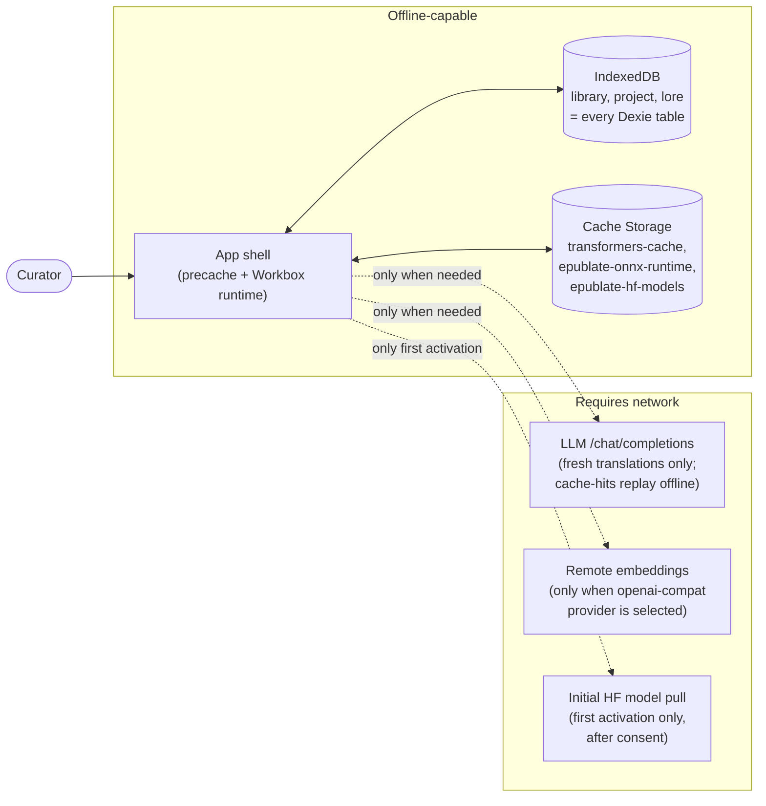

# epublate architecture

A developer-oriented tour of the codebase. Read it top-to-bottom the first time; bookmark the section headings as a reference afterwards.

This doc starts at the 30,000-foot view (what the app *is*) and progressively drills down into modules, data structures, and the contracts between them. The deep dives at the end pin down the invariants the test suite enforces — those are the things you must not break without thinking very hard.

## Table of contents

1. [What the app is](#what-the-app-is)
2. [System view](#system-view)
3. [Code layout](#code-layout)
4. [Data model](#data-model)
5. [Translation pipeline](#translation-pipeline)
6. [Batch runner](#batch-runner)
7. [Glossary subsystem](#glossary-subsystem)
8. [ePub round-trip](#epub-round-trip)
9. [LLM provider layer](#llm-provider-layer)
10. [State management](#state-management)
11. [Routing & UI shell](#routing--ui-shell)
12. [Lore Books](#lore-books)
13. [Caching, hashing & cost accounting](#caching-hashing--cost-accounting)
14. [Project bundles](#project-bundles)
15. [Testing strategy](#testing-strategy)
16. [Hard invariants](#hard-invariants)
17. [Where to look first when…](#where-to-look-first-when)

---

## What the app is

epublate is a **static SPA** that turns an ePub into a translated ePub by walking a long-form-fiction-aware translation pipeline. There is no server. The only network egress is to the user's configured OpenAI-compatible LLM endpoint.

Three properties pin down everything else:

1. **Local-first.** All persistent state lives in IndexedDB on the curator's device. The original ePub bytes, the glossary, the LLM audit log, the per-project event stream — everything. Deleting the SPA's site data wipes every project; cloning a project to another browser means downloading a `.zip` bundle.
2. **Round-trip-faithful ePub.** Loading and saving a chapter without translating anything must produce byte-equivalent output, down to the DOCTYPE. Inline tags never reach the LLM — they're placeholderized. The writer validates round-trip on every export.
3. **Glossary as a hard contract.** A locked glossary entry's target spelling is enforced by a post-processor. The LLM never sees raw markup, but it does see a curated constraint list per call — and the matcher / enforcer rejects translations that violate locked terms before they ever land in the DB.

Mentally, the app is the Python tool [`epublate`](https://github.com/madpin/epublate) compiled to a browser. The Python source-of-truth invariants survive the port; the only differences are mechanical (Dexie instead of SQLite, `DOMParser` instead of `lxml`, `fetch` instead of the OpenAI SDK).

---

## System view



The arrows form three observable shapes:

- **Read paths**. UI components subscribe to Dexie tables via `useLiveQuery`; mutations elsewhere trigger re-renders without explicit invalidation. This is how the Reader's progress card stays current while a batch is running, and how the Glossary screen lights up entries the translator just proposed.
- **Write paths**. Anything that mutates persistent state goes through `db/repo/*`. Repos own per-table consistency (e.g. an `upsertProposed` glossary write also touches the alias table; a `translateSegment` writes the segment, the LLM call, and an event in one transaction).
- **LLM calls**. Funnel through `llm/factory.buildProvider`, which returns either the `OpenAICompatProvider` (real network) or the `MockProvider` (deterministic, no network). Every other module — pipeline, batch, extractor — is provider-agnostic, so the test suite runs the entire pipeline against the mock.

---

## Code layout

```
src/
├── core/                    high-level orchestration that doesn't belong to one screen
│   ├── pipeline.ts          translate one segment end-to-end
│   ├── batch.ts             run pipeline N at a time with budget + cancel
│   ├── extractor.ts         helper-LLM book intake + per-chapter pre-pass
│   ├── auto_propose.ts      promote translator `new_entities` to proposed glossary rows
│   ├── cache.ts             SHA-256 cache key recipe
│   ├── stats.ts             lifetime spend / cache rate / segment counts
│   ├── style.ts             10 verbatim style presets + `suggestStyleProfile`
│   ├── style_sniff.ts       helper-LLM tone sniffer
│   ├── dialogue.ts          dialogue detector for context-window mode
│   ├── export.ts            build translated ePub blob from segments
│   ├── project_bundle.ts    portable project zip export/import
│   └── project_intake.ts    create-project flow (load + segment + intake)
├── db/
│   ├── library.ts           top-level "epublate-library" Dexie DB (recents, prefs, LLM)
│   ├── dexie.ts             per-project / per-Lore-Book DB constructor + cache
│   ├── schema.ts            row interfaces + status enums
│   └── repo/                typed read/write per table
│       ├── projects.ts      project row + events
│       ├── chapters.ts
│       ├── segments.ts
│       ├── glossary.ts
│       ├── llm_calls.ts
│       └── intake.ts
├── formats/
│   └── epub/
│       ├── loader.ts        JSZip + DOMParser; produce a `Book`
│       ├── segmentation.ts  XHTML ↔ placeholderized text (round-trip-safe)
│       ├── reassembly.ts    splice translations back into the chapter tree
│       ├── writer.ts        Book → updated ePub blob
│       ├── images.ts        cover / inline image extraction
│       ├── entities.ts      named entity expansion (XHTML quirks)
│       ├── xpath.ts         positional XPath dialect for host nodes
│       └── types.ts         Book / ChapterDoc / Segment / InlineToken
├── glossary/
│   ├── matcher.ts           Unicode-aware boundary matching across aliases
│   ├── enforcer.ts          build prompt constraints; validate target text
│   ├── cascade.ts           re-pending segments touched by a locked-term change
│   ├── normalize.ts         language-specific normalization (doubled particles…)
│   ├── dedup.ts             merge near-duplicate proposed entries
│   ├── io.ts                JSON / CSV import/export, upsertProposed
│   └── models.ts            GlossaryEntryWithAliases shape + helpers
├── llm/
│   ├── base.ts              LLMProvider interface + typed errors
│   ├── openai_compat.ts     /v1/chat/completions HTTP provider
│   ├── mock.ts              deterministic mock used by tests + ?mock=1
│   ├── factory.ts           build provider from library + per-project config
│   ├── ollama.ts            Ollama-specific options + presets + sanitizer
│   ├── json_mode.ts         "JSON mode → text fallback" wrapper
│   ├── tokens.ts            gpt-tokenizer wrapper
│   ├── pricing.ts           static price table + curator overrides
│   └── prompts/
│       ├── translator.ts    translator system prompt + JSON response shape
│       ├── extractor.ts     helper-LLM extractor
│       └── extractor_target.ts (for target-only Lore-Book ingest)
├── lore/
│   ├── lore.ts              lifecycle: create / rename / delete a Lore Book
│   ├── attach.ts            attach a Lore Book to a project, with priority
│   ├── glossary.ts          read entries from a Lore Book DB
│   ├── ingest.ts            populate from a source ePub via helper LLM
│   ├── ingest_target.ts     populate from a translated reference ePub
│   ├── import_project.ts    copy approved/locked entries from another project
│   └── io.ts                bundle export/import for Lore Books
├── routes/                  one .tsx per screen; all wrapped in AppShell
├── components/              shadcn-style primitives + form modals + layout
├── state/                   Zustand stores (no global EventBus, no context soup)
├── hooks/                   small composables (useRunBatch, useFormShortcuts, …)
├── workers/                 off-main-thread CPU work + transparent fallbacks
│   ├── epub.worker.ts       JSZip decompress/compress in a dedicated worker
│   └── epub.client.ts       main-thread client with inline JSZip fallback
└── lib/                     pure utilities (id, hash, time, languages, log buffer)
    ├── lru.ts               generic Lru<K,V> cache (size + hit/miss stats)
    ├── throttle.ts          cooperative async throttle with a mutable cap
    └── env_defaults.ts      VITE_EPUBLATE_LLM_* readers + Settings preset table
```

The split is deliberate: `core/` orchestrates, `db/` persists, `formats/` parses, `llm/` calls out, `glossary/` enforces, `lore/` cross-projects, and the React tree (`routes/`, `components/`, `hooks/`, `state/`) only ever consumes those primitives. No screen reaches past `db/repo/*` into Dexie directly; no module under `core/` knows the URL it's running on.

---

## Data model

Three IndexedDB databases coexist, each bounded to a clear purpose.



### Three Dexie databases

| DB                          | Purpose                                                               | Lifetime                              |
| --------------------------- | --------------------------------------------------------------------- | ------------------------------------- |
| `epublate-library`          | Recents, UI prefs, LLM config, lore-book index, theme, default budget | One per browser profile               |
| `epublate-project-<id>`     | One project: ePub bytes, chapters, segments, glossary, audit          | One per project; deleted with project |
| `epublate-lore-<id>`        | One Lore Book: glossary + meta + ingest sources                       | One per Lore Book                     |

`db/dexie.ts` exposes `openProjectDb(id)` / `openLoreDb(id)` which cache opened handles, so the rest of the app can call them as if they were synchronous. `db/library.ts` owns the singleton-row tables (`ui`, `llm`).

### Per-project tables (highlights)

| Table             | Indexed by                                                  | Notes                                                                                       |
| ----------------- | ----------------------------------------------------------- | ------------------------------------------------------------------------------------------- |
| `projects`        | id                                                          | One row; carries `style_guide`, `context_max_segments`, `budget_usd`, `llm_overrides`, **`book_summary`** (project-stable premise that lands in the cacheable system prefix), and **`prompt_options`** (curator-controlled toggles for each prompt block). |
| `chapters`        | id, `project_id`, `[project_id+spine_idx]`, `status`        | One row per spine entry. `notes` is curator-authored chapter context — also the persistence target for **chapter summaries** generated by `runChapterSummary`. |
| `segments`        | id, `chapter_id`, `[chapter_id+idx]`, `status`, `source_hash`| One row per translatable text unit. `inline_skeleton` is the placeholder map.                |
| `glossary_entries`| id, `project_id`, `status`, `type`, `source_term`, `target_term`, `updated_at` | The lore bible; status is one of `proposed`, `confirmed`, `locked`.                          |
| `glossary_aliases`| id, `entry_id`, `[entry_id+side+text]`                      | Alias rows; `side` is `source` or `target`.                                                  |
| `entity_mentions` | id, `segment_id`, `entry_id`, `[segment_id+entry_id]`        | Each (segment, glossary entry) pair the matcher recorded.                                    |
| `llm_calls`       | id, `[project_id+cache_key]`, `purpose`, `created_at`       | Full audit row per LLM call. `cache_hit ∈ {0, 1}`.                                          |
| `events`          | `++id`, `project_id`, `ts`, `kind`                          | Append-only structured event stream (`segment.translated`, `batch.paused`, …).               |
| `attached_lore`   | id, `[project_id+lore_path]`                                | Which Lore Books this project pulls from, with `mode` and `priority`. v2: optional `retrieval_top_k` and `retrieval_min_similarity` per attachment. |
| `intake_runs`     | id, `project_id`, `kind`                                    | One row per helper-LLM intake run (book intake, chapter pre-pass, tone sniff, **embedding pass**, **book summary**, **chapter summary**). |
| `embeddings`      | id, `[scope+ref_id+model]`, `[scope+model]`, `created_at`   | Float32 vectors (packed as `Uint8Array`), one per `(scope, ref_id, model)`. Scopes: `segment`, `glossary_entry`. |
| `source_blobs`    | key (`"original"`)                                          | Verbatim ePub bytes the curator dropped in.                                                  |

### Status enums

A handful of state machines drive the UI's progress meters. Memorize these — they show up everywhere.



`SegmentStatus` is the segment lifecycle. `ChapterStatus` parallels it at chapter scope (a chapter is `done` when all its segments are translated/approved). `GlossaryStatus` is `proposed → confirmed → locked`.

### What lives where (cheat sheet)

| Concern                              | Location                                                |
| ------------------------------------ | ------------------------------------------------------- |
| Original ePub bytes                  | `epublate-project-<id>` → `source_blobs` (`key=original`) |
| Translatable text units              | `segments.source_text` + `segments.target_text`         |
| Inline-tag placeholders              | `segments.inline_skeleton` (JSON-stringified `InlineToken[]`) |
| The lore bible                       | `glossary_entries` + `glossary_aliases`                 |
| Cache (across batches)               | `llm_calls` indexed by `[project_id+cache_key]`         |
| Reader scroll position               | `localStorage` (per project; not in Dexie)              |
| Theme / mock toggle / API key        | `epublate-library` → `ui` / `llm` singleton rows         |
| Embedding provider config            | `epublate-library` → `llm.embedding` (per-project override in `projects.llm_overrides`) |
| Embedding vectors (segments + entries) | `epublate-project-<id>.embeddings` and `epublate-lore-<id>.embeddings` |
| Project-stable book premise          | `projects.book_summary` (cacheable system prefix)       |
| Per-chapter scene notes / recap      | `chapters.notes` (curator-authored or `runChapterSummary` output) |
| Curator prompt-block toggles         | `projects.prompt_options` (JSON blob; one bool per block) |
| Last-active project (for sidebar)    | `localStorage` via `useLastProjectStore`                |

---

## Translation pipeline

The function `translateSegment` (`src/core/pipeline.ts`) is the heart of the app. Everything else either prepares its inputs or persists its outputs. Read it once, end-to-end — the comments narrate the contract.



### Inputs

```ts
interface TranslateInput {
  project_id: string;
  source_lang: string;
  target_lang: string;
  style_guide?: string | null;
  chapter_notes?: string | null;
  book_summary?: string | null;        // P3: project-stable premise
  prompt_options?: Partial<PromptOptions> | null;  // P3: which blocks to include
  segment: Segment;
  provider: LLMProvider;
  options: TranslateOptions;
}
```

`previewSegmentPrompt(input)` (in the same file) is the no-side-effects sibling of `translateSegment`: it returns the same `messages`, `system_text`, `user_text`, `prompt_tokens_by_message`, `cache_key`, and `cache_hit` signal **without** calling the LLM or persisting anything. It powers the Project Settings → Prompt simulator and the Reader's Shift+P preview panel; the wire payload it shows is byte-equivalent to what `translateSegment` would post.

The pipeline is provider-agnostic: it never knows whether the `provider` is OpenAI, Ollama, or the mock. It also never re-reads project rows on the hot path — the caller (the Reader, the Batch runner) is responsible for snapshotting `style_guide`, `chapter_notes`, and `glossary_state`. This is what makes a 700-segment batch run feel snappy even though every segment is its own LLM call.

### The five steps

1. **Trivially-empty short-circuit.** A `<p>&nbsp;</p>` or a placeholder-only segment gets `target_text := source_text` and status TRANSLATED with no LLM call. `events.kind = "segment.translated_trivial"`.
2. **Build prompt inputs.** `glossary/enforcer.buildConstraints` projects the project's glossary state down to `(source, target, type, status, notes, gender)` rows. Proposed entries are excluded — the LLM should not constrain against an un-vetted suggestion. Target-only entries (no source) get a parallel `buildTargetOnlyConstraints` block. The context window is collected from the previous N segments of the same chapter — see `collectContextSegments` (it supports `previous` mode, `dialogue` mode, and `off`).
3. **Cache lookup.** `cacheKeyForMessages` produces `sha256(model : system_hash : user_hash : glossary_hash)`. We look up `[project_id+cache_key]` in `llm_calls`; on hit, we replay the cached `response_json` instead of calling the LLM. On miss with `bypass_cache: true`, we suffix `:retry` to the key so the retry doesn't trample the original cache row.
4. **Call the provider** through `chatWithJsonFallback`, which prefers JSON-mode when the endpoint advertises it and silently falls back to plain text + post-parse otherwise. The translator response is a strict JSON object: `{ target, used_entries, new_entities, notes }`.
5. **Validate and persist.** `validateSegmentPlaceholders` ensures every `[[T0]]…[[/T0]]` round-trips into the splice. `collectViolations` runs locked-term enforcement plus language-specific particle checks (e.g. doubled Russian/Polish particles). The segment row, the `llm_call` row, and the `segment.translated` event commit in a single Dexie transaction. *Auto-propose* (`autoProposeFromTranslatorTrace`) and entity-mention recording run **outside** the transaction — a glossary write hiccup must never roll back the translation we just stored.

### Outputs

```ts
interface TranslateOutcome {
  segment_id: string;
  target_text: string;
  trace: TranslatorTrace;
  cache_hit: boolean;
  prompt_tokens: number;
  completion_tokens: number;
  cost_usd: number;
  llm_call_id: string;
  cache_key: string;
  trivial: boolean;
  violations: Violation[];
}
```

The Reader, the Batch runner, and the Inbox cascade flow all read `outcome.violations` to decide whether to re-pend, surface to the curator, or accept silently.

### Why the trace shape matters

`TranslatorTrace.new_entities` is the firehose that grows the glossary as the curator translates. `core/auto_propose.ts` filters and validates each item, then calls `glossary/io.upsertProposed` which uses `(type, source_term, target_term)` as a soft dedupe key. This is how a fresh project's glossary fills up with characters and place names "for free" as you read.

`TranslatorTrace.used_entries` is informational — it tells you which glossary ids the translator referenced. The enforcer doesn't trust it (it does its own match against `source_text`), but the Inbox surfaces it for curator inspection.

---

## Batch runner

Single-segment translation is the atom; batch is the molecule. `core/batch.runBatch` is the foreground task that walks pending segments and calls the pipeline, with all the production-grade scaffolding you'd expect:



### Public surface

```ts
interface RunBatchInput {
  project_id: string;
  source_lang: string;
  target_lang: string;
  provider: LLMProvider;
  options: BatchOptions; // model, concurrency, budget_usd, chapter_ids, bypass_cache, pre_pass…
  segments?: SegmentRow[];
  glossary_state?: ReadonlyArray<unknown> | null;
  on_progress?: ProgressCallback;
  on_segment_start?: SegmentLifecycleCallback;
  on_segment_end?: SegmentLifecycleCallback;
  signal?: AbortSignal;
}
```

The callback trio (`on_progress` / `on_segment_start` / `on_segment_end`) is what the persistent **Batch status bar** hooks into, and what the Reader uses to highlight in-flight segments. The runner emits no global event bus; everything is callback-driven so two batches in two tabs (each with their own AbortController) can't collide.

### The four hard rules

1. **Concurrency cap.** Defaults to 1; user-configurable (typically 4). The pool is a sliding-window of `Promise.all(workers.map(worker))` — each worker pulls the next segment off the cursor until empty/budget/cancel. A shared `Throttle` (`src/lib/throttle.ts`) gates the workers so the *effective* in-flight count can adapt below the configured ceiling — see "Adaptive concurrency from rate-limit headers" below.
2. **Budget cap.** `effective_budget` is taken from the call's `options.budget_usd ?? project.budget_usd`. After every successful translation we compare `summary.cost_usd` to `effective_budget`; the moment we cross, we set `paused = true` and drain the in-flight workers.
3. **Failure isolation.** Per-segment failures are caught inside the worker, recorded as `batch.segment_failed` events, and added to `summary.failures`. They never abort the batch.
4. **Cancellation.** The `AbortSignal` is checked between worker iterations and propagated to the LLM call so `fetch` aborts promptly. The runner throws `BatchCancelled` (carrying the partial summary).

### Adaptive concurrency from rate-limit headers

The runner does not statically pin in-flight count to the curator's configured `concurrency`. Instead each worker acquires a slot from a shared `Throttle` whose cap is recomputed after every successful call from the provider's `getRateLimitHint()`:

- After `translateSegment` returns, the worker calls `provider.getRateLimitHint?.()`. The `OpenAICompatProvider` returns its last sampled `x-ratelimit-remaining-requests` / `-tokens` / `-reset-*` snapshot (see `parseRateLimitHeaders` in `src/llm/openai_compat.ts`). Mock and raw providers return `null`.
- `deriveConcurrencyCap(configured, hint)` (exported from `src/core/batch.ts`) picks the effective cap. Policy: `min(configured, floor(remaining_requests / 2))`, clamped to `[1, configured]`. The `÷2` is a deliberate "leave half the window for someone else" safety factor so a brief co-tenant spike doesn't push the next call into a 429. We never amplify beyond the curator's chosen value and we always make forward progress (floor = 1).
- When the effective cap changes, the worker calls `throttle.setCap(newCap)`. Raising the cap wakes parked acquirers up to the new ceiling; lowering it is enforced lazily as in-flight work completes (no preemption).
- Every transition writes a `batch.concurrency_adjusted` audit event with `{from, to, configured, remaining_requests, remaining_tokens, reset_requests_ms}`. The Activity log surfaces these so curators see exactly why a batch slowed down.
- Providers without rate-limit headers are a no-op: `getRateLimitHint()` returns `null`, the cap stays at `configured`, and the throttle gate adds no measurable wall-clock — identical behaviour to the pre-throttle code path.

### Resilience layer (per-segment retry + circuit breaker)

A flaky local LLM endpoint used to drag whole batches into the Inbox one segment at a time. The worker now wraps `translateSegment` in a two-tier guard, both knobs configurable via `BatchOptions.retry: BatchRetryConfig` (defaults in `BATCH_RETRY_DEFAULTS`):

1. **Per-segment retry budget** — `max_retries_per_segment` (default `2`). On a transient failure (network error, abort-as-timeout, JSON parse glitch) the worker re-runs the same segment with the same prompt up to N more times before recording a `summary.failures` entry. Provider-level retries (`Retry-After`-aware exponential backoff) still happen first; this is the second line of defence above them. Each attempt writes a `batch.segment_retry` event capturing `attempt`, `error`, and the `next_delay_ms` jitter so the audit ledger records the recovery story. Validator violations and cancellations are *not* retried — they are deterministic outcomes.

2. **Sliding-window circuit breaker** — `error_window_size` × `max_errors_in_window` (defaults `100` × `10`). The runner keeps a rolling outcome ring of the last W segments; when failures inside the window cross threshold T the batch pauses with `pause_reason = "circuit breaker tripped: <count>/<window> segments failed in the recent window"`. Recovery clears the window on Resume. Successful segments age out naturally, so a brief network blip doesn't trip the breaker. Each trip writes a `batch.circuit_breaker` event.

`resolveBatchRetryConfig` clamps malformed inputs (negative numbers, threshold larger than window) so the curator can't silently disable the breaker by typing the wrong order. The curator-facing UI lives in `src/components/settings/BatchReliabilityCard.tsx`; see [USAGE → Batch reliability](USAGE.md#batch-reliability-retry--circuit-breaker).

### Pause reasons

- **Budget cap** → `paused_reason = "budget cap $X.XXX reached at $Y.YYY"`. The status bar offers a Resume action that re-issues the batch with a higher cap.
- **Rate limit** → `LLMRateLimitError` from the provider. The runner pauses and surfaces the retry-after window in the status bar's title. Concurrency-bound flows (OpenRouter free tier, OpenAI's per-minute caps) drive this.
- **Circuit breaker tripped** → repeated transient failures crossed the configured threshold (see above). Resume after fixing the underlying issue (Ollama tunnel down, model unloaded, tunnel cert rotated, …).

### Optional helper-LLM pre-pass

When `options.pre_pass` is set, the runner sequentially walks every chapter that has pending segments, runs `extractor.runPrePass` on it (one helper-LLM call), and re-snapshots glossary state before the translation pool starts. This is the path that grows the glossary up front so the translator already has a name for "Mr. Bennet" the first time it sees him.

### `useRunBatch` hook

The React-side wrapper at `hooks/useRunBatch.ts` owns the lifecycle: it builds the provider, pushes progress into `state/batch.ts`, drains the pending queue when the active batch finishes, and surfaces terminal states (completed / paused / cancelled) as Sonner toasts. Components don't call `runBatch` directly — they call `start()` and let the hook own everything else.

---

## Glossary subsystem

The glossary is what makes long-form translation tractable. There are five sub-modules under `src/glossary/`:

| Module       | Purpose                                                                                          |
| ------------ | ------------------------------------------------------------------------------------------------ |
| `models.ts`  | `GlossaryEntryWithAliases` — the canonical "entry + aliases" pair the rest of the codebase uses. |
| `matcher.ts` | Unicode-aware boundary matching: find every glossary mention in `source_text`.                   |
| `enforcer.ts`| Build prompt constraints; validate target text; compute `glossary_hash` for the cache key.       |
| `cascade.ts` | When a locked term changes, find every translated segment that touched it and re-pend.           |
| `io.ts`      | JSON / CSV import/export; `upsertProposed` for the auto-propose path.                            |

### Matching

`makePattern` produces a single regex that matches any of an entry's source terms or aliases, with two important properties:

- **Longest-match first.** Terms are sorted by length descending so `"Saint-Élise"` wins over `"Élise"`.
- **Unicode-aware boundaries.** Lookarounds (`(?<![\\p{L}\\p{N}_])` / `(?![\\p{L}\\p{N}_])`) instead of `\b`, because JS `\b` is ASCII-only.

`findMentions(source, entries)` returns spans in source order. The pipeline calls this *after* a successful translation to record one `entity_mentions` row per (segment, entry) pair — that's how the Glossary screen's "Occurrences" list knows where each entry appears.

**Compiled-regex cache.** `makePattern` is the matcher's hot loop: every segment runs it both before the LLM call (to build prompt constraints) and after (to validate the response). A module-scoped `Lru<string, RegExp>` (`src/lib/lru.ts`) memoises every distinct alphabetically-sorted, deduplicated term list, so a stable glossary compiles each entry's regex exactly once across the entire batch. The cache exposes telemetry via `__getMatcherStats()` (compile count + hit count) for the synthetic benchmark and tests; the LRU bound is `MAX_CACHE_SIZE = 4096` patterns. Two passes over an unchanged 2k-entry glossary go from "2k compiles per call" to "2k total".

### Enforcement

`buildConstraints(entries)` is the pure projection that produces the prompt's constraint block. It excludes proposed entries (the LLM should not be locked to an unvetted suggestion) and it sorts deterministically (locked first, then confirmed; alphabetical within each bucket). Identical glossaries always produce identical prompts, which is what makes the cache key stable.

`validateTarget({ source_text, target_text, entries })` walks every locked-status entry, checks whether its source term appeared in `source_text`, and if so verifies the canonical target term (or any of its target aliases) appears in `target_text`. Any miss is a `Violation`. The pipeline's `collectViolations` adds language-specific particle checks on top (e.g. detecting doubled `さん` particles in Japanese targets when the source already had one).

### Cascade

When a curator changes a glossary entry's target term, every previously translated segment that touched the old terminology may now be wrong. `glossary/cascade.ts` exposes a shared read-only preflight and two recovery paths the curator picks between in the EntryEditModal dialog:

1. `computeAffected({ project_id, entry, prev_target_term })` reads every translated segment, applies `makePattern` against both source and previous target, returns the candidate list. Read-only, no side-effects.
2. `applyTargetRename({ candidates, prev_target_term, new_target_term, … })` does an **in-place substring replacement** on the target text — same Unicode-aware word-boundary regex from `makePattern`, so "rei" doesn't accidentally consume "reino". Free, instant, preserves segment status; emits `segment.renamed` + `glossary.renamed` events. Skips candidates whose target doesn't actually contain the old term (source-only matches).
3. `cascadeRetranslate({ candidates, … })` flips matching segments back to `pending` so the next batch run re-translates them under the new term. Robust against context that depends on the term but slow + paid; emits `segment.cascaded` + `glossary.cascaded` events with the prior translation preserved as audit history.

The dialog surfaces all three options ("Apply rename" / "Reset to pending" / "Skip") whenever target-term changes affect at least one previously translated segment — including `proposed` entries, since renaming is free even for unvetted terminology that leaked into a translation.

### Auto-propose

The translator's JSON response can include `new_entities` — names, places, items the model thinks are worth tracking. `core/auto_propose.ts` filters them (no pure-year markers, no out-of-vocabulary `type` values), then calls `glossary/io.upsertProposed`. The upserter's dedupe key is `(type, normalized_source_term, normalized_target_term)` so a flurry of calls all proposing "Anne" only creates one entry.

---

## ePub round-trip

ePub is a ZIP of XHTML files. The hard invariant is **byte-faithful round-trip on un-translated content**. Mess this up and `epubcheck` rejects the output, e-readers crash on opening, and three years of test fixtures fail loudly.



### Workers (`workers/epub.worker.ts` + `workers/epub.client.ts`)

ePub intake and export shuffle bytes through `JSZip`, which is the single most expensive synchronous step in the whole pipeline for multi-MB books. We offload it to a dedicated Web Worker:

- `epub.worker.ts` exposes two request types: `unzip` (bytes → `Map<path, Uint8Array>`) and `zip` (`Map<path, Uint8Array | string>` → bytes). Replies use `ArrayBuffer` transferables to avoid a structured-clone copy on the way back.
- `epub.client.ts` is the main-thread façade. It lazily constructs a worker per call and terminates it after settle, so the worker pool never grows past 1 simultaneous task. If `Worker` isn't supported (jsdom, niche browsers) or worker construction throws, the client falls back to the same `JSZip` calls inline — byte-equivalent output, just on the main thread.
- DOM parsing stays on the main thread. `DOMParser` / `XMLSerializer` aren't reliably available in workers across browsers, and a separate worker for "parse this string of XHTML I already have in main-thread memory" doesn't buy enough to justify the IPC.

The loader (`formats/epub/loader.ts`) and writer (`formats/epub/writer.ts`) call into the client without knowing whether the work happened on or off the main thread. Round-trip property tests in `formats/epub/loader_writer.test.ts` cover both paths.

### Loader (`formats/epub/loader.ts`)

JSZip plus the native `DOMParser`. We retain the **full** original ZIP (`zip_entries: Map<string, Uint8Array>`) so the writer can produce an updated bundle without re-fetching anything from disk. This is the browser equivalent of the Python tool keeping `item.content` around verbatim.

Two browser-specific quirks land here:

- **Named entities.** XHTML's `&copy;` / `&hellip;` family is opt-in; we flatten via `expandNamedEntities` before parsing. Reassembly carries a list of expansions to undo on serialize.
- **DOCTYPE preservation.** `XMLSerializer` silently drops single-quoted `PUBLIC`/`SYSTEM` identifiers in some browsers. We capture `doctype_raw` verbatim from the source string and re-emit it at write time. The writer's regression test is anchored to a real Project Gutenberg ePub.

### Segmentation (`formats/epub/segmentation.ts`)

The contract is property-tested with `fast-check`:

> For any chapter, `applyParts(host, [placeholderize(host)])` is identity on the host's serialized form.

In English: turn an XHTML element into placeholderized text, splice it back in unchanged, and the bytes match.

The placeholders are the `[[T0]]…[[/T0]]` tokens. They appear in three flavours:

- **Pair**: `[[T0]]…[[/T0]]` for inline elements with content (`<em>`, `<strong>`, `<span>`).
- **Void**: `[[T0]]` for elements with no content (`<br/>`, ``).
- **Entity**: `[[T0]]` for named entities the curator's source happened to encode (rare in practice).

Block hosts are paragraph-level containers (`<p>`, `<h1>` … `<h6>`, `<li>`, `<td>`, `<th>`, `<figcaption>`, `<blockquote>`, `<dt>`, `<dd>`, `<caption>`, `<div>`, `<section>`, `<article>`, `<aside>`, `<header>`, `<footer>`, `<main>`). Their direct text content becomes a segment; their nested block descendants are recursed.

### Reassembly + writer

`reassembleChapter(chapter, translated_segments)` walks the chapter tree, finds each segment's host (via `host_path` — a positional XPath dialect we own), and splices the target back in. Untranslated segments fall back to source so partial work always produces a valid ePub.

`writer.ts` then bundles the mutated `Book` back into a `.epub`:

- Writes `mimetype` first, uncompressed (per spec).
- Replaces only the entries we mutated (chapters that were touched, plus the OPF when we set the language).
- Passes everything else through verbatim — CSS, fonts, SVGs, the `META-INF/container.xml` — never decoded as UTF-8.
- Strips internal `data-epublate-*` attributes that we add as scaffolding during segmentation (`epubcheck` rejects unknown attributes).
- Re-emits the source DOCTYPE verbatim from `chapter.doctype_raw`.

The result passes `epubcheck` on a corpus we keep at `tests/fixtures/`.

---

## LLM provider layer

Every LLM call goes through `LLMProvider`:

```ts
interface LLMProvider {
  readonly name: string;
  chat(request: ChatRequest): Promise<ChatResult>;
  /**
   * Optional: most recent `x-ratelimit-*` snapshot from a 2xx
   * response. Read by `src/core/batch.ts` to attenuate concurrency.
   */
  getRateLimitHint?(): RateLimitHint | null;
}
```

Two concrete implementations. The factory at `src/llm/factory.ts` decides which one to hand back per call.

### `OpenAICompatProvider`

Speaks `/v1/chat/completions`. Works against OpenAI, Azure OpenAI, OpenRouter, Together, Groq, DeepInfra, Ollama (relaunched with `OLLAMA_ORIGINS="http://*,https://*,chrome-extension://*,moz-extension://*"` — the bare `*` shorthand is parsed inconsistently across Ollama releases), vLLM, and llama.cpp. The browser-specific scaffolding:

- **Retry loop with full-jitter exponential backoff.** Same retry semantics as the Python tool: respects `Retry-After` and `X-RateLimit-Reset` headers up to a `RATE_LIMIT_SHORT_WAIT_CAP_SECONDS = 120` ceiling, then surfaces a typed `LLMRateLimitError` so the orchestrator can pause cleanly.
- **Rate-limit hint sampling.** On every 2xx the provider snapshots `x-ratelimit-remaining-requests` / `-tokens` / `-reset-*` into `lastRateLimitHint` via `parseRateLimitHeaders`. The batch runner reads this through `getRateLimitHint()` after each call and shrinks the worker pool's `Throttle` when the upstream window is tight — see [Adaptive concurrency from rate-limit headers](#adaptive-concurrency-from-rate-limit-headers). Providers without these headers fall back to "no hint" → no attenuation, identical to the static-concurrency path.
- **CORS-aware error mapping.** Browser-side, a CORS rejection comes through as a generic `TypeError`. We catch it and re-throw as `LLMError("network error")` with a hint pointing at the Settings docs.
- **Configurable per-request timeout with curator-friendly abort copy.** The provider takes a `timeout_ms` (default **120 000 ms**, library/project overridable through `resolveLlmConfig`). Internally it wraps the user-supplied `AbortSignal` with `AbortSignal.any` plus a `setTimeout` that calls `controller.abort(new DOMException("Request timed out after Xs", "TimeoutError"))`. When the call surfaces as a `network error: signal is aborted without reason` we now know whether the abort came from the user (cancel button), a real network failure, or our own timer — and we re-throw with `"timed out after Xs while talking to <url> — increase Request timeout in Settings → LLM, or disable thinking on the model"` so the curator gets actionable advice. See `OpenAICompatProvider.chat`.
- **API key never echoed back.** The audit log's `request_json` is built from our own `Message` array, not from the wire payload — so even `?debug=true` query strings can't leak the key.
- **Optional Ollama options pass-through.** When the resolved config carries `ollama_options`, the provider sanitizes them through `sanitizeOllamaOptions` once on construction and merges them into every chat-completion body. Numeric Modelfile knobs (`num_ctx`, `num_predict`, `temperature`, `top_k`, `top_p`, `repeat_penalty`, `seed`, `mirostat*`) go under a top-level `options` object; the **`think`** boolean (Ollama's reasoning toggle for Gemma 3 / Qwen 3 / DeepSeek-R1 / GPT-OSS) is emitted as a top-level body field per Ollama's REST spec. Cloud providers ignore the unknown fields; Ollama maps them onto its native knobs. The schema, defaults, presets, sanitizer, and `buildOllamaBodyExtras` live in `src/llm/ollama.ts`; the curator-side card is `src/components/settings/OllamaOptionsCard.tsx`. See [USAGE → Ollama options](USAGE.md#ollama-options-optional-auto-detected).
- **Reasoning effort with the `none` Ollama-compat extension.** `reasoning_effort` accepts the standard OpenAI o-series ladder (`minimal` / `low` / `medium` / `high`) plus **`none`**, which Ollama-compatible endpoints honour as "skip the thinking phase". Cloud providers that don't recognise the value just ignore the field. Project-level overrides flow through `resolveLlmConfig` so a single library default can be tightened per project.

### `MockProvider`

Deterministic, no-network. Returns `[mock-tr] <source_text>` verbatim, with a synthetic token count derived from `source_text.length / 4`. Used by:

- The `?mock=1` URL toggle.
- The `Mock LLM mode` switch in Settings.
- Every test in the suite (the pipeline and the batch runner are exercised against the mock; `openai_compat.test.ts` exercises the HTTP flow against a `vi.spyOn(globalThis, "fetch")` fake).

### Build-time `.env` defaults and Settings presets

`src/lib/env_defaults.ts` exposes two small surfaces that keep the LLM Settings card painless to set up:

- **`readLlmEnvDefaults(source?)`** reads `VITE_EPUBLATE_LLM_BASE_URL` / `_API_KEY` / `_MODEL` / `_HELPER_MODEL` / `_ORGANIZATION` / `_REASONING_EFFORT` / `_TIMEOUT_MS` and returns a `Partial<LibraryLlmConfigRow>`. Empty / whitespace / non-parsing values are dropped (not nulled) so the caller can spread the partial without clobbering hard-coded defaults. `readLlmEnvDefaults` accepts an explicit `source` map so unit tests don't have to fight Vite's static `import.meta.env` capture.
- **`LLM_PRESETS`** ships the three quick-preset rows surfaced above the Base URL field in the LLM card (OpenAI, OpenRouter, Ollama). Each preset carries a stable `id`, a base URL, a translator model slug, an optional helper-model slug, and a one-line tooltip. Preset buttons only mutate the form drafts — the API key field is intentionally left alone and persistence still happens through the existing Save button.

The seeding rule lives in `state/app.ts → hydrate()` and `db/library.ts → seedLlmConfigIfEmpty()`:

1. On every hydrate, the app store calls `readLlmEnvDefaults()` once. If the result has at least one key, it calls `seedLlmConfigIfEmpty(partial)`.
2. `seedLlmConfigIfEmpty` does a direct `libraryDb().llm.get("llm")`. If a row already exists, it returns `{ seeded: false }` and the env partial is ignored. Otherwise it writes a single row that merges `DEFAULT_LLM_CONFIG` with the env partial and returns `{ seeded: true }`.
3. `AppShell` listens for `seeded_from_env === true` and fires a one-shot info toast that points curators at Settings → LLM endpoint.

Curator state always wins. Once any value has been saved via the Settings card, env defaults stop influencing the configuration; the only way to re-seed is to clear the Dexie row (Settings → Reset all data, or DevTools → Application → IndexedDB).

`VITE_EPUBLATE_LLM_API_KEY` is captured at build time and baked into the JS bundle as a string literal. For local dev / single-user deploys against a private endpoint this is fine; for public deploys it's a credential leak. The `.env.example` file is the canonical place this warning lives — every value there is commented out by default and the file ships with a per-provider snippet block (OpenAI, OpenRouter, Ollama).

### Translator prompts

`src/llm/prompts/translator.ts` builds two messages per segment — a **system** message that's stable across the whole project and a **user** message that varies per segment. Both use Anthropic-style XML wrappers so each block is unambiguous to the LLM and easy to grep in the audit ledger. The split is the key to the cache benefit: the system message is identical for every segment in a chapter, so OpenAI-compatible providers serve it from their own prefix cache after the first call.

```xml
<!-- system message — the cacheable prefix -->
<role>You are a literary translator…</role>
<rules>1. Inline placeholders are opaque… 2. …</rules>
<language_notes lang="en">…</language_notes>          <!-- include_language_notes -->
<style_guide>…</style_guide>                          <!-- include_style_guide -->
<book_summary>…</book_summary>                        <!-- include_book_summary -->
<glossary>… locked + confirmed entries …</glossary>
<target_only_terms>… target-only terms …</target_only_terms>  <!-- include_target_only -->
<output_format>{ "target": "…", "used_entries": [], "new_entities": [], "notes": "" }</output_format>

<!-- user message — per-segment dynamic content -->
<chapter_notes>…</chapter_notes>                      <!-- include_chapter_notes -->
<proposed_terms unvetted="true">…</proposed_terms>    <!-- include_proposed_hints + embeddings on -->
<recent_context>… previous N segments …</recent_context>      <!-- include_recent_context -->
<source>{ raw segment text with [[T0]] placeholders }</source>
```

`buildTranslatorMessages` reads the curator-controlled `PromptOptions` blob from the project row and emits `null` placeholders for any block the curator turned off. The hard rules of the translator prompt (verbatim port of the Python tool's wording):

1. Inline placeholders are opaque, must round-trip.
2. Translate naturally for the target audience but preserve voice / tense / POV.
3. Translate every textual passage end-to-end (don't preserve "original quote" cargo).
4. Preserve leading/trailing whitespace verbatim.
5. Keep proper nouns consistent — the glossary is the contract.
6. Locked > confirmed > proposed (drop the latter from the prompt).
7. Apply a glossary entry only when used in the same sense.
8. Honour gender markers on the canonical target term.

The cache key recipe lives in `cacheKeyForMessages`: `sha256(model : system_hash : user_hash : glossary_hash)`. The system message hashes once per project — flipping `include_book_summary` or editing the style guide invalidates every entry in one stroke; editing the source segment or the chapter notes only invalidates that segment.

#### Helper-LLM summary services

`src/llm/prompts/summary.ts` and `src/core/summary.ts` ship the on-demand book/chapter recap helpers. Both write through the standard `intake_runs` + `llm_calls` audit pipes, so a curator-triggered run from the Project Settings, the Project Dashboard, or the Reader chapter-notes dialog all leaves the same trail.

| Service              | Reads                                            | Writes back to                | Intake-run kind            |
| -------------------- | ------------------------------------------------ | ----------------------------- | -------------------------- |
| `runBookSummary`     | First ~30 source segments + glossary highlights  | `projects.book_summary`       | `IntakeRunKind.BOOK_SUMMARY`    |
| `runChapterSummary`  | Every source segment in the chapter              | `chapters.notes`              | `IntakeRunKind.CHAPTER_SUMMARY` |

The helper-LLM uses the same `LLMProvider` instance the translator does (curator can override the helper model in Settings → LLM); responses are JSON-only so a malformed reply lands as a structured failure in the intake-run ledger rather than a half-applied edit.

The response is a strict JSON object:

```json
{
  "target": "string with the translation, including all placeholders",
  "used_entries": ["glossary entry ids the translator actually consulted"],
  "new_entities": [{"type": "character", "source_term": "...", "target_term": "..."}],
  "notes": "free-form translator commentary, optional"
}
```

`chatWithJsonFallback` requests `response_format: json_object` first; on a 400 from a permissive endpoint that doesn't support it, falls back to plain text + post-parse via `parseTranslatorResponse`. The same fallback also catches the 5xx `"llama runner process no longer running"` symptom emitted by some Ollama builds (notably the `gemma4:*` family) when JSON-grammar sampling crashes the runner — Ollama re-spawns the runner before the next request, so dropping `response_format` and retrying succeeds. See `src/llm/json_mode.ts` for the full pattern list.

---

## Embeddings

A sibling of `LLMProvider` for the optional retrieval layer (default `none`, fully backward-compatible). Three concrete providers in `src/llm/embeddings/`:

| Provider                | Constructor             | Backend                        | Network              | Notes                                                         |
| ----------------------- | ----------------------- | ------------------------------ | -------------------- | ------------------------------------------------------------- |
| `openai-compat`         | `OpenAICompatEmbeddingProvider` | `POST /v1/embeddings`  | Curator's endpoint   | Same retry/backoff/`Retry-After` helper as `OpenAICompatProvider`. |
| `local`                 | `LocalEmbeddingProvider`        | `@xenova/transformers` | One-time HF download | Lazy-imported; default model `Xenova/multilingual-e5-small` (~120 MB), cached in browser Cache Storage. |
| `mock`                  | `MockEmbeddingProvider`         | none                   | none                 | Deterministic SHA-256-derived vectors — used for tests + the inbox-dedup oracle. |

`buildEmbeddingProvider(library, project_overrides)` (in `factory.ts`) merges the library default with the per-project override and returns a fully-instantiated provider, or `null` when embeddings are disabled. Per-project override lives inside `projects.llm_overrides` (parsed as `{ embedding: ProjectEmbeddingOverrides }`).

Vectors land in a single `embeddings` Dexie store (per-project or per-Lore-Book DB), discriminated by `scope`:

| Scope            | Where               | What it stores                                              | Keyed by                                              |
| ---------------- | ------------------- | ----------------------------------------------------------- | ----------------------------------------------------- |
| `segment`        | per-project DB      | Source-text vector for `relevant` cross-chapter context     | `[scope+ref_id+model]`                               |
| `glossary_entry` | per-project DB      | Project-side glossary entry vector for proposed-hint retrieval | same                                              |
| `glossary_entry` | per-Lore-Book DB    | Lore-Book entry vector for retrieval against the segment    | same                                              |

The retrieval primitive is `cosineTopK(target, dbId, scope, model, vec, options)` in `db/repo/embeddings.ts` — a linear-scan ANN that's cheap up to ~50k rows per scope. Filters: `min_similarity`, `filter` (allow-list of `ref_id`s), `exclude_ref_id` (for self-similarity).

Audit ledger reuses `llm_calls`: each batched embed call writes one row with `purpose = "embedding"`, `prompt_tokens = total_input_chars / 4`, `completion_tokens = 0`, and `cost_usd` from `pricing.ts`. Budget cap in `core/batch.ts` integrates from `llm_calls`, so embed costs flow through naturally.

### Four feature integrations

1. **Lore-Book retrieval** (`src/lore/attach.ts` + `src/lore/embeddings.ts`). Project-side glossary still goes in full; per attached Lore Book, the segment vector is matched against the Lore-Book's `glossary_entry` vectors and the top-K survivors get folded into the prompt. Per-attachment `top_k`/`min_similarity` overrides live on `attached_lore`. Falls back to flatten-everything when embeddings are disabled.
2. **`relevant` cross-chapter context** (`src/core/pipeline.ts` `collectContextSegments`). Embed all segments at intake (the `EMBEDDING_PASS` intake-run kind handles this); when the curator picks `mode = "relevant"` in the Context-window card, retrieve top-K previously-translated segments by cosine to the current segment vector. Format identical to `previous` mode so the prompt shape is unchanged.
3. **Proposed-entry hints** (`src/glossary/enforcer.ts` `buildProposedHints`). Today `buildConstraints` deliberately drops `proposed` entries — locking the LLM to un-vetted terms is risky. With embeddings on, `proposed` entries with cosine ≥ `min_similarity` (default 0.72) to the segment vector are retrieved, sorted deterministically by `source_term` for cache-key stability, and rendered as a separate `### Proposed terms (unvetted hints)` block in the system prompt. A 10th rule tells the translator they're soft hints, not contracts. `validateTarget` is unchanged — proposed entries still don't trigger violations.
4. **Inbox dedup** (`src/glossary/dedup.ts` `findEmbeddingDuplicates`). Clusters of `proposed` entries with cosine ≥ 0.92 and same `type` surface in a "Possible duplicate proposals" Inbox card; one-click merge calls `mergeGlossaryEntries`.

### Cache-key recipe with embeddings

The retrieval results all land inside the user message; `cacheKeyForMessages` already hashes that, so cache invalidation is automatic. Two extra knobs:

- The proposed-hints block sorts entries by `source_term` (then `id`) before formatting, so adding a 9th proposed entry that doesn't make the top-K won't churn the cache.
- `request_payload.proposed_hints_used` is included in the audit ledger but **not** the cache key — it's an audit field, not a determinism input.

### Bundle export

`project_bundle.ts` ships at `SCHEMA_VERSION = 2`: in addition to the v1 streams, v2 bundles include `segment_embeddings.jsonl` and `glossary_entry_embeddings.jsonl`, with each `vector` re-encoded as base64. Older bundles (`schema_version = 1`) import cleanly — the embedding files are optional.

### Model-change consequences and re-embed flow

Embedding vectors are tied to the model that produced them: rows tagged `model = "X"` are not comparable against a query vector from `model = "Y"`, even when both use the same `dim`. The retrieval primitive `cosineTopK` already filters by `(scope, model)` so a stale row never pollutes the top-K, but that also means the curator silently loses the vectors when they switch the active model.

`src/llm/embeddings/inventory.ts` exposes the curator-facing primitives that close this loop:

| Function                          | Purpose                                                                                                                              |
| --------------------------------- | ------------------------------------------------------------------------------------------------------------------------------------ |
| `getProjectEmbeddingInventory`    | Per-`(scope, model)` histogram + active/stale/missing counts. Includes attached Lore Books.                                          |
| `reembedProject`                  | Runs `runEmbeddingPass` (segments) + `embedProjectGlossaryEntriesWithProvider` against the active provider; opt-in Lore-Book pass.   |
| `purgeStaleEmbeddings`            | Drops rows whose `model` differs from `keep_model`. Used after re-embed to reclaim quota.                                            |

Two UX guard rails sit on top:

1. **Settings → Embeddings** detects when `(provider, model, dim)` differs from the persisted config and shows a warning dialog before saving. Curators must click "Save anyway" — there's no silent path.
2. **Project Settings** mirrors the dialog for the per-project override and renders `EmbeddingInventoryCard` below the override form. The card shows the live histogram (active vs stale per model), a "Re-embed everything" button (Lore-Book opt-in via checkbox to avoid rewriting vectors that other projects share), and a "Purge stale rows" button to free IndexedDB quota once the curator is sure they won't switch back.

The persistence model: vectors carry `model` on each row, so the project's history is implicit — every row knows which model produced it. The `LibraryEmbeddingConfig` and `projects.llm_overrides.embedding` define the *current preference*, which is what `resolveEmbeddingConfig` returns at retrieval time.

---

## State management

Five Zustand stores, each with a single, narrow concern. No global event bus. Every persisted store also writes through to Dexie or `localStorage`.

| Store                          | Path                       | Persistence            | What it owns                                       |
| ------------------------------ | -------------------------- | ---------------------- | -------------------------------------------------- |
| `useAppStore`                  | `state/app.ts`             | `epublate-library` IDB | Theme, LLM config, mock-mode flag                  |
| `useUiStore`                   | `state/ui.ts`              | none                   | Cheat-sheet open/closed, transient UI flags        |
| `useBatchStore`                | `state/batch.ts`           | `epublate-library` IDB (via `batch_persist`) | Active batch + pending queue (refresh-resumable)   |
| `useTranslatingStore`          | `state/translating.ts`     | none                   | Set of in-flight segment ids (Reader highlights)   |
| `useLastProjectStore`          | `state/last_project.ts`    | `localStorage`         | Last-active project id (sidebar fallback)          |

The pattern is consistent: state lives in Zustand, side-effects (Dexie writes, localStorage writes) live in store actions, components subscribe via small `useStore(s => s.field)` selectors. There's no Redux-style action bus and no global Context; the AppShell and the routes don't share any state object beyond the stores.

Persistent rows live in Dexie, **not** in Zustand. The Reader's segment list comes from `useLiveQuery(() => db.segments.where(...))`, not from a Zustand cache. This keeps the batch runner's writes and the Reader's reads naturally consistent — Dexie's `useLiveQuery` re-fires on any matching change.

### Refresh-resumable batches

`useBatchStore` is the one Zustand store with a Dexie-backed
mirror. The sibling `state/batch_persist.ts` module subscribes to
the store and writes a singleton `batch_state` row on every change
(throttled to ~10 Hz). Three reasons to bend the "no persistence"
rule for this store:

1. **First-paint continuity.** `useAppStore.hydrate()` reads the
   persisted row in parallel with the LLM/UI singletons, then
   seeds `useBatchStore.active` + `queue` *before* `ready=true`.
   The BatchStatusBar mounts with the same numbers it showed
   before the refresh — no flash of "no active batch".
2. **Auto-resume.** `useResumeInterruptedBatch` (mounted in
   `AppShell`) decides whether to take ownership of an
   `status="running"` row. It calls `useRunBatch.start()` with the
   persisted input plus a `resume_baseline: BatchSummary` so the
   runner counts onto the existing tally (`total = baseline_done +
   remaining_pending`) instead of resetting to "0/N".
3. **Cross-tab safety.** The owner tab refreshes a 2 s heartbeat
   while the run is active and clears `owner_session_id` in the
   `pagehide` handler. A sibling tab opened mid-batch sees a fresh
   heartbeat and politely mirrors instead of competing for IDB
   writes; if the owner dies hard, the heartbeat eventually goes
   stale (≥ 6 s) and the next tab to boot claims the run.

Curator dismissal still removes the row — once the BatchStatusBar's
"Dismiss" button fires, `useBatchStore.dismiss()` empties the store
and the persistence subscriber writes through with `clearBatchState()`.

---

## Routing & UI shell

Single React Router 7 tree, all wrapped in `AppShell`:



### AppShell layout

The sidebar splits into three sections:

- **Library** (always visible): Projects, Lore Books.
- **Project** (visible when a project is "open"): Dashboard, Reader, Glossary, Inbox, plus secondary advanced screens (Intake runs, LLM activity, Logs, Project settings).
- **Footer**: global **Help & guides**, Settings, theme picker, mock-mode banner. The Help link opens [src/routes/HelpRoute.tsx](../src/routes/HelpRoute.tsx) — an in-app onboarding tour with deep-linkable anchors (`#quickstart`, `#local-llm`, `#troubleshooting`, …) that mirrors the most-needed slices of [USAGE.md](USAGE.md), notably the multi-scheme `OLLAMA_ORIGINS` recipe and the LNA-permission walkthrough for HTTPS deploys hitting `http://localhost`. It pulls its screenshots from `docs/screenshots/` via Vite's `import.meta.glob({ query: "?url" })` so the doc-set rule keeps a single source of truth — no duplicate `public/help/` folder.

A project is "open" when the URL has `/project/:projectId` *or* when the curator has visited a project recently — `useLastProjectStore` remembers the most recent id so the Project section doesn't collapse the moment the curator clicks Settings or Lore Books. If the remembered project has been deleted, the AppShell silently degrades to the no-project view (`useLiveQuery` returns null).

### `useLiveQuery` everywhere

Routes don't manage their own data caches. They subscribe to Dexie tables via `useLiveQuery` and let the framework handle invalidation:

```ts
const project = useLiveQuery(() => libraryDb().projects.get(projectId), [projectId], null);
const segments = useLiveQuery(
  () => openProjectDb(projectId).segments.where('chapter_id').equals(chapterId).sortBy('idx'),
  [projectId, chapterId],
  []
);
```

This is what makes the progress card update in real time during a batch run, and what makes a glossary edit immediately re-render the Reader's source pane (because `entity_mentions` changed).

### Hotkeys via the cheat-sheet store

Every screen registers its hotkeys with `useUiStore.cheatSheet`, which the cheat-sheet dialog renders into a categorized list. Pressing `?` or `F1` opens the dialog. Hotkeys are silently ignored when the focus target is an `input`, `textarea`, or `[contenteditable]`, so typing `t` in a search box doesn't translate anything.

---

## Lore Books

Lore Books are standalone glossary bundles, attachable to multiple projects. The exact same `ProjectDb` Dexie schema backs them — only the singleton `projects` row's `kind = "lore"` differentiates a Lore Book from a translation project.

### Lifecycle

`createLoreBook({ name, source_lang, target_lang, … })` writes:

1. One `projects` row with `kind = "lore"`.
2. One `lore_meta` row (description, default proposal kind).
3. One `lore.created` event.
4. One library row in `epublate-library.loreBooks` so the Lore Books landing screen lists it without opening every per-Lore-Book DB.

### Attachment

`lore/attach.attachLoreBook({ project_id, lore_id, mode, priority })` writes (or updates) one row in the project's `attached_lore` table. The row carries:

- `mode` ∈ `read_only | writable`. In `writable` mode, the curator can promote project-side proposed entries back into the Lore Book.
- `priority` (integer). Higher wins on conflicts when two attached Lore Books disagree on a target term. Project-side entries always beat any Lore Book entry — local lore is sovereign.

### Glossary projection

`lore/attach.resolveProjectGlossaryWithLore(project_id, project_state)` is the merge function the batch runner calls before a batch. It:

1. Reads every `attached_lore` row.
2. Loads each Lore Book's confirmed/locked entries via `lore/glossary.listLoreEntries(lore_id)`.
3. Merges with project-side entries, with project always winning, then by descending Lore-Book priority.

The merged list is what gets passed as `glossary_state` to the pipeline. The cache key incorporates `glossary_hash`, so attaching/detaching a Lore Book invalidates exactly the segments whose effective glossary changed.

### Ingest

Two helper-LLM-driven flows:

- `lore/ingest.ingestSourceEpub` — read a source ePub, run the helper LLM against capitalized tokens, propose entries (with target terms suggested by the helper).
- `lore/ingest_target.ingestTargetEpub` — read a translated reference ePub, walk capitalized tokens, propose entries (with source terms inferred from context).

Both write a `lore_sources` row and produce a `intake_runs` row identical in shape to project-side intake.

---

## Caching, hashing & cost accounting

The cache key is the most important six lines in the codebase. From `core/cache.ts`:

```
sha256( model
        : sha256(system_prompts joined by \u0001)
        : sha256(user/assistant messages joined by \u0001)
        : glossary_hash )
```

Each component:

- **`model`** — the model slug. Switching models ⇒ full cache invalidation, which is what you want.
- **`system_hash`** — hashed system prompt text. Editing the style guide changes the system prompt, which flips this. Small, surgical: only segments translated under the old style are invalidated.
- **`user_hash`** — hashed user/assistant turns. Includes the source text, the glossary block, the target-only constraints, and any context window. Editing a previous segment invalidates downstream cache hits in reading order, just like the Python tool.
- **`glossary_hash`** — `sha256` of `(canonical_source, canonical_target, status, gender)` for every entry, sorted. Adding/removing/locking an entry flips this; renaming an alias on an existing entry that didn't change `(source, target, status, gender)` does not.

`bypass_cache: true` suffixes `:retry` to the cache key so the retry doesn't trample the original cache row. The audit ledger keeps both rows; the Reader's "Retry" action uses this path.

### Token counting and cost

`llm/tokens.ts` wraps `gpt-tokenizer` for client-side token estimates that (within a token or two) match an OpenAI invoice. `llm/pricing.ts` carries a static price table plus a curator override mechanism — Settings → LLM lets you patch in custom prices for self-hosted endpoints or new models.

`estimateCost(model, prompt_tokens, completion_tokens)` is the function the pipeline calls to populate `llm_call.cost_usd`. Cache hits set `cost_usd = 0` regardless of what the cached row originally cost; this is what lets the budget cap be a meaningful guardrail across re-runs.

`core/stats.ts` aggregates the audit ledger into the Dashboard's progress card values: `LLM spend (lifetime)`, cache rate, prompt/completion totals, etc. It's the read-only counterpart of the audit ledger and is the single source of truth for "how much has this project cost so far".

### PWA caching layers

epublate ships as a static SPA but registers a service worker via `vite-plugin-pwa` (configuration in [vite.config.ts](../vite.config.ts), registration in [src/main.tsx](../src/main.tsx)). Three independent caches collaborate so the curator can install the app and use it offline; understanding which cache holds which artifact is the difference between "I just lost my book" and "I refreshed the tab".



| Layer                              | Backed by                                     | Holds                                                                                       | Lifecycle                                                                                                                  |
| ---------------------------------- | --------------------------------------------- | ------------------------------------------------------------------------------------------- | -------------------------------------------------------------------------------------------------------------------------- |
| **Workbox precache**               | `workbox-precaching` (auto-generated)         | The SPA shell — every `.js`, `.css`, `.html`, `.svg`, `.woff2`, `.wasm`, `.webp`, `.json`. | Refreshed on every deploy; `cleanupOutdatedCaches: true` drops stale revisions. Bumped `maximumFileSizeToCacheInBytes` to 10 MiB so transformers tokenizer chunks aren't silently skipped. |
| **`epublate-onnx-runtime`**        | Workbox `runtimeCaching` (`CacheFirst`)        | ONNX runtime WASM from `cdn.jsdelivr.net/npm/@xenova/transformers/*`.                       | 30-day TTL, 50-entry cap. Hash-pinned URL means repeated visits are zero-byte.                                              |
| **`epublate-hf-models`**           | Workbox `runtimeCaching` (`CacheFirst`)        | `huggingface.co/Xenova/*` model weight blobs.                                              | 365-day TTL, 200-entry cap. Belt-and-suspenders against transformers.js's own `transformers-cache`. Content-addressed → safe to keep for a year. |
| **`transformers-cache`**           | `@xenova/transformers` Cache Storage           | Same model weights, keyed by transformers.js's own URL scheme.                              | Wiped only when the curator clears site data or the cache-purge migration fires (see [src/llm/embeddings/local.ts](../src/llm/embeddings/local.ts)). |
| **IndexedDB (Dexie)**              | Browser-native                                  | Library, every project DB, every lore-book DB. Contains the curator's actual *work*.       | Persisted across browser updates; survives PWA reinstall. Eviction protected by `navigator.storage.persist()` on first use. |
| **Service-worker lifecycle flag**  | `localStorage`                                  | One key (`epublate-offline-ready`) flipped by `onOfflineReady`.                            | Pure UX flag; clearing localStorage just makes Settings → Install say "Caching app for offline use…" until next activation. |

The two `runtimeCaching` rules above are the *only* third-party origins epublate ever fetches at runtime — both are explicitly allow-listed in [.cursor/rules/no-network-side-effects.mdc](../.cursor/rules/no-network-side-effects.mdc). Adding any other origin is a privacy regression and a rule violation.

The install affordance lives in [src/components/settings/InstallCard.tsx](../src/components/settings/InstallCard.tsx) and is wired through three small hooks under [src/hooks/](../src/hooks/) — `usePwaInstall`, `useOnlineStatus`, `useOfflineReady` — each with colocated tests. The sidebar footer in [src/components/layout/AppShell.tsx](../src/components/layout/AppShell.tsx) renders the same hooks as a compact "Install" button + offline pill so curators see the state without leaving whatever screen they're on.

`onNeedRefresh` triggers a sticky sonner toast with a "Reload now" action that calls `updateSW(true)` so installed users pick up new builds without manually closing the standalone window. There is no autoupdate channel that calls third parties: the new build comes from the same origin as the SPA itself.

---

## Project bundles

The `.epublate-project.zip` bundle is the curator's portable representation. `core/project_bundle.exportProjectBundle(project_id)` produces:

- `manifest.json` — schema version + provenance.
- `original.epub` — verbatim source bytes.
- `project.json` + `library_row.json` — singleton rows.
- `chapters.jsonl`, `segments.jsonl`, `glossary.jsonl`, `glossary_aliases.jsonl`, `glossary_revisions.jsonl`, `entity_mentions.jsonl`, `llm_calls.jsonl`, `events.jsonl`, `intake_runs.jsonl`, `intake_run_entries.jsonl`, `attached_lore.jsonl`, `lore_meta.jsonl`, `lore_sources.jsonl` — one JSON object per line for streaming-friendly bodies.

`core/project_bundle.importProjectBundle(zip)` validates the manifest's schema version, generates a fresh project id, rewrites all `project_id` columns, and writes everything to a new `epublate-project-<new_id>` DB. The same bundle can be imported many times into the same browser without colliding.

> Bundles are forward-compatible: older clients refuse newer schemas with a precise error message instead of silently corrupting state. Add a `version(N)` Dexie migration when bumping the schema, and bump `SCHEMA_VERSION` in `project_bundle.ts` in lockstep.

---

## Testing strategy

The test suite is split along the same module boundaries as the source. Each module has a sibling `.test.ts(x)` with three classes of test:

| Test type           | Where                                               | Backed by                         |
| ------------------- | --------------------------------------------------- | --------------------------------- |
| **Unit**            | `lib/*.test.ts`, `glossary/*.test.ts`               | Plain Vitest                      |
| **DB integration**  | `db/repo/*.test.ts`, `core/*.test.ts`               | `fake-indexeddb` Vitest backend   |
| **Property-based**  | `formats/epub/segmentation.test.ts`                 | `fast-check`                      |
| **DOM / component** | `components/layout/CheatSheet.test.tsx`             | `@testing-library/react` + jsdom  |
| **Round-trip ePub** | `formats/epub/petitprince_reader.test.ts`           | jsdom + `tests/fixtures/*.epub`   |
| **Synthetic bench** | `tools/bench.ts` (run via `npm run bench`)          | jsdom + `fake-indexeddb` (Vitest) |

Run with `npm run test`. The whole suite is hermetic — no network, no real LLM, no real filesystem mutations beyond the testing temp dirs Vitest manages.

The bench is opt-in (`npm run bench`) and drives the full intake → batch pipeline over `docs/petitprince.epub` against the deterministic `MockProvider`. It prints wall-clock for `intake_ms` / `batch_ms`, segment counts, matcher cache compiles + hits, and entity-cache misses + hits. Wall-clock isn't comparable across machines — CI should treat numbers as ratios against a rolling baseline, not absolute thresholds.

The two non-obvious ones:

- **`fake-indexeddb`.** Pulls in a pure-JS IndexedDB implementation that survives Vitest's module-loader. We `import "fake-indexeddb/auto"` in `src/test/setup.ts` and every Dexie-touching test runs against the fake backend with no special wiring.
- **`fast-check` round-trip.** `segmentation.test.ts` uses property-based testing to verify `applyParts(host, [placeholderize(host)])` is identity for arbitrary chapter shapes. This is the hardest invariant in the codebase to keep alive; the property test catches almost every regression.

---

## Hard invariants

If you change one of these, expect tests to fail loudly and the doc set to be wrong. The shortlist (more in `AGENTS.md`):

1. **Round-trip identity.** Re-serializing a parsed XHTML chapter is byte-equivalent to the input chapter when no segment was translated.
2. **Placeholder integrity.** Every `[[Tn]]` / `[[/Tn]]` issued in the source appears exactly once in the target, in the same relative order. Pair tokens get matched openers/closers; void tokens stand alone. The validator runs before the Dexie write — a malformed translation never gets persisted.
3. **Locked terms are non-negotiable.** A translation that violates a locked entry is rejected and the segment is flipped to FLAGGED. The Inbox surfaces it.
4. **Cache key incorporates everything that affects output.** Model, system prompt, user/assistant turns, glossary state hash. Forgetting one means stale cache hits.
5. **One DB per project.** `Dexie.delete(projectDbName(id))` is the deletion path. Don't add cross-project foreign keys in IndexedDB.
6. **No third-party network calls.** No analytics, no error reporters, no autoupdate channels. The only egress is the curator's configured LLM endpoint.
7. **Per-segment durability.** Every batch operation writes durable per-segment state. Closing the tab is harmless: re-opening resumes from `pending`/`flagged`.
8. **Schema migrations only.** Bumping the Dexie schema requires an explicit `version(N)` migration. Never wipe data without curator consent.

---

## Where to look first when…

Use this as a navigation aid the first few weeks you're working on the codebase.

| You want to…                                              | Start here                                                            |
| --------------------------------------------------------- | --------------------------------------------------------------------- |
| Understand a translation start-to-finish                  | `src/core/pipeline.ts`                                                |
| Trace a batch from the UI through to the audit row       | `src/hooks/useRunBatch.ts` → `src/core/batch.ts` → `pipeline.ts`     |
| Debug an `epubcheck` failure                              | `src/formats/epub/writer.ts` + `loader.ts`; tests in `epub.test.ts`  |
| Add a new style preset                                    | `src/core/style.ts`                                                   |
| Tweak the translator system prompt                        | `src/llm/prompts/translator.ts`                                       |
| Understand glossary cascade behaviour                     | `src/glossary/cascade.ts`                                             |
| Wire a new screen                                         | `src/router.tsx` + `src/components/layout/AppShell.tsx`               |
| Add a Dexie column                                        | `src/db/schema.ts` + `src/db/dexie.ts` (bump `version(…)` + migrate)  |
| Add a new LLM provider shape                              | Implement `LLMProvider` (`src/llm/base.ts`); wire in `factory.ts`     |
| Reproduce a screenshot                                    | `tools/snap.mjs` + `?mock=1`                                          |
| Smoke-test prompt structure against a real Ollama         | `tools/smoke-ollama-prompts.mjs` (`OLLAMA_BASE`, `MODEL`)             |
| Refresh a Lore Book from a translated reference ePub      | `src/lore/ingest_target.ts`                                           |
| Move a project to another browser                         | `src/core/project_bundle.ts`                                          |
| Audit what an LLM call cost                               | `src/db/repo/llm_calls.ts` + `src/core/stats.ts`                      |

---

## Further reading

- [`docs/USAGE.md`](USAGE.md) — hands-on tour of every screen with screenshots.
- [`AGENTS.md`](../AGENTS.md) — hard invariants restated for AI agents and humans modifying the codebase.
- [`docs/screenshots/README.md`](screenshots/README.md) — how to refresh the screenshot set.
- The original [`epublate`](https://github.com/madpin/epublate) Python TUI — the source of truth for the prompts, the segmentation invariants, and the glossary semantics.
