# Using epublate

A tour of the app from "I just opened it" to "I have a translated ePub on my disk." Read it linearly the first time; bookmark the section headers as a reference afterwards.

> Screenshots live in [`docs/screenshots/`](screenshots). The shipped placeholders are intentional — they identify each screen by name and let the docs render even before you've captured the real images. Replace them at any time; the filenames are the contract.

## Table of contents

1. [Concepts at a glance](#concepts-at-a-glance)
2. [First run](#first-run)
3. [Configuring an LLM endpoint](#configuring-an-llm-endpoint)
4. [Creating your first project](#creating-your-first-project)
5. [The Dashboard](#the-dashboard)
6. [The Reader](#the-reader)
7. [Translating chapter by chapter](#translating-chapter-by-chapter)
8. [Running a project-wide batch](#running-a-project-wide-batch)
9. [The Glossary](#the-glossary)
10. [The Inbox](#the-inbox)
11. [Project Settings](#project-settings)
12. [Lore Books](#lore-books)
13. [Helper LLM intake & tone sniff](#helper-llm-intake--tone-sniff)
14. [Cost, caching & budgets](#cost-caching--budgets)
15. [Exporting your translated ePub](#exporting-your-translated-epub)
16. [Project bundles & moving devices](#project-bundles--moving-devices)
17. [Keyboard shortcuts](#keyboard-shortcuts)
18. [Themes & mock mode](#themes--mock-mode)
19. [Troubleshooting](#troubleshooting)
20. [FAQ](#faq)

---

## Concepts at a glance

<p align="center">
  
</p>

| Term         | What it is                                                                                       |
| ------------ | ------------------------------------------------------------------------------------------------ |
| **Project**  | One ePub being translated. Lives in its own IndexedDB; deleting the project deletes that DB.     |
| **Chapter**  | A spine entry from the source ePub (one XHTML file). Has segments and a translation status.     |
| **Segment**  | A translatable text unit (paragraph-ish). The smallest cache-keyed translation unit.            |
| **Glossary** | The project's lore bible: characters, places, terms with locked target translations.             |
| **Lore Book**| Standalone, attachable bundle of glossary entries; share lore across projects.                   |
| **Style**    | A preset (or custom) prose contract embedded into the translator's system prompt.                |
| **Cache**    | SHA-256 hashed mapping from `(source, glossary state, style, model, languages)` → translation.   |

Two invariants the whole tool relies on:

1. **Round-trip identity.** Loading and saving an ePub without translating any segments produces byte-equivalent output (down to the DOCTYPE and any non-XHTML asset).
2. **Glossary as a hard contract.** A locked entry's target spelling is enforced by a post-processor — translations that don't match are flagged and surfaced in the Inbox.

---

## First run

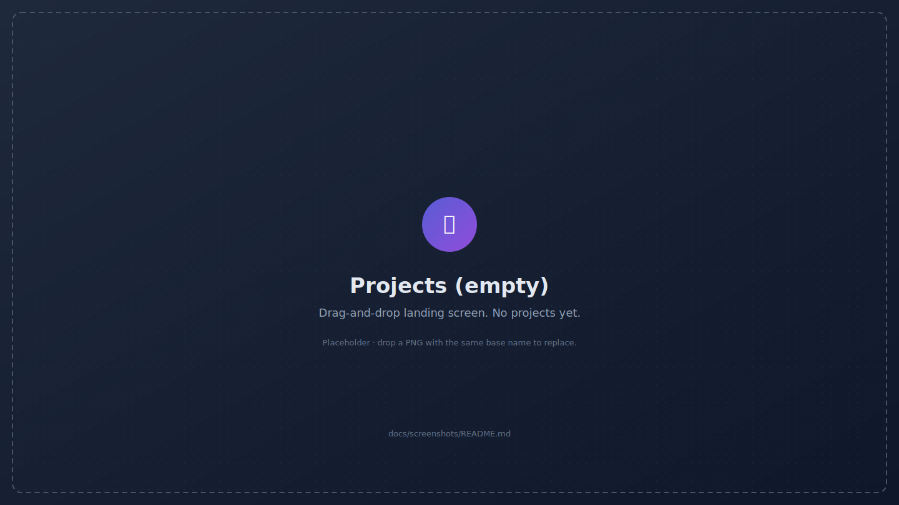

When you open `http://localhost:5173` (or your deployed URL) for the first time, you see the **Projects** screen. There's nothing here yet. Two paths to populate it:

- **Drag-and-drop** an `.epub` file onto the dropzone, or click "New project" and pick one.
- **Import bundle** if you have an `.epublate-project.zip` from another machine / browser.

The sidebar's **Library** section (Projects, Lore Books) stays visible everywhere. The Project section appears only when a project is open, and disappears as soon as you navigate back to Projects.

> The first time you create a project, the browser prompts for `navigator.storage.persist()`. Granting it tells the OS not to evict your work under storage pressure. You can revoke or re-prompt later from the **Settings** screen.

---

## Configuring an LLM endpoint

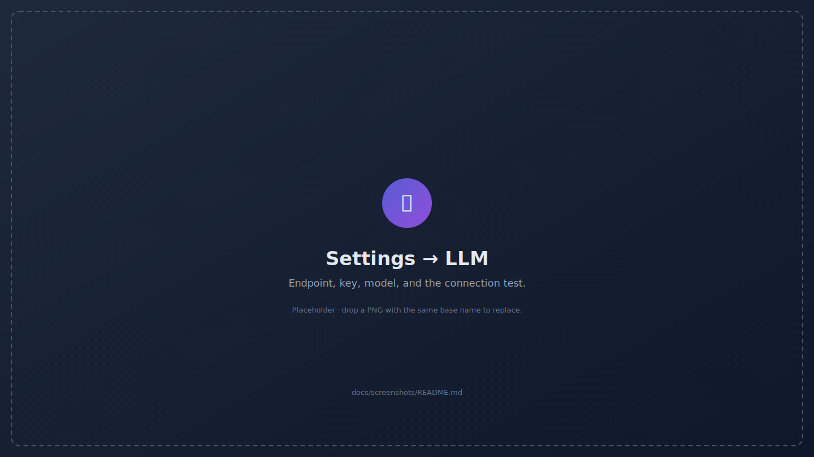

Open **Settings** from the sidebar footer. The LLM tab has four important fields:

| Field             | Purpose                                                                                              |
| ----------------- | ---------------------------------------------------------------------------------------------------- |
| Base URL          | OpenAI-compatible `/v1` URL. OpenAI / OpenRouter / Together / Groq / DeepInfra / Ollama all work.    |
| API key           | Stored in IndexedDB on this device only. Use the redact toggle to mask while sharing your screen.    |
| Translator model  | The chat completion model used for `translate` calls (e.g. `gpt-4o-mini`, `claude-3.5-sonnet`).      |
| Helper model      | A cheaper model for intake, tone sniff, and pre-pass extraction. Falls back to the translator model. |

Click **Test connection** before kicking off any work. The button performs a 1-token completion against your endpoint and prints a precise diagnosis:

- ✅ "Connection OK · `<model>` · 23 ms" — you're set.
- ⚠️ "Failed to execute 'fetch' on 'Window': Illegal invocation" — most likely a stray newline / space in your API key. Re-paste it from the source.
- ⚠️ "401 unauthorized" — wrong key, expired token, or wrong organization id.
- ⚠️ "404 model not found" — pick a different model the endpoint actually exposes.

If you don't have an LLM yet, append `?mock=1` to any URL or toggle **Mock LLM mode** in Settings. The mock provider returns deterministic placeholders so the entire UI works without network access.

---

## Creating your first project

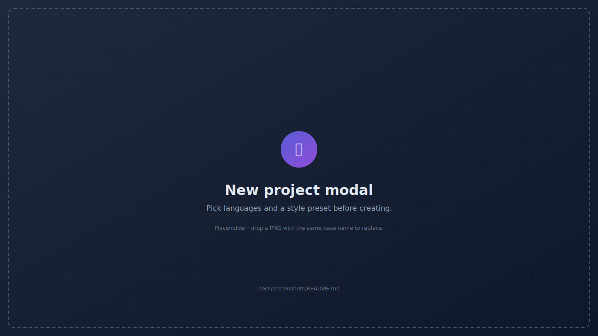

Click **New project** (or drop an `.epub` directly onto the dropzone). The modal asks for:

- **Source language** and **target language** as ISO 639-1 codes (`en`, `pt`, `ja`, `ru` …). These control the translator's prompt and the language tagging in the exported ePub's metadata.
- **Style preset** — pick from ten verbatim presets (Literary fiction, Hard sci-fi, Cozy fantasy, Romance, Military thriller, Pulp adventure, YA, Magical realism, Children's, Translation studies). Each preset has a description; the full prompt block is editable later from Project Settings or the Edit Style modal on the Dashboard.
- **Optional:** a project name override (defaults to the ePub's title) and an initial budget cap.

Submitting the modal:

1. Stores the original ePub bytes verbatim in `epublate-project-<id>` IDB.
2. Parses the ePub spine and produces one Chapter row per XHTML file.
3. Segments every chapter into translatable units; the segments table is now populated and the Dashboard surfaces real progress.
4. Runs (optionally) a one-shot **book intake** against the helper LLM that proposes glossary entries and a suggested style profile based on the first chapter.

You can skip intake by toggling it off in the modal — running it later from the Intake runs screen produces the same result.

---

## The Dashboard

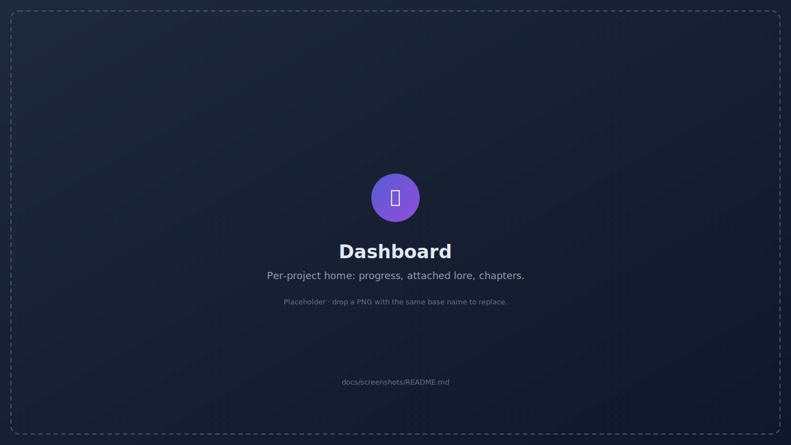

The Dashboard is the project's home page. Six things to know:

1. **Progress card** (top-left) — translated / pending / flagged segments, chapter count, lifetime LLM spend with cache rate, and the original ePub size.
2. **Style row** — current preset; the "Edit style" button opens a modal to swap presets or write a custom prose block.
3. **Helper suggestion callout** — if the helper LLM ran an intake and suggested a different tone preset, the dashboard surfaces it here with a one-click Apply.
4. **Shortcut grid** — Reader, Glossary, Inbox, Project Settings, LLM activity, Intake runs, Logs.
5. **Attached Lore Books** — Lore Books currently injected into this project's translator prompts. Detach, reorder priority, or change read-only/writable mode in place.
6. **Chapters list** — every parsed chapter with its status. The list is scrollable; click any row to jump straight into the Reader on that chapter.

Header actions:

- **Download ePub** builds a translated `.epub` from the current segment state. Disabled until at least one segment is translated.
- **Translate batch** opens the Batch modal pre-populated with the project's budget cap.

Footer actions:

- **Bundle** downloads `<name>.epublate-project.zip` — the full portable representation of the project.

---

## The Reader

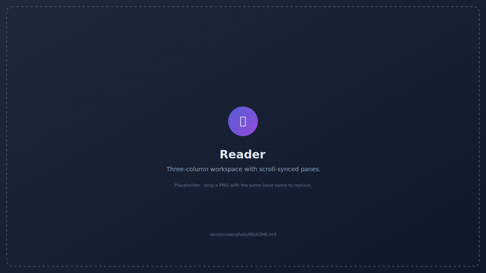

The Reader is where the per-segment work happens. Three columns:

- **Chapter sidebar (left).** Spine-order list. Click to switch chapters; the URL keeps the chapter id (`?ch=…`) so reload / back-navigation puts you back where you were.
- **Source pane (centre).** Stacked segment cards in reading order. The focused card has a coloured left border. Image-only / structurally empty segments are filtered out — they have no meaningful translation to accept.
- **Target pane (right).** Mirror of the source pane showing the current target text, "(not yet translated)", or "▸ Translating…" while a call is in flight.

### Segment-anchored scroll sync

Translated text is rarely the same length as the source, so a pixel-only mirror would drift. Instead, the Reader picks the topmost source card whose box contains the source pane's `scrollTop`, computes the fractional offset within that card, and scrolls the target pane to the same fractional offset on its matching card. The panes always stay aligned at the segment level.

### Position memory

The Reader saves the current chapter, focused segment, and source-pane scroll offset to `localStorage` keyed by project id. Leave the Reader, navigate elsewhere, come back — and you land on the same chapter, the same segment, the same scroll offset.

> Why `localStorage` and not the project DB? "Where I was last reading" is browser-local UI state, not project data. Bundles you export and re-import don't carry it, which is the right behaviour: position memory should be device-local.

### Hotkeys (Reader)

| Key       | Action                                            |
| --------- | ------------------------------------------------- |
| `j` / `↓` | Next segment                                      |
| `k` / `↑` | Previous segment                                  |
| `t`       | Translate the focused segment                     |
| `Shift+T` | Translate the entire current chapter              |
| `r`       | Re-translate the focused segment, bypassing cache |
| `a`       | Accept the focused translation                    |
| `e`       | Edit the focused translation                      |

Inputs and textareas swallow the hotkeys silently — typing "t" inside a search box doesn't translate anything.

---

## Translating chapter by chapter

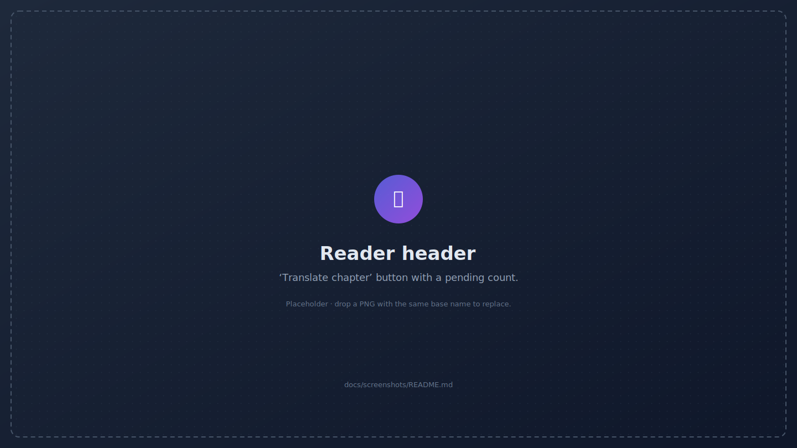

Two ways to translate one chapter at a time:

- **Press `Shift+T`** anywhere in the Reader (outside text inputs).
- **Click "Translate chapter"** in the Reader header. The button shows the count of remaining pending segments in the current chapter.

Both open the **Batch modal pre-scoped to the current chapter**. You can still tweak concurrency, budget, and bypass-cache before launching.

This is the recommended flow for the first read-through of a book — translate one chapter, skim it in the Reader, fix any glossary issues, then translate the next. The cost stays bounded and any glossary correction propagates to subsequent chapters.

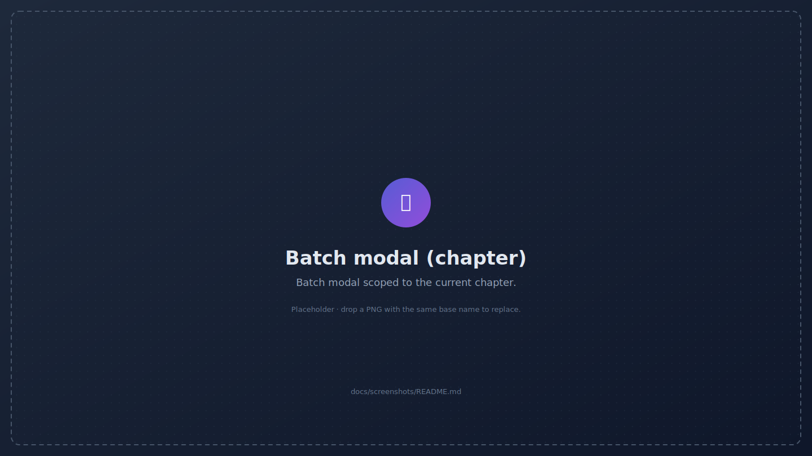

---

## Running a project-wide batch

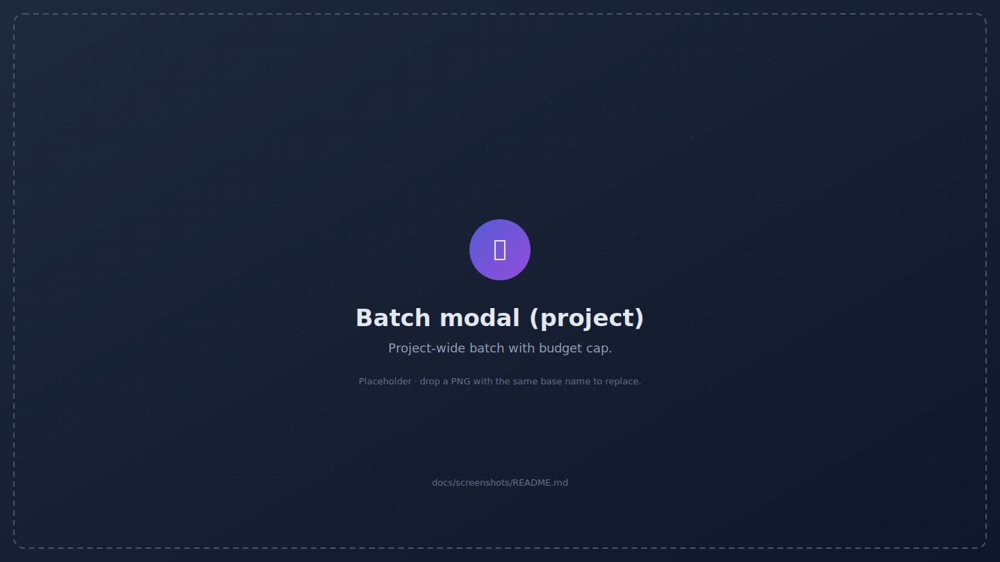

For a full project run, click **Translate batch** on the Dashboard. The modal exposes:

| Field            | What it does                                                                                          |
| ---------------- | ------------------------------------------------------------------------------------------------------ |
| Concurrency      | Parallel LLM calls. Defaults to 1; raise only if your endpoint tolerates it. Hard cap at 8.            |
| Budget cap (USD) | Stops new work once cumulative spend crosses the cap. Cache hits cost zero and never count.           |
| Bypass cache     | Re-translate every segment from scratch. Useful after style or model changes; otherwise leave off.    |
| Helper pre-pass  | Run the helper LLM once per chapter before its segments hit the translator, so the glossary is hot.   |

The batch runs in the foreground; a **persistent status bar** at the top of the app shows progress, cost, and a Cancel button. Navigate freely while it runs — close the Reader, edit the glossary, browse Lore Books — the bar stays attached. If you hit the budget cap mid-run, the bar offers Resume (raises cap, continues from where it stopped) and Open Inbox (jumps to flagged segments).

Per-segment failures are captured as `batch.segment_failed` events and don't sink the batch. Rate-limit errors pause the batch with the retry-after window surfaced in the bar's title bar.

---

## The Glossary

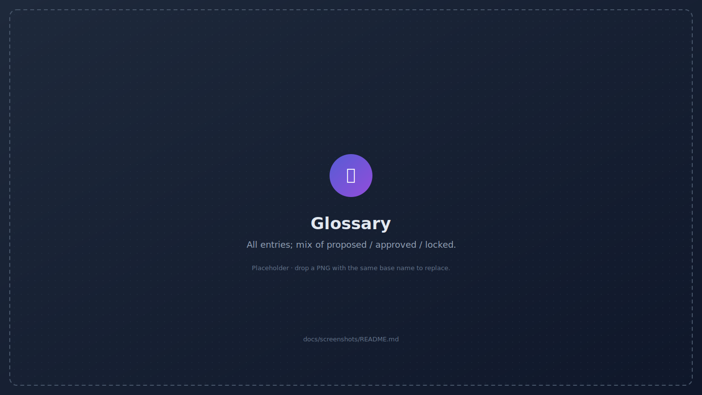

The glossary is your project's lore bible. Entries have:

- **Type** — character, place, organization, event, item, date_or_time, phrase, term.
- **Source term** — exactly as it appears in the original. Leave blank for **target-only** entries (invented terms with no source counterpart).
- **Target term** — the canonical translation. The matcher / enforcer treats this as authoritative.
- **Aliases** — alternate source spellings (e.g. "Mr Bennet" / "Mr. Bennet" / "Bennet") and alternate target spellings (e.g. for declension-rich target languages).
- **Status** — `proposed` / `approved` / `locked`. Locked entries trigger post-processor enforcement.
- **Notes** — free-form. Keep glossary rationale here so future-you knows why "Lizzy" is not a valid alias.

Where entries come from:

1. **Helper LLM intake** at project create proposes ~50 entries from the first chapter.
2. **Helper LLM pre-pass** in the batch runner proposes ~5–10 per chapter.
3. **Translator new_entities** on every successful segment translation. New characters / locations the LLM noticed during translation are auto-proposed here.
4. **Manual edits.** Press `n` to create, click any row to edit, `Del` to delete.
5. **Lore Book attachment.** Entries projected from attached Lore Books appear with a Lore Book chip.

### Cleanup duplicates

When the same entity appears as multiple proposed entries (e.g. "Anne", "Anne Elliot", "Lady Anne"), the **Cleanup duplicates** action surfaces a merge confirmation modal so you can collapse them into one entry with the union of aliases.

### Cascade re-translation

Editing a locked entry's target term marks every segment whose source matched the old form as `pending` and resets their cache key, so the next batch retranslates them with the new spelling. The Inbox shows the cascade scope before it commits.

---

## The Inbox

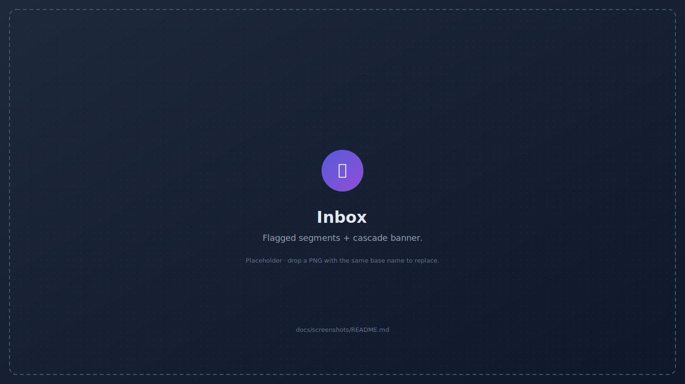

The Inbox is where work goes when something needs your attention:

- **Glossary violations** — translator emitted a term that doesn't match the locked target spelling. Click "Re-translate" or "Edit" to fix.
- **Placeholder mismatches** — translator dropped a `[[T0]]…[[/T0]]` inline marker. The validator catches this on save and flags the segment.
- **Cascade pending** — segments whose locked-term spelling changed and now need re-translation.
- **Failed batch segments** — segments where the LLM call errored. The error message and a Retry button are inline.
- **Proposed entities** — glossary entries proposed by the translator or helper LLM that haven't been approved or locked yet.

The Inbox is read-write: every action there is the same one you'd take in the Reader or Glossary, but pre-scoped to the segments / entries that need attention.

---

## Project Settings

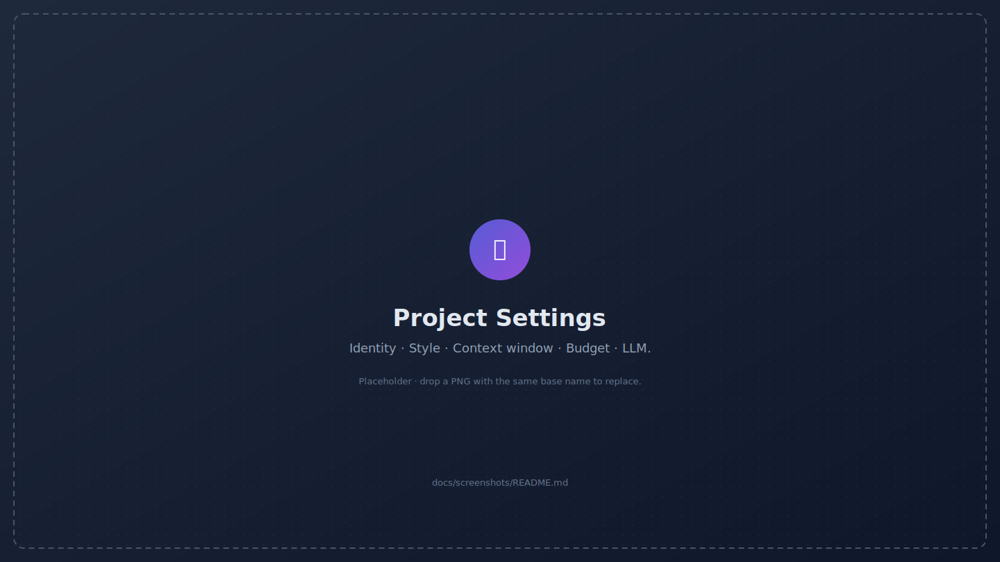

The new dedicated Project Settings screen consolidates every per-project knob in one place. Five sections:

1. **Identity** — rename the project (kept in sync with the library projection so the recents list updates immediately). Read-only metadata: source filename, project id, languages, original size.
2. **Style** — pick a preset or write a custom guide. Editing the guide invalidates the cache for this project.
3. **Context window** — *new in this release*. Inject the previous N segments of the same chapter into the translator prompt as read-only context. Big windows hold tone / pronoun / reference consistency across paragraphs but cost extra prompt tokens. Most curators land between **2 and 6 segments**. Set both `Max segments` and `Max characters` to `0` to disable context entirely.
4. **Budget** — pre-fills the Batch modal so a runaway run can't drain a wallet. Cache hits cost `$0.00` and never count.
5. **LLM overrides** — per-project replacements for the global Settings → LLM defaults (base URL, translator model, helper model, reasoning effort). Empty fields fall back to the global value. Useful when one book needs a heavier model than your default.

Save with the header button or `Ctrl/⌘+S`. Every save writes a `project.updated` event to the audit log.

---

## Lore Books

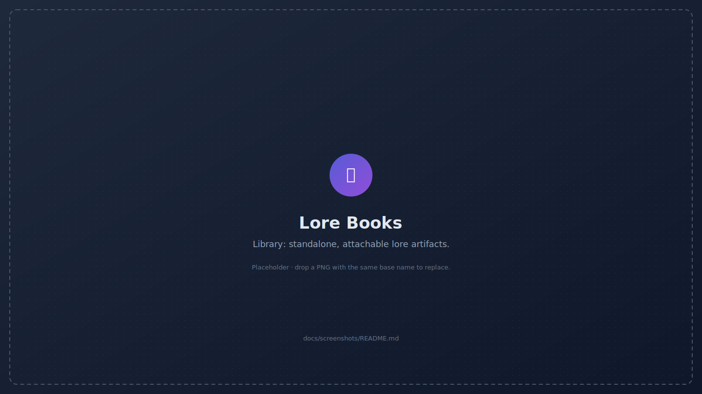

A Lore Book is a standalone bundle of glossary entries you can attach to multiple projects. Use cases:

- A series of novels with the same characters and locations.
- A genre conventions sheet (e.g. mecha names always in katakana with a romanized alias).
- A house-style sheet for your translation studio.

Click a Lore Book to enter its dashboard:

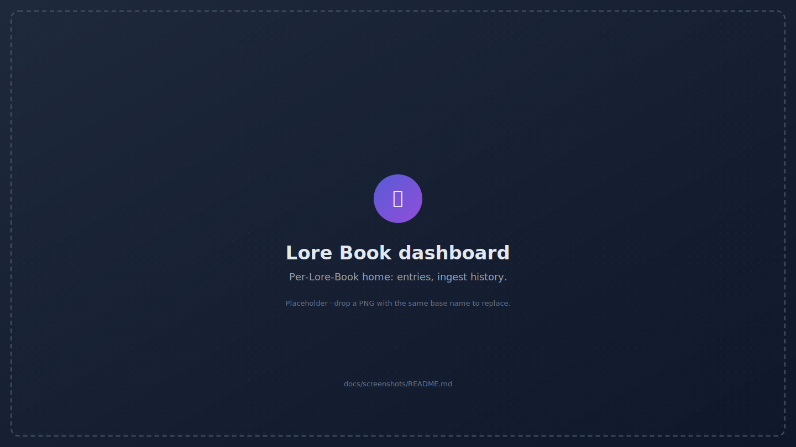

You can populate a Lore Book in three ways:

1. **Ingest from a translated ePub.** Walks through a finished bilingual or target-only ePub and proposes entries by name-matching the helper LLM against capitalised tokens.
2. **Ingest from a source ePub.** Same idea but starts from the source side; the helper LLM proposes target translations.
3. **Import from existing project.** Copy every approved or locked entry from another project's glossary.

To attach a Lore Book to a project, open the Dashboard, click **Attach** on the Attached Lore Books card, pick the book, choose **read-only** (won't grow on translator-proposed entries) or **writable** (will), and set a **priority** (higher numbers win on conflicts within the Lore Book stack — but project entries always win against any Lore Book entry).

---

## Helper LLM intake & tone sniff

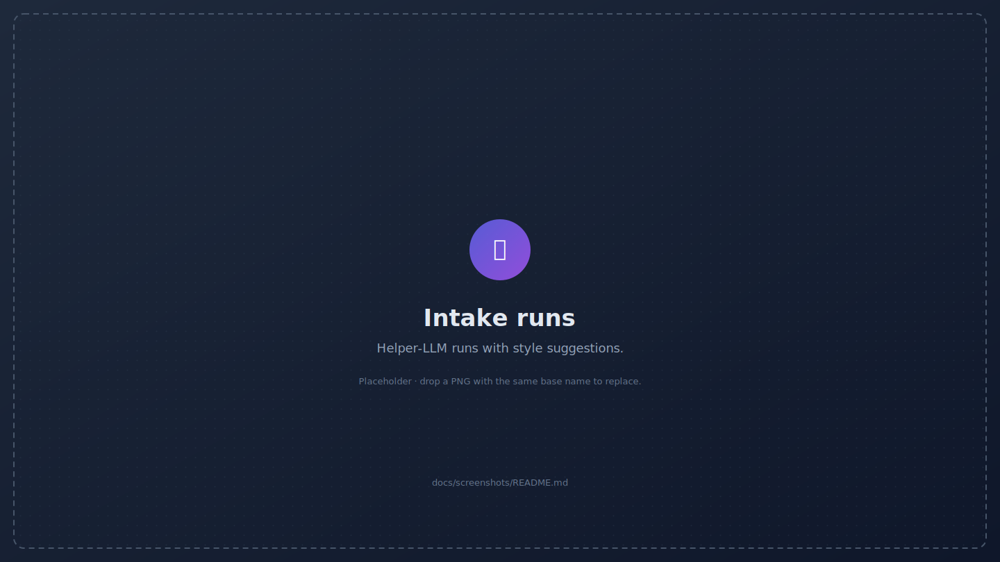

The helper LLM is the cheap second brain. It runs in two modes:

- **Book intake** (one-shot, on project create or manual re-run) — reads the first chapter, proposes glossary entries, and suggests a style profile. The Dashboard surfaces "Helper suggests: Hard sci-fi" with a one-click Apply.
- **Per-chapter pre-pass** (optional, in the batch runner) — runs once per chapter just before its segments hit the translator. Adds one helper call per chapter; in exchange, the glossary is fully populated before any translation prompt is built.

The Intake runs screen lists every run with its status, started_at, and findings. Open a run to see the proposed glossary entries and the suggested style profile.

The **tone sniffer** is a specialised intake that scores the source against the ten verbatim presets and picks the closest match. Run it from the New Project modal (it pre-selects the suggested preset) or from the Dashboard's helper-suggestion callout.

---

## Cost, caching & budgets

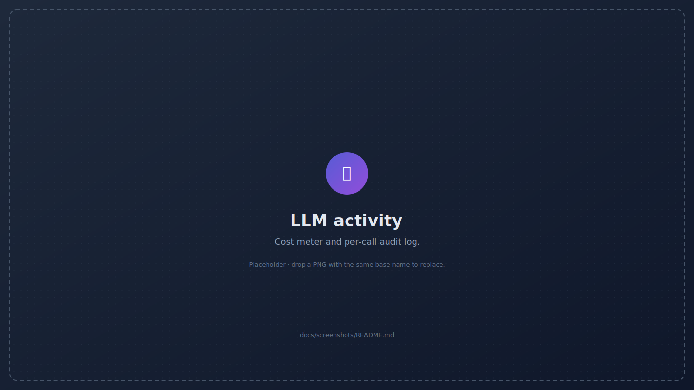

Every LLM call is audited in the `llm_calls` table:

- **purpose** — `translate`, `extract`, `extract_target`, `tone_sniff`, `review`, …
- **prompt_tokens / completion_tokens** — counted with `gpt-tokenizer` so the meter matches your invoice (within a token or two for non-OpenAI models).
- **cost_usd** — derived from the model's published pricing table or `0` for cache hits.
- **cache_hit** — `1` for cache hits, `0` otherwise.
- **cache_key** — SHA-256 of `(source, glossary state hash, style hash, model, source/target lang)`. Editing any of these inputs invalidates the cache for the affected segments without touching unrelated work.
- **request_json / response_json** — the full payload for forensics.

Cache hits cost zero and never count against the budget cap. Re-running a batch on a populated cache is free.

---

## Exporting your translated ePub

The Dashboard's **Download ePub** button builds the file:

1. Loads the original ePub bytes verbatim from the source blob.
2. Walks every chapter and replaces source segment text with target segment text where one exists. Untranslated segments fall back to the source text — the file still validates as ePub even with partial work.
3. Re-emits each chapter through the writer, which:
   - Restores the source DOCTYPE verbatim from `chapter.doctype_raw` (we capture it at load time because `XMLSerializer` drops `PUBLIC`/`SYSTEM` identifiers, especially when single-quoted).
   - Strips internal `data-epublate-*` attributes (they're not allowed by `epubcheck`).
   - Treats `<table>` / `<ul>` / `<figure>` as block-level scaffolding so the orphan-wrapper machinery doesn't scramble the DOM.
   - Preserves empty inline anchors with critical IDs (e.g. `<a id="page_v"/>`).
4. Passes every non-chapter / non-OPF entry through as raw bytes — no UTF-8 round-trip — so CSS, fonts, SVGs, and any out-of-spec text encodings stay intact.
5. Updates the OPF metadata's language tag and adds a `dc:contributor` line crediting the translator (you).

Run `epubcheck` against the downloaded file to verify externally.

---

## Project bundles & moving devices

A bundle is a single `.zip` containing the original ePub plus every Dexie row as JSON-Lines.

**To export:** Dashboard → footer → **Bundle**. Filename is `<project-name>.epublate-project.zip`.

**To import:** Projects landing page → **Import bundle** → pick the file. The bundle is unzipped, validated against the manifest's schema version, and written to a fresh project DB with a new id, so the same bundle can be imported multiple times without colliding.

> Bundles are forward-compatible: older clients refuse newer schemas with a precise error message ("bundle was exported by epublate v1.5+, this client is v1.2") instead of silently corrupting state.

Bundles do **not** carry the Reader scroll position (it lives in `localStorage`, which is correct — position memory is device-local) and they do **not** carry your LLM API key (that's library-level state; the imported project picks up your current Settings on the new device).

---

## Keyboard shortcuts

Press `?` or `F1` from any screen to open the cheat sheet:

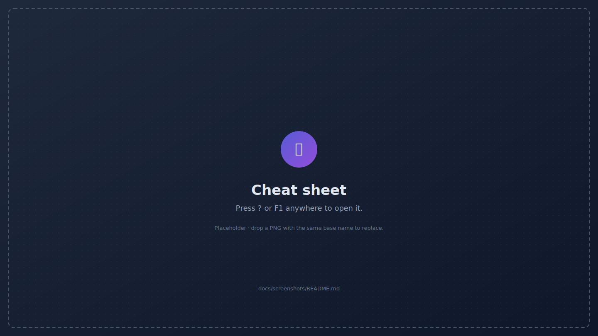

| Group       | Combo       | Action                                          |
| ----------- | ----------- | ----------------------------------------------- |
| Global      | `?` / `F1`  | Open this cheat sheet                           |
|             | `Esc`       | Close any open modal                            |
| Reader      | `j` / `↓`   | Next segment                                    |
|             | `k` / `↑`   | Previous segment                                |
|             | `t`         | Translate focused segment                       |
|             | `Shift+T`   | Translate the whole chapter                     |
|             | `a`         | Accept focused translation                      |
|             | `e`         | Edit focused translation                        |
|             | `r`         | Re-translate focused segment, bypass cache      |
| Glossary    | `/`         | Focus the search box                            |
|             | `n`         | New entry                                       |
|             | `Enter`     | Open / edit selected entry                      |
|             | `Del`       | Delete selected entry                           |
| Batch / Inbox | `b`       | Open batch modal (Dashboard)                    |
|             | `x`         | Cancel running batch                            |
|             | `i`         | Jump to project Inbox                           |
| Modals      | `Ctrl/⌘+S`  | Submit form (alternate to Enter)                |

The cheat sheet is the source of truth — if it lists a hotkey, that hotkey is wired and tested.

---

## Themes & mock mode

The sidebar footer has a compact theme picker and the mock-mode banner.

**Themes** (four built-in):

| Theme      | Vibe                                              |
| ---------- | ------------------------------------------------- |
| Slate      | Default, light + balanced contrast.               |
| Solarized  | Warm-paper light, easy for long reading sessions. |
| Midnight   | Dark, blue-shift, low fatigue at night.           |
| Ledger     | High-contrast greyscale; great for screenshots.   |

**Mock mode** — toggle in Settings or append `?mock=1` to any URL. Every LLM call goes through `MockProvider` (`src/llm/mock.ts`), which returns deterministic output and zero cost. The cache table fills, the audit log fills, the cost meter ticks at `$0.0000` — every screen behaves as if it had a real LLM. Use it for:

- Demos and screenshots (consistent output across re-runs).
- Verifying the segmentation / glossary / batch pipeline without spending tokens.
- Local development without copying API keys into a dev environment.

---

## Troubleshooting

### "Translation failed: network error" / "Failed to execute 'fetch' on 'Window'"

Almost always a malformed API key. Re-paste the key from the source — make sure there's no trailing newline or stray space. The Settings → LLM → Test connection button will print a precise diagnosis.

If the error is "Illegal invocation," it means a previous build had a `fetch.bind` regression — pull the latest. There's a regression test (`src/llm/openai_compat.test.ts`) guarding it.

### "401 unauthorized"

- Wrong API key, or the right key for the wrong organization.
- The endpoint is enforcing a `OpenAI-Organization` header — set it in the Organization field in Settings → LLM.

### "404 model not found"

The model isn't on the endpoint. Check the endpoint's documentation for the exact slug. Some endpoints (e.g. OpenRouter) require a vendor prefix like `openai/gpt-4o-mini`.

### My CORS-only Ollama endpoint fails

Ollama disables browser CORS by default. Run it with `OLLAMA_ORIGINS=*` (or a specific origin):

```bash
OLLAMA_ORIGINS=* ollama serve
```

### `epubcheck` complains about a chapter

The most common causes (all fixed in this build, kept here for diagnosis):

- **HTM-004 "Irregular DOCTYPE"** — fixed by `loader.ts` capturing the source DOCTYPE verbatim.
- **RSC-005 "Unknown attribute data-epublate-orphan"** — fixed by `writer.ts` stripping `data-epublate-*` before serialization.
- **Disappearing `<a id="page_v"/>`** anchors — fixed by `segmentation.ts` preserving inline runs that contain any element, even if their text content is only whitespace.

If `epubcheck` flags something else, please open an issue with the exact validator output and the chapter's source XHTML — the test suite (`src/formats/epub/epub.test.ts`) is the place to add a regression test.

### My batch keeps pausing

- **Budget cap reached.** Raise it in the Resume modal or the Project Settings → Budget card.
- **Rate-limit hit.** The status bar shows the retry-after window. Either wait, switch to a different model, or raise your endpoint's quota.

### Storage quota exceeded

A 100k-word novel is ~5 MB; ten of them are ~50 MB. The browser typically allots much more, but if you hit the quota, the Settings screen has a per-project size table and a delete action. Project bundles are the recommended way to archive completed work.

### Lost a curator-edited target

Every edit writes a `segment.edited` event to the audit log; nothing is irreversible. Open Logs and filter by `segment_id`.

---

## FAQ

**Does it work offline?** After the first load, yes. The PWA service worker caches the app shell. Translations need network unless you're in mock mode.

**Can I run the LLM call against my own self-hosted model?** Yes — anything OpenAI-compatible. We've tested OpenAI, OpenRouter, Together, Groq, DeepInfra, and Ollama (with `OLLAMA_ORIGINS=*`).

**Do you support reasoning models?** Yes. Project Settings → LLM overrides has a `reasoning_effort` knob (`minimal` / `low` / `medium` / `high`); it's only honoured by OpenAI o-series and compatible models, ignored elsewhere.

**Can I export the glossary?** Yes — the Glossary screen has JSON / CSV import / export buttons. The bundled JSON includes aliases and revisions; the CSV is one row per `(entry, alias_side, alias_text)`.

**Does the helper LLM ever overwrite my locked entries?** No. The matcher / enforcer treats locked entries as authoritative; the helper can only *propose*. New helper proposals are visible from the Inbox until you approve, lock, or delete them.

**Can I run two projects in two browser tabs?** Yes. Each project lives in its own IDB; the batch store is in-memory per tab so two batches in two tabs don't collide. Just keep an eye on your endpoint's rate limit.

**What if my LLM provider's pricing changes?** The cost meter uses a static price table per model. It's a *meter*, not a billing source of truth — your provider's invoice is. The numbers help you avoid runaway runs; double-check your invoice for the exact figure.

**Why TypeScript / React and not Rust / WASM?** Because the Python tool's architecture maps cleanly onto a TypeScript port — same data model, same prompts, same invariants — and a browser-first SPA is a much simpler deploy story (`npm run build` produces a static directory). The `JSZip` + `DOMParser` combination handles ePubs faster than a WASM `lxml` would in practice, and it ships in every browser.

---

## Where to go from here

- The cheat sheet (`?` from any screen) is the fastest reference for daily use.
- Architecture conventions and invariants live in [`AGENTS.md`](../AGENTS.md). Read it before changing the segmentation pipeline or the cache key shape.
- Bug reports & PRs welcome — see the contributing notes in the [README](../README.md#contributing).
