# Using epublate

A tour of the app from "I just opened it" to "I have a translated ePub on my disk." Read it linearly the first time; bookmark the section headers as a reference afterwards.

> Screenshots live in [`docs/screenshots/`](screenshots). They're captured deterministically by `tools/snap.mjs` against `?mock=1`; see the screenshot folder's [README](screenshots/README.md) for how to refresh them.
>
> If you want the developer-side counterpart (modules, data flow, cache key recipe, ePub round-trip invariants), read [**ARCHITECTURE.md**](ARCHITECTURE.md) next.
>
> **Prefer in-app help?** This doc is mirrored, in tour-card form, at the **Help & guides** route in the running SPA — open it from the sidebar footer. The in-app version always matches the build you're using and works offline once the SPA is installed; this markdown file is the longer narrative for repo readers.

## Table of contents

1. [Concepts at a glance](#concepts-at-a-glance)
2. [First run](#first-run)
3. [Configuring an LLM endpoint](#configuring-an-llm-endpoint)
4. [Creating your first project](#creating-your-first-project)
5. [The Dashboard](#the-dashboard)
6. [The Reader](#the-reader)
7. [Translating chapter by chapter](#translating-chapter-by-chapter)
8. [Running a project-wide batch](#running-a-project-wide-batch)
9. [The Glossary](#the-glossary)
10. [The Inbox](#the-inbox)
11. [Project Settings](#project-settings)
12. [Lore Books](#lore-books)
13. [Helper LLM intake & tone sniff](#helper-llm-intake--tone-sniff)
14. [Cost, caching & budgets](#cost-caching--budgets)
15. [Exporting your translated ePub](#exporting-your-translated-epub)
16. [Project bundles & moving devices](#project-bundles--moving-devices)
17. [Keyboard shortcuts](#keyboard-shortcuts)
18. [Themes & mock mode](#themes--mock-mode)
19. [The in-app Help & guides screen](#the-in-app-help--guides-screen)
20. [Troubleshooting](#troubleshooting)
21. [FAQ](#faq)

---

## Concepts at a glance

<p align="center">
  
</p>

| Term         | What it is                                                                                       |
| ------------ | ------------------------------------------------------------------------------------------------ |
| **Project**  | One ePub being translated. Lives in its own IndexedDB; deleting the project deletes that DB.     |
| **Chapter**  | A spine entry from the source ePub (one XHTML file). Has segments and a translation status.     |
| **Segment**  | A translatable text unit (paragraph-ish). The smallest cache-keyed translation unit.            |
| **Glossary** | The project's lore bible: characters, places, terms with locked target translations.             |
| **Lore Book**| Standalone, attachable bundle of glossary entries; share lore across projects.                   |
| **Style**    | A preset (or custom) prose contract embedded into the translator's system prompt.                |
| **Cache**    | SHA-256 hashed mapping from `(source, glossary state, style, model, languages)` → translation.   |

Two invariants the whole tool relies on:

1. **Round-trip identity.** Loading and saving an ePub without translating any segments produces byte-equivalent output (down to the DOCTYPE and any non-XHTML asset).
2. **Glossary as a hard contract.** A locked entry's target spelling is enforced by a post-processor — translations that don't match are flagged and surfaced in the Inbox.

---

## First run

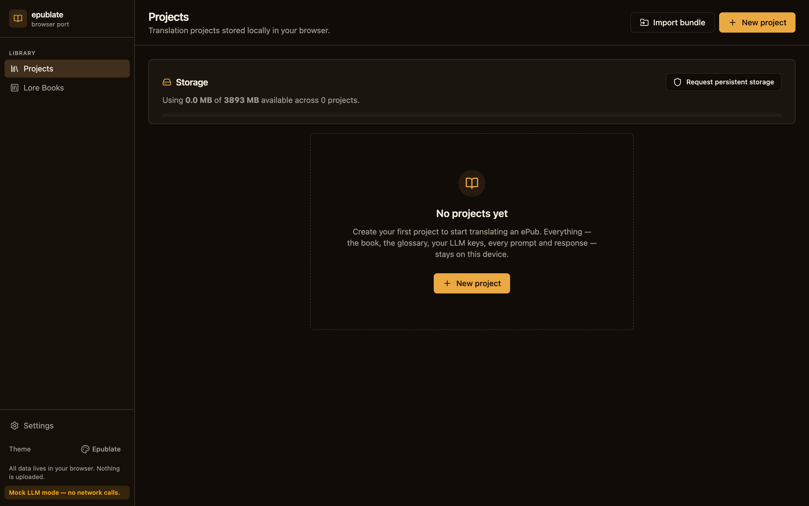

When you open `http://localhost:5173` (or your deployed URL) for the first time, you see the **Projects** screen. There's nothing here yet. Two paths to populate it:

- **Drag-and-drop** an `.epub` file onto the dropzone, or click "New project" and pick one.
- **Import bundle** if you have an `.epublate-project.zip` from another machine / browser.

The sidebar's **Library** section (Projects, Lore Books) stays visible everywhere. The Project section appears only when a project is open, and disappears as soon as you navigate back to Projects.

> The first time you create a project, the browser prompts for `navigator.storage.persist()`. Granting it tells the OS not to evict your work under storage pressure. You can revoke or re-prompt later from the **Settings** screen.

---

## Configuring an LLM endpoint

Open **Settings** from the sidebar footer.

### Install for offline use


The first card on the Settings screen lets you save the app to this device. Click **Install epublate** and your browser will offer a confirm dialog; afterwards epublate appears in your dock / Applications / Home Screen and opens in its own window without browser chrome.

Three pills tell you the status:

- **Available to install** / **Installed** / **Running as installed app** / **Browser-managed install** — the install state. The button disables in any state other than "Available to install".
- **App cached for offline use** — flips on the first time Workbox finishes precaching the shell. Until then the badge says "Caching app for offline use…" — no action required, refresh the page to confirm.
- **Online** / **Offline** — `navigator.onLine` snapshot. Editing, browsing, and cache-hit translations work in either state; new LLM/embedding calls need the online state.

If the install button stays disabled and the install pill says "Browser-managed install", your browser hasn't fired the PWA install event for this page (Safari desktop and Firefox desktop don't support it by default). You can still install via:

- **Chrome / Edge / Brave** — the install icon at the right edge of the address bar, or the three-dot menu → "Install epublate".
- **Firefox** — install the "PWAs for Firefox" extension.
- **Safari (iOS / iPadOS)** — Share → "Add to Home Screen".

The first time the service worker activates a sonner toast says "epublate is saved on this device" so you know the offline shell is ready. Subsequent builds trigger a "A new version of epublate is available — Reload now" toast on activation.

### LLM endpoint

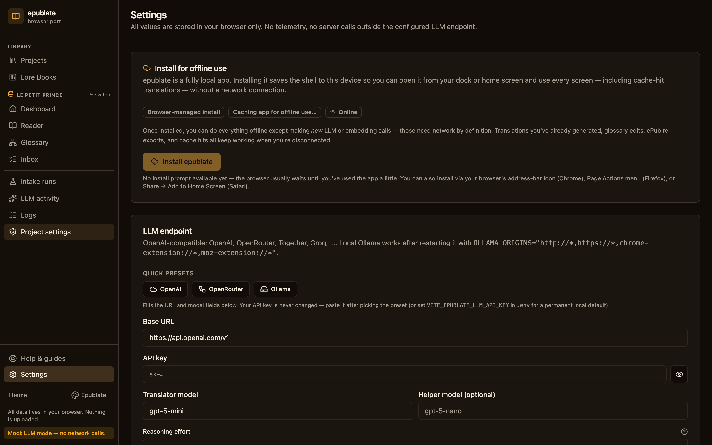

The LLM card has four important fields:

| Field             | Purpose                                                                                              |
| ----------------- | ---------------------------------------------------------------------------------------------------- |
| Base URL          | OpenAI-compatible `/v1` URL. OpenAI / OpenRouter / Together / Groq / DeepInfra / Ollama all work.    |
| API key           | Stored in IndexedDB on this device only. Use the redact toggle to mask while sharing your screen.    |
| Translator model  | The chat completion model used for `translate` calls (e.g. `gpt-4o-mini`, `claude-3.5-sonnet`).      |
| Helper model      | A cheaper model for intake, tone sniff, and pre-pass extraction. Falls back to the translator model. |

Above the fields there's a **Quick presets** row with three buttons:

- **OpenAI** — fills `https://api.openai.com/v1` + `gpt-5-mini` / `gpt-5-nano`.
- **OpenRouter** — fills `https://openrouter.ai/api/v1` + `openai/gpt-5-mini` / `openai/gpt-5-nano`. Browse other model slugs at [openrouter.ai/models](https://openrouter.ai/models).
- **Ollama** — fills `http://localhost:11434/v1` + `llama3.2`. No API key needed; remember to start Ollama with `OLLAMA_ORIGINS="http://*,https://*,chrome-extension://*,moz-extension://*"` so the SPA's origin isn't rejected.

Presets only mutate the draft fields; nothing is persisted until you click **Save**, and the API key field is intentionally left untouched. For a permanent local default — so you don't repaste your key into every fresh browser session — copy `.env.example` to `.env` and uncomment the `VITE_EPUBLATE_LLM_*` lines you care about. Those values seed the Dexie LLM row on first run only; once you click Save in Settings, your stored config owns the configuration and `.env` no longer applies. **Don't deploy a public build with `VITE_EPUBLATE_LLM_API_KEY` set — the value is baked into the JS bundle.**

Click **Test connection** before kicking off any work. The button performs a 1-token completion against your endpoint and prints a precise diagnosis:

- ✅ "Connection OK · `<model>` · 23 ms" — you're set.
- ⚠️ "Failed to execute 'fetch' on 'Window': Illegal invocation" — most likely a stray newline / space in your API key. Re-paste it from the source.
- ⚠️ "401 unauthorized" — wrong key, expired token, or wrong organization id.
- ⚠️ "404 model not found" — pick a different model the endpoint actually exposes.

If you don't have an LLM yet, append `?mock=1` to any URL or toggle **Mock LLM mode** in Settings. The mock provider returns deterministic placeholders so the entire UI works without network access.

The card also exposes two reliability knobs that mostly matter for slow models:

- **Request timeout** — how long a single chat-completion call is allowed to run before the in-flight `fetch` is aborted. Defaults to **120 s**, which is generous for cloud providers but tight for local Ollama on a CPU-only laptop running a 14 B+ thinking model. Bump this to 300–600 s if you see the new error message _"timed out after Xs while talking to … — increase Request timeout in Settings → LLM, or disable thinking on the model"_. Empty / `0` falls back to the 120 s default.
- **Reasoning effort** — pass-through to OpenAI o-series and any compatible endpoint. `minimal` / `low` / `medium` / `high` follow the official spec; **`none`** is an Ollama-compat extension that asks the endpoint to skip the thinking phase entirely (e.g. `qwen3:14b` honours it via the OpenAI-shaped `/v1/chat/completions` translator). Cloud providers that don't recognise `none` ignore the field. To turn thinking off on Ollama specifically, prefer the `think: false` switch in the Ollama options card below — it's the native, model-agnostic toggle.

### Ollama options (optional, auto-detected)


The **Ollama options** card sits right under the LLM endpoint and forwards Ollama-specific knobs (`num_ctx`, `num_predict`, sampling, Mirostat) on every chat request. Cloud providers ignore the extra body field, so leaving values set here doesn't break a mid-project swap to OpenAI / OpenRouter / Together.

When epublate detects an Ollama-shaped base URL (`:11434` or `ollama` in the host), the card opens automatically. Otherwise it folds into a muted "Show anyway" state — these knobs only matter for Ollama, and the form would be a distraction on a cloud config.

The card is structured for the two most common workflows:

- **Quick presets.** One click loads `Translation (8K context)` (recommended for most curators), `Long context (16K)` (for chapter-sized batches when your model + GPU fit it), `Deterministic` (temperature 0 + fixed seed; ideal for screenshotting or reproducing a glossary regression), or `Creative` (looser sampling for tone experiments).
- **Field-by-field tweaks.** Each input has an inline help icon with prose explaining what the knob does, the Ollama default, and the value epublate suggests. The four common-tier fields are visible by default; sampling (`top_k`, `top_p`, `seed`) and Mirostat hide behind a "Show advanced options" toggle.

The single biggest lever is `num_ctx`. Ollama's default is 2048 tokens, which is small enough that a chapter-sized prompt is silently truncated — bump this to 8192 or 16384 if your model can hold it. Memory cost roughly doubles with the window; if Ollama OOMs, drop back to 4096.

The card also exposes the **Disable thinking** tri-state (rendered as `Use model default` / `Enable` / `Disable`). Setting it to **Disable** sends `think: false` as a top-level field on the chat-completion body, which is Ollama's documented way to skip reasoning on Gemma 3 / Qwen 3 / DeepSeek-R1 / GPT-OSS and other thinking-capable models. The translation presets (Translation 8K, Long context, Deterministic) ship with `think: false` because reasoning rarely helps on a translation prompt and roughly halves wall-clock time. Set it back to `Use model default` if you ever want to compare side-by-side.

Two non-destructive escape hatches: **Reset** rewinds the form to the last saved state, and **Clear all** drops every override (so Ollama uses its built-in defaults). Neither writes anything until you click **Save**.

### Embeddings (optional, off by default)


Below the LLM card sits the **Embeddings** card. It powers four features:

- **Lore-Book retrieval.** Attach a 5,000-entry series bible without ballooning every prompt — only the entries semantically relevant to the current segment make it through.
- **`Relevant` cross-chapter context mode.** See above; requires this toggle to be on.
- **Proposed-entry hints.** Translator-proposed glossary entries (status `proposed`) are dropped from the constraints block by design — but with embeddings on, they're rendered as a separate `### Proposed terms (unvetted hints)` block when the cosine similarity is above the threshold. Hints, never contracts.
- **Inbox dedup.** A "Possible duplicate proposals" card surfaces clusters of `proposed` entries with cosine ≥ 0.92 and the same `type`, with a one-click merge.

Three providers:

| Provider        | Network                                | Storage           | Notes                                                                 |
| --------------- | --------------------------------------- | ----------------- | --------------------------------------------------------------------- |
| `none` (default)| —                                       | —                 | Embeddings disabled; everything else works as before.                |
| `openai-compat` | Curator's existing endpoint             | ~6 KB / vector    | Defaults to `text-embedding-3-small` (1536-dim). Can point at a different `base_url` if you want to embed locally and chat remotely. |
| `local`         | One-time `huggingface.co/Xenova/*` pull | ~1.5 KB / vector  | Uses `@xenova/transformers`; default model `Xenova/multilingual-e5-small` (~120 MB, 384-dim). After the first download the model is cached in your browser's Cache Storage and stays offline. The picker is greyed with a "Download required" pill until you click through the consent dialog once. |

Turning embeddings on offers an opt-in backfill: "Embed all 8,432 segments + 184 glossary entries (estimated cost: $0.04)?" — runs as a normal background batch with cancel + resume. The cost is recorded as `purpose = "embedding"` in the LLM activity ledger.

#### Switching embedding models

Vectors are model-specific — rows produced by `voyage-3.5` (1024-dim) cannot be ranked against a query from `text-embedding-3-small` (1536-dim). The retrieval primitive silently filters mismatched rows, so the practical effect of switching models is "the project's embedding work disappears until you re-embed."

epublate doesn't pretend this isn't happening:

- **Save-time warning.** Changing provider, model, or dim in either Settings → Embeddings (library default) or Project Settings → Embeddings (per-project override) pops a confirm dialog with a side-by-side diff. Click _Save anyway_ to proceed.
- **Per-project inventory card.** Project Settings now renders an **Embedding inventory** card with a histogram of `(scope, model)` rows: segments, project glossary, every attached Lore Book. Active rows light up green; rows under non-active models are flagged grey/struck-through as "stale".
- **Re-embed everything.** A one-click action that re-runs the intake-style embedding pass plus the project glossary embed under the active provider's model. Lore Books are opt-in via a checkbox because their vectors are shared across every project that has them attached.
- **Purge stale rows.** A second action that drops every project-DB row whose `model` differs from the active one. Useful once the curator is sure they won't switch back; a future re-embed re-creates them at the cost of fresh provider calls.

### Batch reliability (retry + circuit breaker)


A flaky local model or a half-open Ollama tunnel used to drag a whole batch into the Inbox one segment at a time. The **Batch reliability** card exposes a two-tier resilience layer that catches both:

- **Per-segment retry budget.** When `translateSegment` throws a transient error (`network error talking to …`, AbortError-as-timeout, JSON parse glitches), the runner retries the same segment up to **N more times** (default `2`) before recording a failure. Provider-level retries (rate-limit backoff, `Retry-After`) still happen first; this is the second line of defence above them. Cache hits, locked-glossary rejections, and validator errors are *not* retried — they are deterministic and would just burn the budget.
- **Sliding-window circuit breaker.** The runner keeps a rolling outcome ring of the last **W segments** (default `100`). If the failure count inside the window crosses **threshold T** (default `10`), the batch is paused with `pause_reason = "circuit breaker tripped: 12/100 segments failed in the recent window"` and the status bar offers a Resume action once you've fixed the underlying problem. Successful segments age out of the window naturally, so a brief network blip doesn't trip the breaker.

The defaults are calibrated for cloud LLMs ("retry the obvious; pause after 10 % sustained failure"). For local Ollama on a CPU-only host you may want to bump `Max retries per segment` to `4` and lower the window to `50` so you notice trouble earlier. Setting `Max retries` to `0` disables segment retries entirely (matching pre-resilience behaviour). Click **Restore defaults** to put every field back to the recommended values without losing other Settings changes.

Every segment retry writes a `batch.segment_retry` event and every breaker trip writes a `batch.circuit_breaker` event to the audit ledger, so you can reconstruct exactly when the runner intervened from the LLM activity screen.

---

## Creating your first project


Click **New project** (or drop an `.epub` directly onto the dropzone). The modal asks for:

- **Source language** and **target language** as ISO 639-1 codes (`en`, `pt`, `ja`, `ru` …). These control the translator's prompt and the language tagging in the exported ePub's metadata.
- **Style preset** — pick from ten verbatim presets (Literary fiction, Hard sci-fi, Cozy fantasy, Romance, Military thriller, Pulp adventure, YA, Magical realism, Children's, Translation studies). Each preset has a description; the full prompt block is editable later from Project Settings or the Edit Style modal on the Dashboard.
- **Optional:** a project name override (defaults to the ePub's title) and an initial budget cap.

Submitting the modal:

1. Stores the original ePub bytes verbatim in `epublate-project-<id>` IDB.
2. Parses the ePub spine and produces one Chapter row per XHTML file.
3. Segments every chapter into translatable units; the segments table is now populated and the Dashboard surfaces real progress.
4. Runs (optionally) a one-shot **book intake** against the helper LLM that proposes glossary entries and a suggested style profile based on the first chapter.

You can skip intake by toggling it off in the modal — running it later from the Intake runs screen produces the same result.

---

## The Dashboard

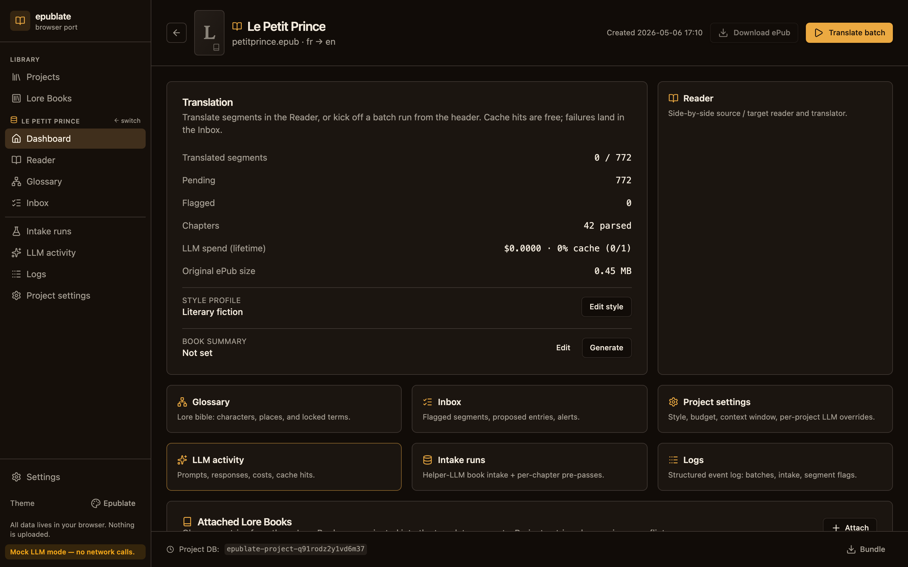

The Dashboard is the project's home page. Six things to know:

1. **Progress card** (top-left) — translated / pending / flagged segments, chapter count, lifetime LLM spend with cache rate, and the original ePub size.
2. **Style row** — current preset; the "Edit style" button opens a modal to swap presets or write a custom prose block.
3. **Helper suggestion callout** — if the helper LLM ran an intake and suggested a different tone preset, the dashboard surfaces it here with a one-click Apply.
4. **Shortcut grid** — Reader, Glossary, Inbox, Project Settings, LLM activity, Intake runs, Logs.
5. **Attached Lore Books** — Lore Books currently injected into this project's translator prompts. Detach, reorder priority, or change read-only/writable mode in place.
6. **Chapters list** — every parsed chapter with its status. The list is scrollable; click any row to jump straight into the Reader on that chapter.

Header actions:

- **Download ePub** builds a translated `.epub` from the current segment state. Disabled until at least one segment is translated.
- **Translate batch** opens the Batch modal pre-populated with the project's budget cap.

Footer actions:

- **Bundle** downloads `<name>.epublate-project.zip` — the full portable representation of the project.

---

## The Reader


The Reader is where the per-segment work happens. Three columns:

- **Chapter sidebar (left).** Spine-order list. Click to switch chapters; the URL keeps the chapter id (`?ch=…`) so reload / back-navigation puts you back where you were.
- **Source pane (centre).** Stacked segment cards in reading order. The focused card has a coloured left border. Image-only / structurally empty segments are filtered out — they have no meaningful translation to accept.
- **Target pane (right).** Mirror of the source pane showing the current target text, "(not yet translated)", or "▸ Translating…" while a call is in flight.

### Segment-anchored scroll sync

Translated text is rarely the same length as the source, so a pixel-only mirror would drift. Instead, the Reader picks the topmost source card whose box contains the source pane's `scrollTop`, computes the fractional offset within that card, and scrolls the target pane to the same fractional offset on its matching card. The panes always stay aligned at the segment level.

### Position memory

The Reader saves the current chapter, focused segment, and source-pane scroll offset to `localStorage` keyed by project id. Leave the Reader, navigate elsewhere, come back — and you land on the same chapter, the same segment, the same scroll offset.

> Why `localStorage` and not the project DB? "Where I was last reading" is browser-local UI state, not project data. Bundles you export and re-import don't carry it, which is the right behaviour: position memory should be device-local.

### Hotkeys (Reader)

| Key       | Action                                            |
| --------- | ------------------------------------------------- |
| `j` / `↓` | Next segment                                      |
| `k` / `↑` | Previous segment                                  |
| `t`       | Translate the focused segment                     |
| `Shift+T` | Translate the entire current chapter              |
| `Shift+P` | Toggle the **Prompt preview** panel for the focused segment |
| `r`       | Re-translate the focused segment, bypassing cache |
| `a`       | Accept the focused translation                    |
| `e`       | Edit the focused translation                      |

Inputs and textareas swallow the hotkeys silently — typing "t" inside a search box doesn't translate anything.

---

## Translating chapter by chapter


Two ways to translate one chapter at a time:

- **Press `Shift+T`** anywhere in the Reader (outside text inputs).
- **Click "Translate chapter"** in the Reader header. The button shows the count of remaining pending segments in the current chapter.

Both open the **Batch modal pre-scoped to the current chapter**. You can still tweak concurrency, budget, and bypass-cache before launching. The modal is identical to the project-wide one shown below — only the default scope differs.

This is the recommended flow for the first read-through of a book — translate one chapter, skim it in the Reader, fix any glossary issues, then translate the next. The cost stays bounded and any glossary correction propagates to subsequent chapters.

---

## Running a project-wide batch


For a full project run, click **Translate batch** on the Dashboard. The modal exposes:

| Field            | What it does                                                                                          |
| ---------------- | ------------------------------------------------------------------------------------------------------ |
| Concurrency      | Parallel LLM calls. Defaults to 1; raise only if your endpoint tolerates it. Hard cap at 8.            |
| Budget cap (USD) | Stops new work once cumulative spend crosses the cap. Cache hits cost zero and never count.           |
| Bypass cache     | Re-translate every segment from scratch. Useful after style or model changes; otherwise leave off.    |
| Helper pre-pass  | Run the helper LLM once per chapter before its segments hit the translator, so the glossary is hot.   |

The batch runs in the foreground; a **persistent status bar** at the top of the app shows progress, cost, and a Cancel button. Navigate freely while it runs — close the Reader, edit the glossary, browse Lore Books — the bar stays attached. If you hit the budget cap mid-run, the bar offers Resume (raises cap, continues from where it stopped) and Open Inbox (jumps to flagged segments).

Per-segment failures are captured as `batch.segment_failed` events and don't sink the batch. Rate-limit errors pause the batch with the retry-after window surfaced in the bar's title bar.

---

## The Glossary

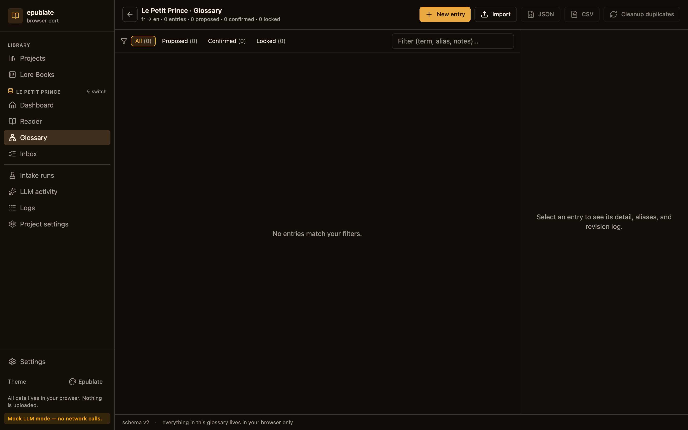

The glossary is your project's lore bible. Entries have:

- **Type** — character, place, organization, event, item, date_or_time, phrase, term.
- **Source term** — exactly as it appears in the original. Leave blank for **target-only** entries (invented terms with no source counterpart).
- **Target term** — the canonical translation. The matcher / enforcer treats this as authoritative.
- **Aliases** — alternate source spellings (e.g. "Mr Bennet" / "Mr. Bennet" / "Bennet") and alternate target spellings (e.g. for declension-rich target languages).
- **Status** — `proposed` / `approved` / `locked`. Locked entries trigger post-processor enforcement.
- **Notes** — free-form. Keep glossary rationale here so future-you knows why "Lizzy" is not a valid alias.

Where entries come from:

1. **Helper LLM intake** at project create proposes ~50 entries from the first chapter.
2. **Helper LLM pre-pass** in the batch runner proposes ~5–10 per chapter.
3. **Translator new_entities** on every successful segment translation. New characters / locations the LLM noticed during translation are auto-proposed here.
4. **Manual edits.** Press `n` to create, click any row to edit, `Del` to delete.
5. **Lore Book attachment.** Entries projected from attached Lore Books appear with a Lore Book chip.

### Cleanup duplicates

When the same entity appears as multiple proposed entries (e.g. "Anne", "Anne Elliot", "Lady Anne"), the **Cleanup duplicates** action surfaces a merge confirmation modal so you can collapse them into one entry with the union of aliases.

### Updating the target term in existing translations

Editing an entry's target term opens a follow-up dialog that asks how to handle the previously translated segments that referenced the old form. Three choices:

- **Apply rename (recommended).** Substring-replaces the old target term with the new one in every matching translation, using a Unicode-aware word boundary so "rei" can't consume "reino". Free, instant, keeps the surrounding prose untouched. Segment status is preserved — already-approved rows stay approved, just with the term fixed. Best for simple terminology swaps ("feiticeiro" → "mago").
- **Reset to pending.** Drops the existing translations and flips them back to `pending` so the next batch retranslates them under the new term. Slower and costs LLM tokens, but reshapes context that depends on the term (e.g. "wizard" → "sorcerer" when the surrounding sentence relies on the old connotation). Original target text is preserved in `segment.cascaded` events for the audit log.
- **Skip.** Update the glossary only; leave the translations alone. Useful when the change is cosmetic (notes, gender) and shouldn't propagate.

The dialog appears for any status (proposed / confirmed / locked) when the rename would actually affect a translated segment — proposed terms that leaked into a translation can be renamed in place at zero cost.

---

## The Inbox

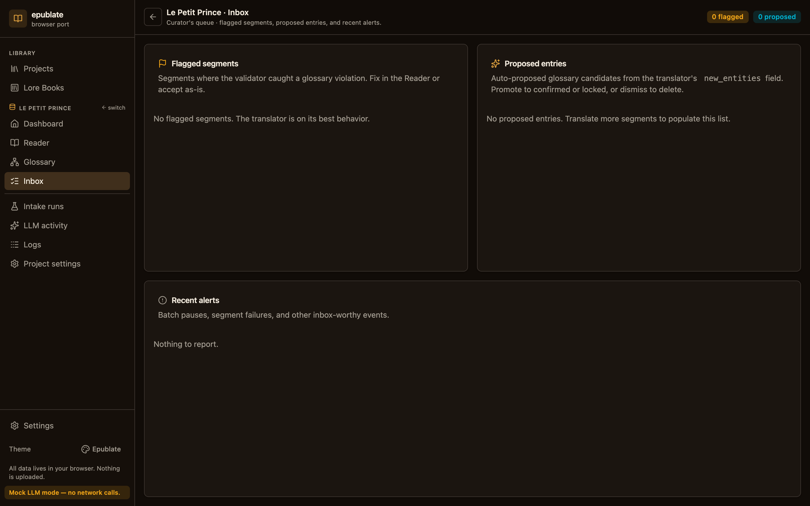

The Inbox is where work goes when something needs your attention:

- **Glossary violations** — translator emitted a term that doesn't match the locked target spelling. Click "Re-translate" or "Edit" to fix.
- **Placeholder mismatches** — translator dropped a `[[T0]]…[[/T0]]` inline marker. The validator catches this on save and flags the segment.
- **Cascade pending** — segments whose locked-term spelling changed and now need re-translation.
- **Failed batch segments** — segments where the LLM call errored. The error message and a Retry button are inline.
- **Proposed entities** — glossary entries proposed by the translator or helper LLM that haven't been approved or locked yet.

The Inbox is read-write: every action there is the same one you'd take in the Reader or Glossary, but pre-scoped to the segments / entries that need attention.

---

## Project Settings


The new dedicated Project Settings screen consolidates every per-project knob in one place. Five sections:

1. **Identity** — rename the project (kept in sync with the library projection so the recents list updates immediately). Read-only metadata: source filename, project id, languages, original size.
2. **Style** — pick a preset or write a custom guide. Editing the guide invalidates the cache for this project.
3. **Context window** — Inject the previous N segments of the same chapter into the translator prompt as read-only context. Big windows hold tone / pronoun / reference consistency across paragraphs but cost extra prompt tokens. Most curators land between **2 and 6 segments**. Set both `Max segments` and `Max characters` to `0` to disable context entirely.
   - **Modes.** `Off`, `Previous` (default), `Dialogue`, **`Relevant`** (cross-chapter top-K by cosine similarity — requires an embedding provider).
   - When **Relevant** is selected, a sub-control for **Minimum cosine similarity** (default `0.65`) appears alongside `Max segments`. The pipeline embeds the current segment, ranks every previously translated/approved segment in the project against it, drops anything below the threshold, and feeds the top-K survivors to the translator in the same shape as `Previous` mode. See the screenshot below.

   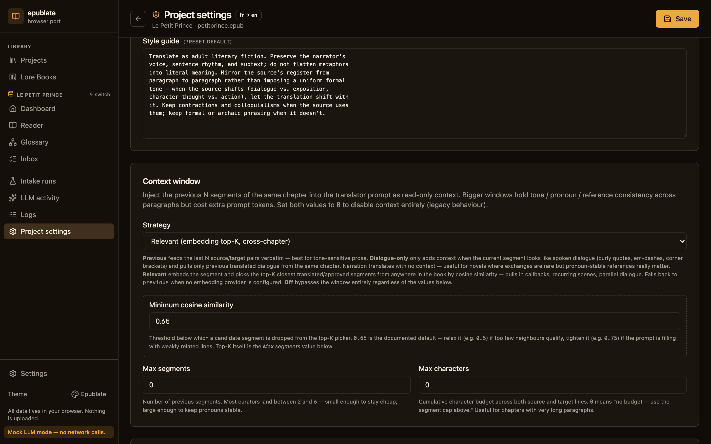
4. **Budget** — pre-fills the Batch modal so a runaway run can't drain a wallet. Cache hits cost `$0.00` and never count.
5. **LLM overrides** — per-project replacements for the global Settings → LLM defaults (base URL, translator model, helper model, reasoning effort). Empty fields fall back to the global value. Useful when one book needs a heavier model than your default.
6. **Embeddings (project override)** — opt this project into a different embedding provider than the global default. Same fields as Settings → Embeddings (provider, model, batch size, custom price). Leaving everything blank inherits the global config.
7. **Embedding inventory** — live histogram of which model produced each vector in the project (segments, project glossary, attached Lore Books). Lights stale rows up grey when the active model has drifted from what's on disk, and provides one-click _Re-embed everything_ + _Purge stale rows_ buttons. See the [Switching embedding models](#switching-embedding-models) section above for the full flow.

Save with the header button or `Ctrl/⌘+S`. Every save writes a `project.updated` event to the audit log. Changing the embedding override (provider, model, or dim) prompts a confirm dialog explaining what becomes stale.

---

## Configurable prompts, summaries, and the Prompt simulator

Project Settings exposes four adjacent cards that together let curators look inside — and tune — the exact prompt the translator LLM sees.

### Prompt options

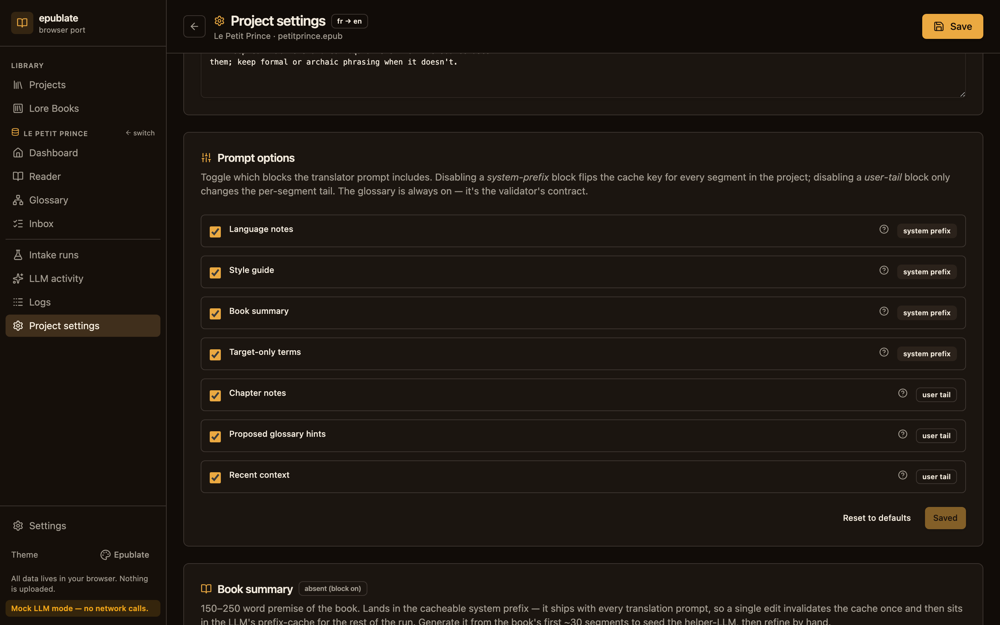

Each translation prompt is built from a fixed set of blocks. Toggle them off to make the prompt smaller (and cheaper); toggle them on to give the translator more context. The system-prefix blocks (language notes, style guide, book summary, target-only terms) are part of the cacheable prefix — flipping one invalidates the cache for this project once and then reuses the new prefix for every subsequent segment. The user-tail blocks (chapter notes, proposed-term hints, recent context) only invalidate the segments they actually touch.

### Book summary

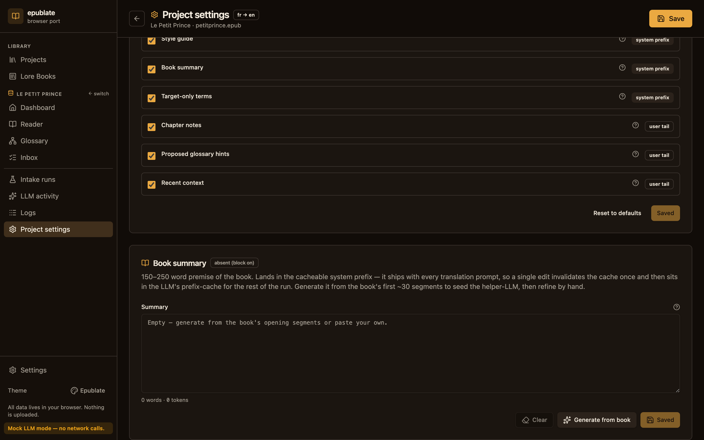

A 200–400 word premise of the book that lands in the cacheable system prefix. Two ways to populate it:

- **Generate from book.** Calls the helper LLM over the book's first ~30 segments and pastes the result into the textarea. Editable afterwards.
- **Hand-write.** Type whatever you want; click **Save** to persist.

The textarea shows a live token count so curators can keep the recurring prefix size honest. **Clear** drops the summary entirely (the prompt block disappears even when the *Book summary* toggle in **Prompt options** is on). Every helper-LLM run leaves an `intake_run` row in **Intake runs**.

### Chapter summaries

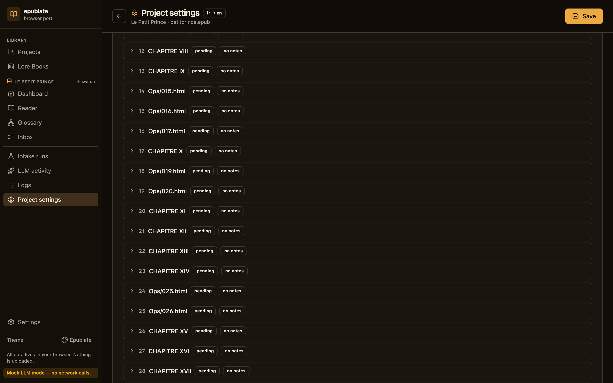

A 50–120 word recap per chapter. Stored alongside the chapter notes (same column — typing into the per-chapter textarea is equivalent to editing the **Notes** dialog in the Reader). Bulk actions:

- **Generate missing** — runs the helper LLM only over chapters whose recap is currently empty.
- **Regenerate all** — wipes every recap and starts fresh. Confirmation dialog because this is destructive for hand-edits.

You can also trigger a per-chapter generate from inside the Reader's **Notes** dialog — the helper LLM writes back into the same field, the audit ledger gets the same `intake_run`, and the Reader's chapter-notes pip lights up immediately.

### Prompt simulator

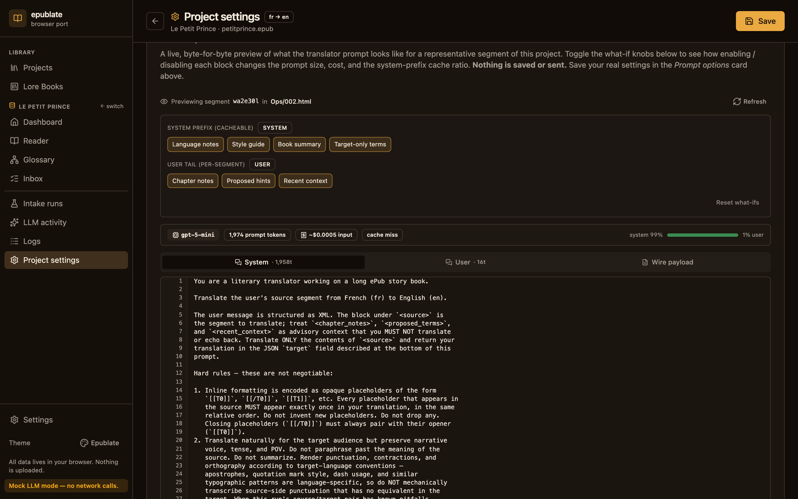

The simulator picks the first non-empty segment of the project as a pivot and shows the **exact** translator prompt that would be posted for it. It re-runs the same code paths as the live pipeline (`previewSegmentPrompt`), so the wire payload tab is byte-equivalent to what `translateSegment` would send.

Three tabs:

- **System** — the cacheable prefix (XML-tagged blocks).
- **User** — the per-segment tail (chapter notes, proposed hints, context, source).
- **Wire payload** — the JSON body that hits the LLM endpoint.

The **what-if** chips above the tabs override the persisted **Prompt options** for preview only — flip a toggle to see how a block change moves the meters. Resetting reverts to the persisted state. **Nothing is saved or sent.**

The same panel is one keystroke away in the Reader: focus a segment, press **`Shift+P`** (or click **Preview prompt** in the header).

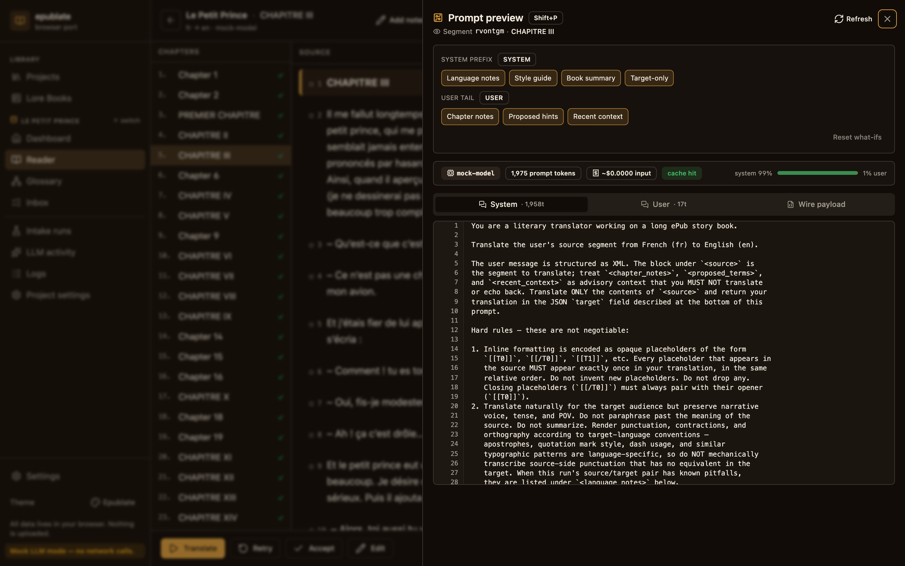

---

## Lore Books

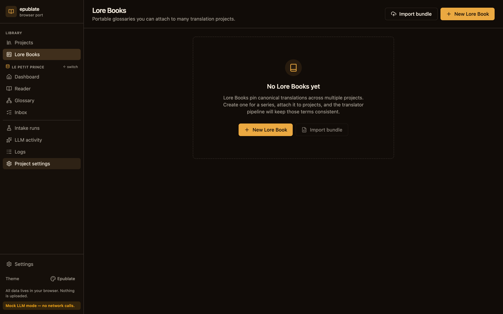

A Lore Book is a standalone bundle of glossary entries you can attach to multiple projects. Use cases:

- A series of novels with the same characters and locations.
- A genre conventions sheet (e.g. mecha names always in katakana with a romanized alias).
- A house-style sheet for your translation studio.

Click a Lore Book to enter its dashboard. The Lore Book dashboard surfaces the entry count, the list of source ePubs that have been ingested, the ingest history, and the projects this Lore Book is currently attached to.

You can populate a Lore Book in three ways:

1. **Ingest from a translated ePub.** Walks through a finished bilingual or target-only ePub and proposes entries by name-matching the helper LLM against capitalised tokens.
2. **Ingest from a source ePub.** Same idea but starts from the source side; the helper LLM proposes target translations.
3. **Import from existing project.** Copy every approved or locked entry from another project's glossary.

To attach a Lore Book to a project, open the Dashboard, click **Attach** on the Attached Lore Books card, pick the book, choose **read-only** (won't grow on translator-proposed entries) or **writable** (will), and set a **priority** (higher numbers win on conflicts within the Lore Book stack — but project entries always win against any Lore Book entry).

---

## Helper LLM intake & tone sniff

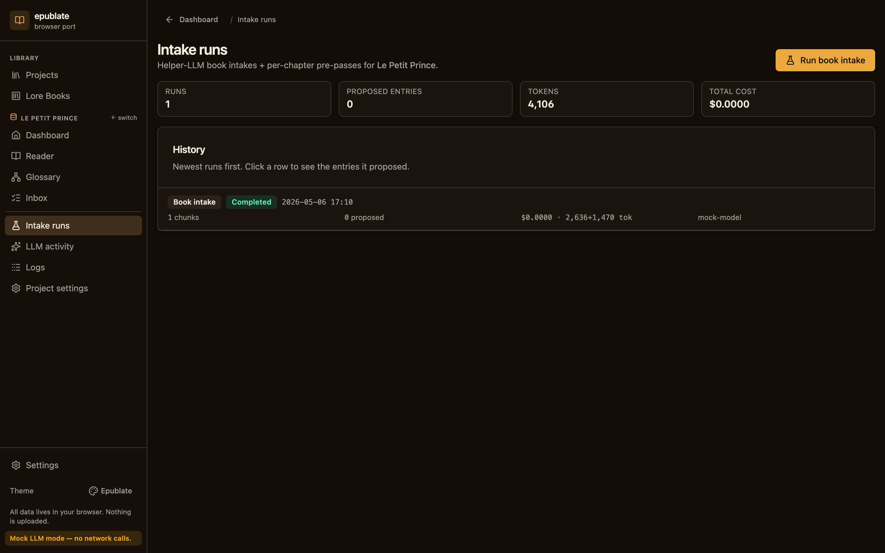

The helper LLM is the cheap second brain. It runs in two modes:

- **Book intake** (one-shot, on project create or manual re-run) — reads the first chapter, proposes glossary entries, and suggests a style profile. The Dashboard surfaces "Helper suggests: Hard sci-fi" with a one-click Apply.
- **Per-chapter pre-pass** (optional, in the batch runner) — runs once per chapter just before its segments hit the translator. Adds one helper call per chapter; in exchange, the glossary is fully populated before any translation prompt is built.

The Intake runs screen lists every run with its status, started_at, and findings. Open a run to see the proposed glossary entries and the suggested style profile.

The **tone sniffer** is a specialised intake that scores the source against the ten verbatim presets and picks the closest match. Run it from the New Project modal (it pre-selects the suggested preset) or from the Dashboard's helper-suggestion callout.

---

## Cost, caching & budgets


Every LLM call is audited in the `llm_calls` table:

- **purpose** — `translate`, `extract`, `extract_target`, `tone_sniff`, `review`, …
- **prompt_tokens / completion_tokens** — counted with `gpt-tokenizer` so the meter matches your invoice (within a token or two for non-OpenAI models).
- **cost_usd** — derived from the model's published pricing table or `0` for cache hits.
- **cache_hit** — `1` for cache hits, `0` otherwise.
- **cache_key** — SHA-256 of `(source, glossary state hash, style hash, model, source/target lang)`. Editing any of these inputs invalidates the cache for the affected segments without touching unrelated work.
- **request_json / response_json** — the full payload for forensics.

Cache hits cost zero and never count against the budget cap. Re-running a batch on a populated cache is free.

---

## Exporting your translated ePub

The Dashboard's **Download ePub** button builds the file:

1. Loads the original ePub bytes verbatim from the source blob.
2. Walks every chapter and replaces source segment text with target segment text where one exists. Untranslated segments fall back to the source text — the file still validates as ePub even with partial work.
3. Re-emits each chapter through the writer, which:
   - Restores the source DOCTYPE verbatim from `chapter.doctype_raw` (we capture it at load time because `XMLSerializer` drops `PUBLIC`/`SYSTEM` identifiers, especially when single-quoted).
   - Strips internal `data-epublate-*` attributes (they're not allowed by `epubcheck`).
   - Treats `<table>` / `<ul>` / `<figure>` as block-level scaffolding so the orphan-wrapper machinery doesn't scramble the DOM.
   - Preserves empty inline anchors with critical IDs (e.g. `<a id="page_v"/>`).
4. Passes every non-chapter / non-OPF entry through as raw bytes — no UTF-8 round-trip — so CSS, fonts, SVGs, and any out-of-spec text encodings stay intact.
5. Updates the OPF metadata's language tag and adds a `dc:contributor` line crediting the translator (you).

Run `epubcheck` against the downloaded file to verify externally.

---

## Project bundles & moving devices

A bundle is a single `.zip` containing the original ePub plus every Dexie row as JSON-Lines.

**To export:** Dashboard → footer → **Bundle**. Filename is `<project-name>.epublate-project.zip`.

**To import:** Projects landing page → **Import bundle** → pick the file. The bundle is unzipped, validated against the manifest's schema version, and written to a fresh project DB with a new id, so the same bundle can be imported multiple times without colliding.

> Bundles are forward-compatible: older clients refuse newer schemas with a precise error message ("bundle was exported by epublate v1.5+, this client is v1.2") instead of silently corrupting state.

Bundles do **not** carry the Reader scroll position (it lives in `localStorage`, which is correct — position memory is device-local) and they do **not** carry your LLM API key (that's library-level state; the imported project picks up your current Settings on the new device).

---

## Keyboard shortcuts

Press `?` or `F1` from any screen to open the cheat sheet:

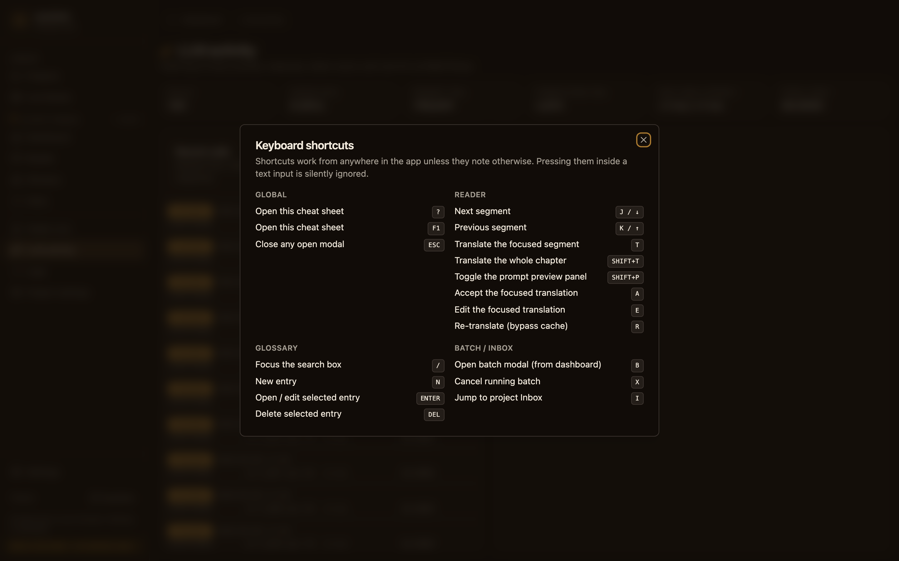

| Group       | Combo       | Action                                          |
| ----------- | ----------- | ----------------------------------------------- |
| Global      | `?` / `F1`  | Open this cheat sheet                           |
|             | `Esc`       | Close any open modal                            |
| Reader      | `j` / `↓`   | Next segment                                    |
|             | `k` / `↑`   | Previous segment                                |
|             | `t`         | Translate focused segment                       |
|             | `Shift+T`   | Translate the whole chapter                     |
|             | `Shift+P`   | Toggle the **Prompt preview** panel             |
|             | `a`         | Accept focused translation                      |
|             | `e`         | Edit focused translation                        |
|             | `r`         | Re-translate focused segment, bypass cache      |
| Glossary    | `/`         | Focus the search box                            |
|             | `n`         | New entry                                       |
|             | `Enter`     | Open / edit selected entry                      |
|             | `Del`       | Delete selected entry                           |
| Batch / Inbox | `b`       | Open batch modal (Dashboard)                    |
|             | `x`         | Cancel running batch                            |
|             | `i`         | Jump to project Inbox                           |
| Modals      | `Ctrl/⌘+S`  | Submit form (alternate to Enter)                |

The cheat sheet is the source of truth — if it lists a hotkey, that hotkey is wired and tested.

---

## Themes & mock mode

The sidebar footer has a compact theme picker and the mock-mode banner.

**Themes** (four built-in):

| Theme      | Vibe                                              |
| ---------- | ------------------------------------------------- |
| Slate      | Default, light + balanced contrast.               |
| Solarized  | Warm-paper light, easy for long reading sessions. |
| Midnight   | Dark, blue-shift, low fatigue at night.           |
| Ledger     | High-contrast greyscale; great for screenshots.   |

**Mock mode** — toggle in Settings or append `?mock=1` to any URL. Every LLM call goes through `MockProvider` (`src/llm/mock.ts`), which returns deterministic output and zero cost. The cache table fills, the audit log fills, the cost meter ticks at `$0.0000` — every screen behaves as if it had a real LLM. Use it for:

- Demos and screenshots (consistent output across re-runs).
- Verifying the segmentation / glossary / batch pipeline without spending tokens.
- Local development without copying API keys into a dev environment.

---

## The in-app Help & guides screen

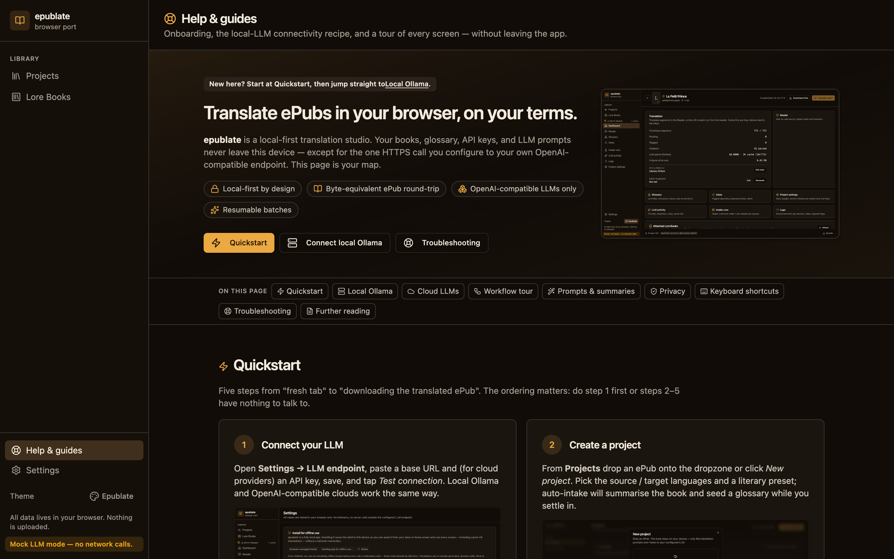

Open **Help & guides** from the sidebar footer (or jump to `/help`). It's a single, scrollable tour that mirrors this doc's most-needed sections without you having to leave the SPA — handy when you're showing someone the app for the first time, or troubleshooting connectivity from a deployed build that can't reach this markdown file offline.

The page is anchored — every section has a stable `id` so deep links keep working forever:

| Section                | Anchor                  | Why you'd jump here                                                          |
| ---------------------- | ----------------------- | ---------------------------------------------------------------------------- |
| Quickstart             | `#quickstart`           | Five-step starter card grid: connect → import → tune → translate → export.   |
| Local Ollama           | `#local-llm`            | Install, the multi-scheme `OLLAMA_ORIGINS` recipe, paste-into-settings, plus the LNA story for HTTPS deploys hitting `http://localhost`. |
| Cloud LLMs             | `#cloud-llm`            | Provider-by-provider table (OpenAI, OpenRouter, Together, Groq, DeepInfra) with copy-ready base URLs. |
| Workflow tour          | `#workflow`             | Visual walkthrough of Projects, Dashboard, Reader, Prompt preview, Glossary, Inbox, LLM activity. |
| Prompts & summaries    | `#prompts`              | What the prompt-options checkboxes do, what the simulator shows, what changes when you toggle book / chapter summaries. |
| Privacy                | `#privacy`              | Two side-by-side lists: what stays on this device, what crosses the wire.    |
| Keyboard shortcuts     | `#keyboard`             | Snapshot of the cheat sheet (live version is one keystroke away with `?` / F1). |
| Troubleshooting        | `#troubleshooting`      | Collapsible answers for the five most-asked snags.                           |
| Further reading        | `#further-reading`      | Links to README, ARCHITECTURE, USAGE on GitHub for the longer narrative.     |

The Local Ollama section is the most-frequented stop — it's the rough edge most curators hit first, especially on HTTPS deploys.

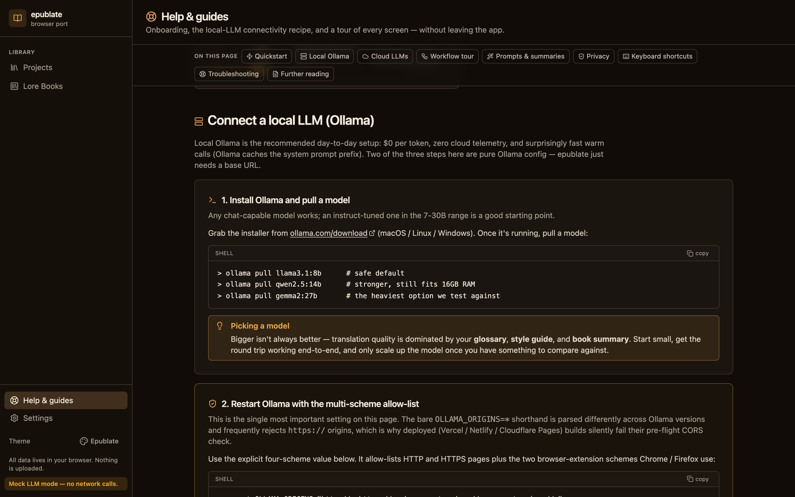

Three things make it actionable:

- The exact `export OLLAMA_ORIGINS="http://*,https://*,chrome-extension://*,moz-extension://*"` value is pre-formatted in a copy-button code block, so you can re-paste it without retyping the four schemes.
- The `launchctl` recipe for macOS users running Ollama as a launchd service is right next to the bare-shell version.
- The HTTPS-deploy ↔ `http://localhost` panel walks through Local Network Access (LNA) in step-by-step form — what to click in `chrome://settings/content`, what flag to disable in `chrome://flags` only as a last resort, and the three working tunnel commands (Tailscale, Cloudflare, ngrok) when you'd rather make Ollama HTTPS once and forget.

The Help page never makes a network call — it's pure rendered Markdown-flavoured TSX. Refreshing it offline (after the SPA is installed via Workbox) works exactly the same as when you're online.

> **Adding to the Help page.** When you change a screen the help page references, refresh the screenshot via `node tools/snap-help.mjs` and update the relevant section in `src/routes/HelpRoute.tsx`. The Help route deliberately reuses `docs/screenshots/` (not a copy in `public/`) so the doc-set rule keeps both surfaces honest.

---

## Troubleshooting

### "Translation failed: network error" / "Failed to execute 'fetch' on 'Window'"

Almost always a malformed API key. Re-paste the key from the source — make sure there's no trailing newline or stray space. The Settings → LLM → Test connection button will print a precise diagnosis.

If the error is "Illegal invocation," it means a previous build had a `fetch.bind` regression — pull the latest. There's a regression test (`src/llm/openai_compat.test.ts`) guarding it.

### "401 unauthorized"

- Wrong API key, or the right key for the wrong organization.
- The endpoint is enforcing a `OpenAI-Organization` header — set it in the Organization field in Settings → LLM.

### "404 model not found"

The model isn't on the endpoint. Check the endpoint's documentation for the exact slug. Some endpoints (e.g. OpenRouter) require a vendor prefix like `openai/gpt-4o-mini`.

### My CORS-only Ollama endpoint fails

Ollama disables browser CORS by default. Run it with the explicit multi-scheme allow-list — `OLLAMA_ORIGINS=*` is the form most blog posts recommend, but several Ollama releases (notably the macOS desktop app's bundled server) parse it as exact-string match against `*` and reject browser requests whose `Origin` header is anything else (e.g. an `https://*.vercel.app` deploy). The explicit list below is portable across Ollama versions and is what curators have reported as actually unblocking HTTPS deploys:

```bash
export OLLAMA_ORIGINS="http://*,https://*,chrome-extension://*,moz-extension://*"
ollama serve
```

If you launched Ollama via `launchctl` (the default on macOS via the Ollama desktop app) the env var must be set on the daemon, not your shell:

```bash
launchctl setenv OLLAMA_ORIGINS "http://*,https://*,chrome-extension://*,moz-extension://*"
launchctl kickstart -k user/$UID/com.ollama.ollama
```

Verify it's actually being honoured (replace the origin with whatever the SPA is served from):

```bash
curl -i \
  -H 'Origin: https://your-deployment.example.app' \
  http://127.0.0.1:11434/v1/models
# response must include `Access-Control-Allow-Origin`
```

### My HTTPS deploy can't reach `http://localhost:11434`

This is the one that bites the hardest after a `vercel deploy`. The error toast you'll see is "Failed to fetch (the browser blocked the HTTPS page at https://… from calling the plaintext loopback URL http://localhost:11434/…)". It's **not** a bug in epublatejs — there are *two* gates the request has to clear and a fresh deploy fails both:

1. **Browser side** — Chrome 142+ enforces **Local Network Access (LNA)**: an HTTPS page calling `http://localhost:…` is blocked as mixed content unless the fetch is annotated with `targetAddressSpace: "loopback"` *and* the user has granted the LNA permission for that origin. epublatejs already passes the annotation on every fetch to a loopback / RFC1918 endpoint (see [`src/llm/private_network.ts`](../src/llm/private_network.ts)), so Chrome *will* prompt you the first time you press **Test connection**.
2. **Ollama side** — Ollama's CORS layer must allow your `https://*.vercel.app` origin. The bare `OLLAMA_ORIGINS=*` shorthand parses inconsistently across Ollama releases and often skips https:// origins, which is why curators report Vercel deploys still failing even after they "set OLLAMA_ORIGINS". Use the explicit multi-scheme allow-list instead.

After deploying the SPA, walk through these in order:

0. **Restart Ollama with the multi-scheme allow-list** so its CORS layer accepts `https://` origins (this is the step the wildcard shorthand often misses):

   ```bash
   export OLLAMA_ORIGINS="http://*,https://*,chrome-extension://*,moz-extension://*"
   ollama serve
   ```

   On macOS via the Ollama desktop app, set it on the daemon and bounce:

   ```bash
   launchctl setenv OLLAMA_ORIGINS "http://*,https://*,chrome-extension://*,moz-extension://*"
   launchctl kickstart -k user/$UID/com.ollama.ollama
   ```

1. **Click Allow on Chrome's "Local Network Access" prompt.** It only appears once per origin and persists. If you accidentally dismissed it, re-grant it at `chrome://settings/content` (look for *"Local Network Access"* / *"Loopback Network"* — the section name was split in Chrome 145).
2. **Run the SPA over HTTP locally.** `npm run dev` (Vite, port 5173) or `npm run preview` (port 4173) is loopback→loopback over HTTP — Chrome treats it as a Secure Context, no LNA prompt, no mixed content. This is the friction-free path for solo curating.
3. **Put Ollama behind HTTPS** and paste the new URL into Settings → LLM endpoint:
   ```bash
   # Tailscale (recommended — no extra cert work):
   tailscale serve --https=11434 http://127.0.0.1:11434

   # Cloudflare Tunnel:
   cloudflared tunnel --url http://localhost:11434

   # ngrok:
   ngrok http 11434
   ```
4. **Disable LNA wholesale via chrome://flags** for dev work — visit `chrome://flags`, search for *"Local Network Access"*, set the flag to *Disabled*, and restart Chrome. The legacy command-line flag `--disable-features=BlockInsecurePrivateNetworkRequests` is a no-op in Chrome 142+ — it targeted the deprecated Private Network Access (PNA) system that LNA replaced.

The Settings → LLM endpoint card surfaces an inline LNA warning under the Base URL field whenever it detects this configuration, before you press **Test connection**, so a fresh deploy never traps you in the "Failed to fetch" loop without recourse.

### `epubcheck` complains about a chapter

The most common causes (all fixed in this build, kept here for diagnosis):

- **HTM-004 "Irregular DOCTYPE"** — fixed by `loader.ts` capturing the source DOCTYPE verbatim.
- **RSC-005 "Unknown attribute data-epublate-orphan"** — fixed by `writer.ts` stripping `data-epublate-*` before serialization.
- **Disappearing `<a id="page_v"/>`** anchors — fixed by `segmentation.ts` preserving inline runs that contain any element, even if their text content is only whitespace.

If `epubcheck` flags something else, please open an issue with the exact validator output and the chapter's source XHTML — the test suite (`src/formats/epub/epub.test.ts`) is the place to add a regression test.

### My batch keeps pausing

- **Budget cap reached.** Raise it in the Resume modal or the Project Settings → Budget card.
- **Rate-limit hit.** The status bar shows the retry-after window. Either wait, switch to a different model, or raise your endpoint's quota.

### Storage quota exceeded

A 100k-word novel is ~5 MB; ten of them are ~50 MB. The browser typically allots much more, but if you hit the quota, the Settings screen has a per-project size table and a delete action. Project bundles are the recommended way to archive completed work.

### Lost a curator-edited target

Every edit writes a `segment.edited` event to the audit log; nothing is irreversible. Open Logs and filter by `segment_id`.

---

## FAQ

**Does it work offline?** Yes — after the first load. The Workbox service worker precaches the SPA shell, and Settings → Install lets you save the app to your dock or home screen so you can launch it without a browser tab. Once the shell is cached you can:

- Browse every screen (Projects, Reader, Glossary, Inbox, LLM activity, Logs, Settings).
- Edit translations, glossary entries, lore books, and project settings (writes go to IndexedDB immediately).
- Download the translated ePub or the project bundle.
- Re-run a batch on a populated cache — every cached translation replays from the audit ledger with zero network.
- Use the local embedding pipeline if you opted in (the model weights are cached in the browser's Cache Storage after the first download).

What still needs network: making *new* LLM calls (anything that wasn't already in the cache) and pulling fresh embeddings from a remote provider. The sidebar shows a yellow "Offline" pill when `navigator.onLine` is false so you know which calls will fail.

**Can I run the LLM call against my own self-hosted model?** Yes — anything OpenAI-compatible. We've tested OpenAI, OpenRouter, Together, Groq, DeepInfra, and Ollama (relaunch it with `OLLAMA_ORIGINS="http://*,https://*,chrome-extension://*,moz-extension://*"` so its CORS layer accepts both http:// and https:// origins — the bare `*` shorthand is parsed inconsistently across Ollama releases).

**Do you support reasoning models?** Yes — and you can also turn reasoning off, which is usually what a translation pipeline wants. Settings → LLM and Project Settings → LLM overrides expose a `reasoning_effort` knob with the standard `minimal` / `low` / `medium` / `high` values plus an Ollama-compat **`none`** option for endpoints that recognise it. To turn thinking off on local Ollama specifically, prefer the **Disable thinking** tri-state in the Ollama options card — it sends `think: false` as a top-level body field, which is the model-agnostic toggle Ollama documents for Gemma 3 / Qwen 3 / DeepSeek-R1 / GPT-OSS. Cloud providers ignore the unknown field, so a single project config works regardless of which endpoint is active.

**Can I export the glossary?** Yes — the Glossary screen has JSON / CSV import / export buttons. The bundled JSON includes aliases and revisions; the CSV is one row per `(entry, alias_side, alias_text)`.

**Does the helper LLM ever overwrite my locked entries?** No. The matcher / enforcer treats locked entries as authoritative; the helper can only *propose*. New helper proposals are visible from the Inbox until you approve, lock, or delete them.

**Can I run two projects in two browser tabs?** Yes. Each project lives in its own IDB; the batch store is in-memory per tab so two batches in two tabs don't collide. Just keep an eye on your endpoint's rate limit.

**What if my LLM provider's pricing changes?** The cost meter uses a static price table per model. It's a *meter*, not a billing source of truth — your provider's invoice is. The numbers help you avoid runaway runs; double-check your invoice for the exact figure.

**Why TypeScript / React and not Rust / WASM?** Because the Python tool's architecture maps cleanly onto a TypeScript port — same data model, same prompts, same invariants — and a browser-first SPA is a much simpler deploy story (`npm run build` produces a static directory). The `JSZip` + `DOMParser` combination handles ePubs faster than a WASM `lxml` would in practice, and it ships in every browser.

---

## Where to go from here

- The cheat sheet (`?` from any screen) is the fastest reference for daily use.
- The developer-side architectural deep dive lives in [`ARCHITECTURE.md`](ARCHITECTURE.md) — modules, data flow, cache key recipe, ePub round-trip invariants, and where to look first when you want to change something.
- Hard invariants restated for AI agents (and humans) modifying the codebase live in [`AGENTS.md`](../AGENTS.md). Read it before changing the segmentation pipeline or the cache key shape.
- Bug reports & PRs welcome — see the contributing notes in the [README](../README.md#contributing).
